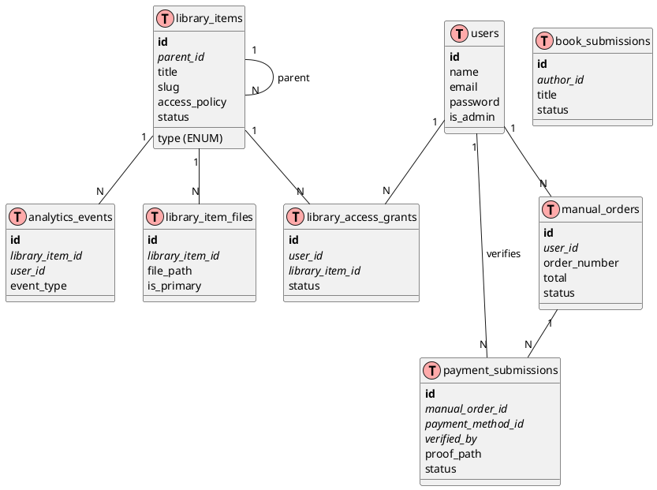
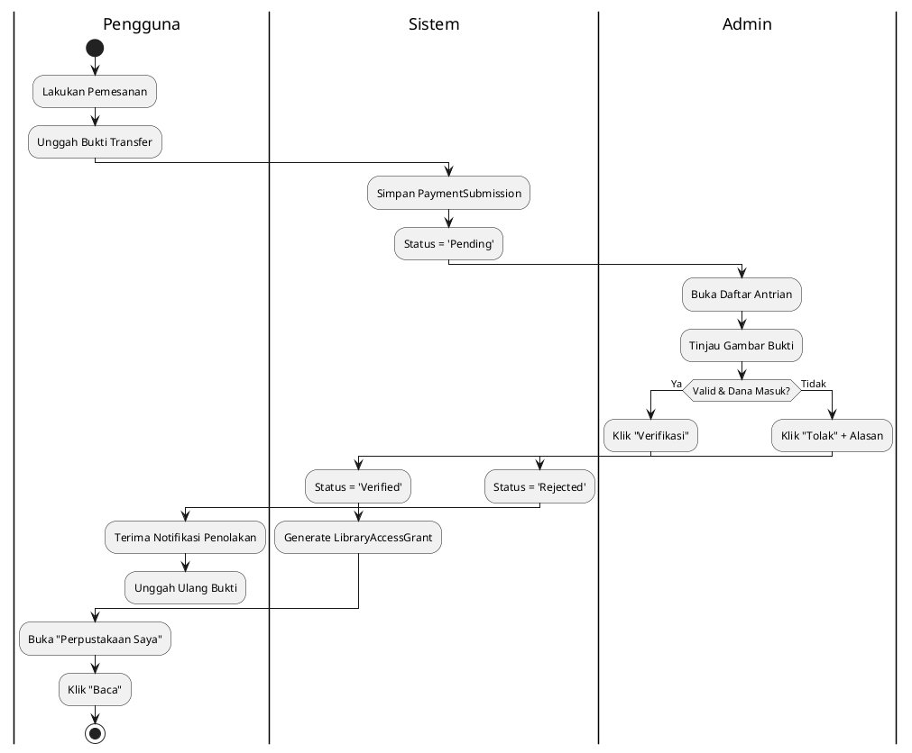
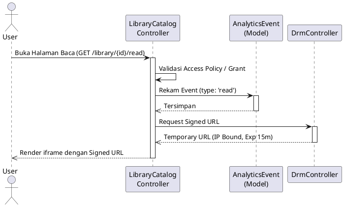

# 📊 Laporan Komprehensif Sistem P4I Digital Library & Publishing (Aktual)

**Target Sistem:** P4I Digital Library & Publishing
**Folder:** `d:\P4I_Publisher_Ebook`
**Jenis Sistem:** Unified Digital Library, E-Book Marketplace, Author Portal, DRM, & Analytics
**Framework:** Laravel 12 (PHP ^8.2)
**Versi Rilis:** `p4i-digital-library-2026-10-04-hotfix5`
**Tanggal Analisis:** 8 Oktober 2026

---

## 📋 Daftar Isi

1. [Ringkasan Eksekutif](#1-ringkasan-eksekutif)
2. [Stack Teknologi](#2-stack-teknologi)
3. [Struktur Folder](#3-struktur-folder)
4. [Arsitektur Sistem](#4-arsitektur-sistem)
5. [Skema Database & ERD Terkini](#5-skema-database--erd-terkini)
6. [Roles & Hak Akses](#6-roles--hak-akses)
7. [Use Case per Role](#7-use-case-per-role)
8. [Spesifikasi Use Case Akademik](#8-spesifikasi-use-case-akademik)
9. [Alur Sistem (Workflow) & UML](#9-alur-sistem-workflow--uml)
10. [Spesifikasi Kebutuhan Sistem (Requirements)](#10-spesifikasi-kebutuhan-sistem-requirements)
11. [Fitur-Fitur Sistem](#11-fitur-fitur-sistem)
12. [Sistem Keamanan & Analytics](#12-sistem-keamanan--analytics)
13. [Infrastruktur, Deployment & Pengujian](#13-infrastruktur-deployment--pengujian)

---

## 1. Ringkasan Eksekutif

**P4I Digital Library & Publishing** adalah evolusi dari platform e-book sebelumnya yang kini mendukung ekosistem perpustakaan digital terpadu secara utuh. Arsitektur terbaru berpusat pada **Unified Library**, di mana berbagai bentuk publikasi akademik (Buku, Jurnal, Edisi Jurnal, Bab Buku, Monograf) dikelola dalam satu sistem hierarkis yang fleksibel.

Sistem juga telah bermigrasi dari *payment gateway* otomatis (Midtrans) ke sistem **Manual Payment Pipeline** untuk fleksibilitas operasional, di mana pembeli mengunggah bukti transfer untuk diverifikasi secara manual oleh Admin. Modul finansial historis (KYC Penulis, Payout Otomatis, dan Pembagian Royalti 70/30) saat ini dinonaktifkan di level *production* via *Feature Flags*.

### Identitas Sistem
| Atribut | Detail |
|---------|--------|
| **Nama Sistem** | P4I Digital Library & Publishing |
| **Database Prod** | MariaDB 10.20 |
| **Metode Pembayaran** | Transfer Manual (Bank/E-Wallet) dengan Verifikasi Bukti |
| **Entitas Utama** | `LibraryItem`, `ManualOrder`, `PaymentSubmission` |
| **Keamanan File** | DRM (Digital Rights Management) via Signed URL + IP Binding |
| **Telemetri** | Sistem Analytics Internal (tanpa pihak ketiga) |
| **Status Operasional** | Production (Hostinger hPanel) |

---

## 2. Stack Teknologi

### Backend
| Komponen | Teknologi | Versi |
|----------|-----------|-------|
| **Framework** | Laravel | ^12.0 |
| **Bahasa** | PHP | ^8.2.33 |
| **Auth Scaffold** | Laravel Breeze | ^2.4 |
| **ORM** | Eloquent (Laravel) | — |
| **Testing** | PHPUnit | ^11.5 |

### Frontend
| Komponen | Teknologi | Versi |
|----------|-----------|-------|
| **CSS Framework** | TailwindCSS | ^3 |
| **Interaktivitas** | Alpine.js | — |
| **Build Tool** | Vite | — |
| **Templating** | Blade (Laravel) | — |

---

## 3. Struktur Folder

Berikut adalah struktur folder dan peran *Controller* serta *Model* yang aktif pada versi aktual:

```text
d:\P4I_Publisher_Ebook\
│
├── 📁 app/
│   ├── 📁 Http/
│   │   ├── 📁 Controllers/
│   │   │   ├── 📁 Admin/
│   │   │   │   ├── AnalyticsDashboardController.php — Dasbor metrik pencarian/view
│   │   │   │   ├── FullAnalyticsController.php      — Ekspor & detail data telemetri
│   │   │   │   ├── LibraryItemController.php        — CRUD Unified Library (Katalog)
│   │   │   │   ├── ManuscriptCurationController.php — Kurasi submission naskah
│   │   │   │   ├── PaymentMethodController.php      — Kelola opsi bank/e-wallet transfer
│   │   │   │   ├── PaymentVerificationController.php— Verifikasi/Tolak bukti transfer
│   │   │   │   └── UserController.php               — Manajemen pengguna & pencabutan lisensi
│   │   │   ├── 📁 Author/
│   │   │   │   ├── AuthorDashboardController.php    — Dasbor penulis
│   │   │   │   ├── AuthorBookController.php         — Lihat buku yang sudah terbit
│   │   │   │   └── BookSubmissionController.php     — Pengajuan naskah PDF
│   │   │   ├── 📁 Auth/                             — Login, Register (Breeze)
│   │   │   ├── DrmController.php                    — Stream URL PDF Aman (Anti-download)
│   │   │   ├── LibraryCatalogController.php         — Tampilan publik Unified Library
│   │   │   ├── LibraryController.php                — Dasbor perpustakaan pribadi user
│   │   │   ├── ManualPaymentController.php          — Proses order dan upload bukti bayar
│   │   │   └── ProfileController.php                — Manajemen akun
│   │   └── 📁 Middleware/
│   │       ├── EnsureAccountIsActive.php
│   │       ├── EnsureUserIsAdmin.php
│   │       └── FeatureFlagMiddleware.php            — Mengamankan rute fitur non-aktif
│   ├── 📁 Models/
│   │   ├── AnalyticsEvent.php      — (Baru) Log aktivitas baca/cari
│   │   ├── BookSubmission.php      — Alur pengajuan naskah
│   │   ├── Category.php            — Kategori / Bidang Ilmu
│   │   ├── LibraryAccessGrant.php  — (Baru) Pengganti BookLicense, hak akses generik
│   │   ├── LibraryItem.php         — (Baru) Core Model (Buku, Jurnal, Artikel)
│   │   ├── LibraryItemCreator.php  — (Baru) Relasi Penulis untuk LibraryItem
│   │   ├── LibraryItemFile.php     — (Baru) Manajemen multipel PDF per item
│   │   ├── ManualOrder.php         — (Baru) Transaksi pembelian manual
│   │   ├── ManualOrderItem.php     — (Baru) Item pesanan manual
│   │   ├── PaymentMethod.php       — (Baru) Rekening Bank / E-Wallet sistem
│   │   ├── PaymentSubmission.php   — (Baru) Bukti transfer & status verifikasi
│   │   └── User.php                — Akun otentikasi
```

---

## 4. Arsitektur Sistem

Sistem menggunakan MVC (*Model-View-Controller*) klasik Laravel, diperkuat dengan Middleware perlindungan dan Sistem Penyimpanan Terselubung (*Private Storage*).

### Arsitektur Telemetri & Akses
1. Pengguna mencari/melihat item di `LibraryCatalogController`.
2. Aksi ini secara asinkron memanggil metode pencatatan di Model `AnalyticsEvent` (merekam `event_type`, `user_id`, `library_item_id`, `search_term`).
3. Pengaturan akses ditentukan oleh kolom `access_policy` di `LibraryItem` (misal: `public_read_download`, `manual_purchase`).
4. Jika dibeli, alur akan diarahkan ke `ManualPaymentController`.

### Arsitektur Pembayaran Manual
1. **Order Creation:** `ManualOrder` dibuat dengan status `pending`.
2. **Proof Upload:** Pengguna mengunggah gambar bukti melalui `PaymentSubmission`.
3. **Verification:** Admin meninjau `PaymentSubmission`. Jika Valid, membuat `LibraryAccessGrant`.

---

## 5. Skema Database & ERD Terkini

### 5.1 Diagram ERD PlantUML



### 5.2 Skema Tabel Utama

#### `library_items` (Unified Library)
```sql
CREATE TABLE library_items (
    id BIGINT UNSIGNED AUTO_INCREMENT PRIMARY KEY,
    parent_id BIGINT UNSIGNED NULL,
    type ENUM('book', 'journal', 'journal_issue', 'journal_article', 'proceeding') NOT NULL,
    title VARCHAR(255) NOT NULL,
    slug VARCHAR(255) UNIQUE NOT NULL,
    access_policy ENUM('public_read_download', 'registered_read_only', 'manual_purchase', 'external') DEFAULT 'manual_purchase',
    price DECIMAL(10,2) NULL,
    status ENUM('draft', 'published', 'archived') DEFAULT 'draft',
    metadata JSON NULL,
    FOREIGN KEY (parent_id) REFERENCES library_items(id)
);
```

#### `payment_submissions` (Pembayaran Manual)
```sql
CREATE TABLE payment_submissions (
    id BIGINT UNSIGNED AUTO_INCREMENT PRIMARY KEY,
    manual_order_id BIGINT UNSIGNED NOT NULL,
    payment_method_id BIGINT UNSIGNED NOT NULL,
    verified_by BIGINT UNSIGNED NULL,
    amount DECIMAL(10,2) NOT NULL,
    proof_path VARCHAR(255) NOT NULL,
    status ENUM('pending', 'verified', 'rejected') DEFAULT 'pending',
    rejection_reason TEXT NULL,
    FOREIGN KEY (manual_order_id) REFERENCES manual_orders(id)
);
```

---

## 6. Roles & Hak Akses

| Role | Indikator di Sistem | Akses Modul |
|------|----------------------|-------------|
| **Guest** | (Belum Login) | Tinjau katalog publik (`/library`), lihat info bibliografi, baca artikel gratis (jika diizinkan *policy*). |
| **Pembeli** | Auth, `is_admin = 0` | Beli item (`/manual-orders/*`), baca DRM (`/reader`), unggah bukti transfer. |
| **Penulis** | Auth, punya `author` | Dasbor Penulis, *Submit Naskah* (PDF), revisi naskah kurasi. |
| **Admin** | Auth, `is_admin = 1` | Validasi Transfer Bank, Kelola Katalog Jurnal/Buku, Kurasi Naskah, Cabut Lisensi Akses, Dasbor Analytics. |

---

## 7. Use Case per Role

```text
GUEST (Pengunjung)
 ├── Melakukan Pencarian Jurnal/Buku (Mencatat Analytics Search Event)
 ├── Membaca Artikel Akses Terbuka (Open Access)
 └── Registrasi Akun

PEMBELI (User)
 ├── Melakukan Pembelian Manual (Manual Purchase)
 ├── Mengunggah Bukti Pembayaran (Payment Submission)
 ├── Melihat Status Verifikasi Pembayaran
 ├── Membaca Dokumen via DRM Stream (Signed URL + IP Binding)
 └── Mendaftar menjadi Penulis

PENULIS (Author)
 ├── Mengajukan Naskah (Buku/Artikel)
 ├── Mengunggah Revisi Berdasarkan Catatan Kurator
 └── Melihat Karya yang Sudah Terbit

ADMIN
 ├── Meninjau & Memverifikasi/Menolak Bukti Transfer
 ├── Menambahkan Edisi Jurnal / Buku ke Katalog
 ├── Menganalisis Metrik (Analytics) Bacaan dan Unduhan Terbanyak
 ├── Mengkurasi (Approve/Reject) Pengajuan Naskah
 └── Menambah Opsi Rekening Pembayaran (Payment Methods)
```

---

## 8. Spesifikasi Use Case Akademik

### UC-01: Pembelian Akses Library Item (Manual Payment)
**Tujuan:** Pengguna mendapatkan `LibraryAccessGrant` dengan mentransfer dana secara manual.
**Aktor:** Pengguna (Primary), Admin (Secondary)
**Prasyarat:** Pengguna memiliki akun; Item bersatus `published` dan `access_policy` = `manual_purchase`.

**Main Flow:**
1. Pengguna membuka halaman detail _Library Item_ di `/library/{slug}`.
2. Pengguna mengklik tombol beli dan mengonfirmasi pesanan.
3. Sistem menginisiasi record `ManualOrder` dan menampilkan instruksi transfer.
4. Pengguna mengunggah gambar bukti transfer (JPG/PNG/PDF).
5. Sistem menyimpan `PaymentSubmission` berstatus `pending` dan menampilkan layar tunggu.
6. Admin meninjau dasbor verifikasi.
7. Admin menyetujui transaksi.
8. Sistem mengubah status order menjadi sukses dan menerbitkan `LibraryAccessGrant`.

**Alternative Flow:**
* **4a (Format Salah):** Sistem menolak file yang tidak sesuai aturan validasi. Pengguna diminta mengulang.
* **7a (Bukti Tidak Valid):** Admin menolak transaksi, mengisi alasan penolakan. Status menjadi `rejected`. Pengguna menerima pemberitahuan revisi.

**Business Rules (BR-01):** Jika jumlah transfer kurang dari nominal pesanan, Admin dapat menolak pesanan atau menyesuaikan status order secara manual dari panel lain.

---

## 9. Alur Sistem (Workflow) & UML

### 9.1 Activity Diagram: Verifikasi Pembayaran Manual



### 9.2 Sequence Diagram: Akses DRM & Telemetri



---

## 10. Spesifikasi Kebutuhan Sistem (Requirements)

### 10.1 Functional Requirements (FR)
| ID | Kebutuhan | Terpenuhi | Modul/Controller |
|----|-----------|-----------|------------------|
| **FR-01** | Sistem mampu mengelola struktur buku, jurnal, dan bab buku. | Ya | `LibraryItem` (Self-referencing) |
| **FR-02** | Pembeli dapat mengunggah bukti pembayaran manual. | Ya | `ManualPaymentController` |
| **FR-03** | Admin dapat menyetujui atau menolak bukti pembayaran. | Ya | `PaymentVerificationController` |
| **FR-04** | Dasbor Analytics merekam pencarian *keyword* populer. | Ya | `AnalyticsDashboardController` |

### 10.2 Non-Functional Requirements (NFR)
| ID | Kebutuhan | Terpenuhi | Bukti Implementasi |
|----|-----------|-----------|--------------------|
| **NFR-01** | PDF Manuskrip dan Buku tidak bisa diunduh secara langsung. | Ya | File disimpan di `storage/app/private` |
| **NFR-02** | Pembacaan file PDF meminimalisasi penggunaan RAM. | Ya | Penggunaan fungsi `fpassthru()` di PHP |

### 10.3 Business Rules (BR)
1. **Hierarki Jurnal:** `LibraryItem` dengan `type`='journal' tidak boleh memiliki *parent*.
2. **Keterikatan IP:** URL untuk membaca (DRM Stream) akan kadaluarsa jika diakses dari IP yang berbeda dari saat URL di-_generate_.

---

## 11. Fitur-Fitur Sistem

Berdasarkan analisis *controller* dan arsitektur aktif, berikut inventarisasi fungsionalitas sistem (64 fitur inti):

### Modul Publik & E-Commerce (Unified Library)
1. **Katalog Terpadu:** Tampilan *Grid* dan *List* untuk buku & jurnal.
2. **Access Policy Engine:** Menegakkan aturan (*Open Access*, *Registered*, *Manual Purchase*).
3. **Pencarian Cerdas:** Filter katalog berdasarkan metadata (Judul, Abstrak, ISBN/ISSN).
4. **Checkout & Order Creation:** Membuat nomor order unik secara otomatis.
5. **Daftar Rekening Dinamis:** Pilihan metode bank/e-wallet untuk tujuan transfer.
6. **Unggah Bukti Transfer:** Validasi ekstensi dan limitasi ukuran gambar.
7. **Perpustakaan Pribadi:** Menampilkan dokumen yang aksesnya telah dimiliki.
8. **Penggantian *Scroll-to-top* UI:** Komponen *Alpine.js* ergonomis dengan ikon buku.

### Modul Admin & Manajerial
9. **Manajemen Hierarki Item:** Menautkan bab/artikel ke induk jurnal/buku.
10. **Antrian Verifikasi Pembayaran:** Tabel urutan pembeli yang menunggu approval.
11. **Light-box Viewer Bukti Transfer:** Melihat gambar resi tanpa mengunduh.
12. **Konfirmasi Penolakan Dinamis:** Input teks wajib untuk alasan menolak bukti transfer.
13. **Dasbor Analitik Real-Time:** Grafik/Ringkasan item terpopuler dan *keyword* pencarian.
14. **Ekspor CSV Analytics:** Menarik log data telemetri ke eksternal.
15. **Manajemen Pengguna Terpadu:** Melihat, *ban*, atau memulihkan hak akses akun.
16. **Pencabutan Akses Paksa:** Opsi mencabut (`revoke`) lisensi (*LibraryAccessGrant*).

### Modul Author & Kurasi
17. **Pengajuan Manuskrip PDF:** Registrasi meta data awal oleh penulis.
18. **Pipeline Revisi (7 Tahap):** Sirkulasi umpan balik antara Editor dan Penulis.
19. **Stream Manuskrip Aman:** Editor membaca draf tanpa mengunduh fisik ke komputer lokal.

### Perlindungan Modul Historis (Mati / Disabled)
* Midtrans Snap Gateway (Ditahan via middleware `feature:midtrans`)
* Otomasi Payout Keuangan (Ditahan via middleware `feature:payout`)
* Sistem Royalti 70/30 Otomatis (Ditahan secara logika)
* Verifikasi KYC Identitas KTP (Ditahan via middleware `feature:author_kyc`)

---

## 12. Sistem Keamanan & Analytics

### 12.1 Keamanan DRM Terlapis
- **Layer 1 (Otentikasi & Otorisasi):** Sistem mendeteksi `LibraryAccessGrant`.
- **Layer 2 (Temporary Signed URL):** Menggunakan utilitas native Laravel `URL::temporarySignedRoute` (kadaluarsa dalam 15 menit).
- **Layer 3 (IP & User Agent Binding):** Memaksa pembaca menggunakan koneksi awal (URL tidak dapat di-copy-paste ke perangkat/komputer rekan).
- **Layer 4 (No-Cache Headers):** Respons stream PDF dikirim dengan instruksi peramban ketat (`no-cache, no-store`).

### 12.2 Analytics Telemetry (Private)
Melacak tren secara internal:
- Model `AnalyticsEvent` dipanggil pada *endpoint* `/library/{id}/read`, `/library/search`.
- Penyimpanan *event* merekam *footprint* pengguna (ID, IP hashing anonim, item yang dilihat).

---

## 13. Infrastruktur, Deployment & Pengujian

### 13.1 Lingkungan Produksi (AS-IS)
Berdasarkan `docs/deployment/23_PRODUCTION_DEPLOYMENT_REPORT.md`:
- Sistem di-*deploy* pada Hostinger (hPanel).
- `php artisan queue:work` dan `schedule:run` dikonfigurasi melalui Cron Jobs pihak server setiap menit (`/bin/sh run_queue.sh`).
- Seluruh rute Legacy (Midtrans/Royalti) terkonfirmasi non-aktif di _production_.

### 13.2 Requirements Traceability & Pengujian
Sistem dilindungi pengujian regresi (*PHPUnit*):
| Feature / Requirement | Metode Test | Status |
|-----------------------|-------------|--------|
| Pembuatan Item Perpustakaan | `test_unified_library_item_creation` | Lulus (Pass) |
| Pencegahan Hierarki Siklik | `test_circular_parent_hierarchy_rejected` | Lulus (Pass) |
| Alur Pembayaran Pembeli | `test_payment_submission_workflow` | Lulus (Pass) |
| Pencegahan *Scroll* Patah UI | `UiHotfixTest` | Lulus (Pass) |

---
*Laporan ini secara komprehensif mendokumentasikan spesifikasi Sistem **P4I Digital Library & Publishing** versi paling aktual (8 Oktober 2026), merepresentasikan pergeseran penuh dari arsitektur e-commerce klasik ke manajemen perpustakaan akademik berjenjang.*
