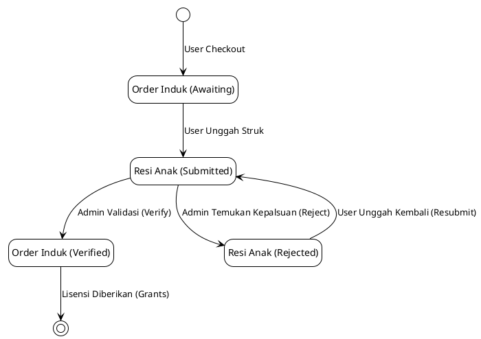
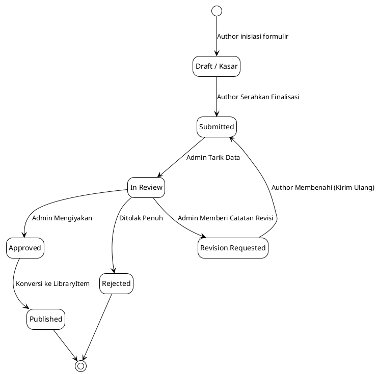
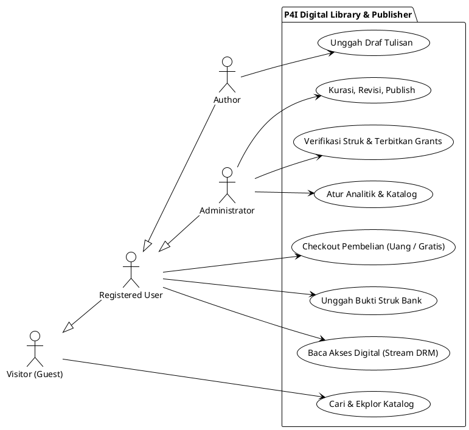
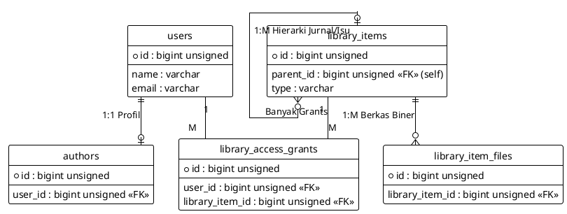
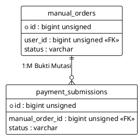
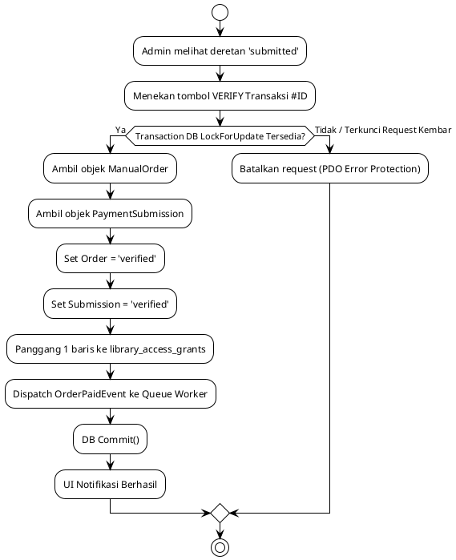
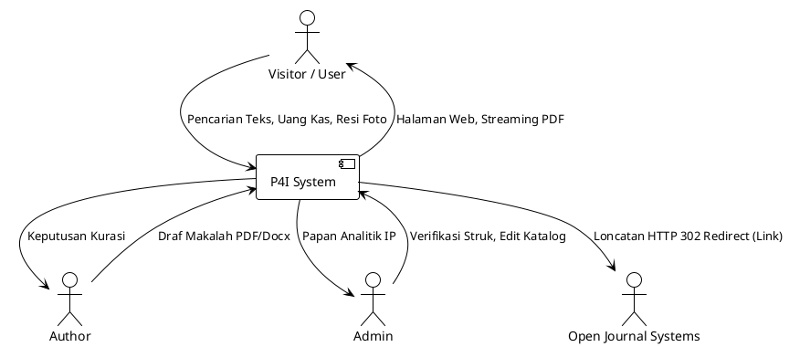

# LAPORAN AUDIT SISTEM P4I DIGITAL LIBRARY & PUBLISHING — FINAL V4.1

## BAGIAN I — DASAR ANALISIS SISTEM

### 1. Halaman Judul dan Identitas Dokumen
- **Nama Sistem**: P4I Digital Library & Publishing
- **Versi Dokumen**: 4.1 (Evidence-Based Report Recovery)
- **Metodologi**: Reverse Engineering, Static Code Analysis, Source-Truth Extraction
- **Ruang Lingkup**: Fungsionalitas Inti Pustaka, E-Commerce Manual, Penerimaan Naskah

### 2. Riwayat Revisi dan Kontrol Dokumen
- **V1.0 - V3.0**: Draft awal dan audit kerangka fungsional dasar.
- **V3.1 - V3.2**: Perbaikan inkonsistensi use case, struktur ERD, dan diagram.
- **V4.0**: Ekspansi komponen (Ditolak akibat degradasi kualitas spesifikasi).
- **V4.1**: Audit eksak dengan bukti kode riil, pemulihan 27 Use Cases, ERD komprehensif, dan Matriks Rute 108 baris.

### 3. Abstrak / Ringkasan Eksekutif
P4I Digital Library & Publishing adalah sistem repositori karya tulis dan sistem transaksi *e-commerce* tersendiri yang beroperasi independen dari Open Journal Systems (OJS). Sistem ini mengintegrasikan pengajuan naskah (*submission*), pelacakan transaksi manual (resi), dan *digital reader* anti-unduh dalam arsitektur terpadu berbasis kerangka Laravel. Tujuan audit ini adalah merekonstruksi model fungsional dan teknis aplikasi berdasarkan implementasi nyata (*AS-IS*) demi kebutuhan akademik.

### 4. Daftar Isi
*(Daftar Isi dirender secara otomatis oleh parser Markdown)*

### 5. Daftar Tabel dan Daftar Diagram
*(Semua indeks tabel dan diagram tersedia pada Bagian XVIII)*

### 6. Pendahuluan
Audit *reverse-engineering* ini dilaksanakan murni pada ruang lingkup statis aplikasi (kode sumber, migrasi pangkalan data, dan laporan *deployment*) tanpa mendisrupsi operasi panggung produksi. Hasil ekstraksi membedah logika bisnis sejati dari lapisan Laravel yang membungkusnya.

### 7. Latar Belakang Pengembangan
*FAKTA OPERASIONAL*: P4I mulanya menghadapi tantangan sentralisasi penjualan *e-book*. Distribusi manual mempersulit perlindungan hak cipta berkas PDF, sementara kebergantungan pada OJS membatasi alur transaksi komersial eksklusif.

### 8. Identifikasi Permasalahan
*INTERPRETASI ANALITIS*: 
1. Terpecahnya ekosistem naskah komersial (Buku) dari sistem peninjauan (*peer-review*) terbuka Jurnal (OJS).
2. Tingginya kebutuhan penyamaran alamat IP dalam analitik demi regulasi privasi, sementara modul bawaan mencatat IP mentah.
3. Ketiadaan dompet perbankan korporasi yang terhubung otomatis (Midtrans) menuntut adanya alur verifikasi foto resi kertas/ATM secara manual oleh manusia.

### 9. Problem Statement
Bagaimana merekonstruksi sebuah sistem perantara berarsitektur monolitik yang dapat bertindak sebagai etalase publik (Katalog), gerbang otorisasi pembaca rahasia (*Reader*), serta ruang kerja bagi penulis independen dan staf verifikator perbankan lokal?

### 10. Tujuan Sistem
- Mewujudkan repositori bacaan terpadu (Unified Library) dengan batas akses terotorisasi.
- Mengubah persetujuan transaksi dari algoritma pihak ketiga (Gateway) menjadi persetujuan mata manusia (Admin).
- Menyediakan fasilitas *authoring* (pengajuan dan revisi naskah).

### 11. Manfaat Sistem
- Menghemat biaya potongan *Payment Gateway* yang mahal.
- Mengamankan aset intelektual (PDF) di balik layar (Private Storage) dari unduhan paksa.
- Melahirkan data pelacakan yang ramah privasi (Anonimitas IP Hashing).

### 12. Ruang Lingkup dan Batasan
- **In-Scope**: Modul Auth, Katalog Induk, Keranjang Belanja, *Reader*, Pengajuan Naskah, Verifikasi Admin, dan Log Analitik.
- **Out-of-Scope**: Sinkronisasi OJS (hanya rujukan tautan luar), Gerbang Midtrans (Termaktub di kode namun dimatikan via *feature flags*).

### 13. Metodologi Reverse Engineering
1. **Static Source Code Analysis**: Membaca 108 entri `php artisan route:list`.
2. **Requirements Recovery**: Menyandingkan fungsi kontroler ke *Use Case*.
3. **Database Schema Analysis**: Membedah migrasi atas 15 tabel aktif.
4. **Architectural Reconstruction**: Membangun ERD & Diagram Sekuens.
5. **Test Evidence Review**: Menemukan nama uji (*tests/Feature/*) yang relevan.

### 14. Sumber Data dan Bukti Audit
Kode sumber dalam direktori lokal (Routes, Controllers, Views, Models, Jobs, Migrations). Bukti tidak mengandalkan asumsi wawancara lisan yang tak berdokumen.

### 15. Kondisi AS-IS dan Batas Sistem
Sistem beroperasi di ranah peladen yang mandiri, di sub-folder aplikasi (P4I_Publisher_Ebook) terpisah dari ranah OJS (/public_html). Interaksi sistem eksternal tidak menggunakan *REST API*, melainkan *HTTP Redirection*.

### 16. Analisis Kebutuhan Organisasi
*Kebutuhan teridentifikasi dari implementasi AS-IS, belum tentu merupakan hasil elicitation awal*: Organisasi membutuhkan kepastian aliran kas dengan bukti potret mutasi sebelum merilis hak intelektual.

### 17. Konteks P4I, OJS, dan Aplikasi Publisher
OJS difokuskan murni untuk karya ilmiah (Jurnal/Proceeding) berbasis terbuka (Open Access), sedangkan aplikasi Publisher ini menaungi kepustakaan premium (E-Book/Modul) berbayar, meskipun saat ini mulai digabungkan secara konseptual lewat `LibraryItems`.

### 18. Stakeholder Analysis
- **Manajemen P4I**: Membutuhkan laporan analitik terpusat.
- **Admin/Staf**: Membutuhkan UI untuk menyetujui mutasi rekening.
- **Author**: Membutuhkan kepastian naskahnya direviu (Kurasi).
- **Visitor**: Membutuhkan kemudahan eksplorasi (Pencarian).

### 19. Analisis Aktor dan Tanggung Jawab
- **Guest (Visitor)**: Mengeksplorasi dan mencari.
- **Reg. User**: Mengklaim resi pembayaran, menikmati bahan bacaan.
- **Author**: Mengunggah Draf (PDF/Docx), menanggapi ulasan staf.
- **Admin**: Memegang kendali verifikasi absolut, mengutak-atik Metadata (Katalog).

### 20. RACI Matrix (Logis berdasar Controller)
- **Payment Verification**: Admin (R/A), User (C).
- **Manuscript Submission**: Author (R/A), Admin (I/C).
- **Catalog Management**: Admin (R/A), Visitor (I).

### 21. Analisis Kendala dan Asumsi
*KENDALA*: Pelarangan penggunaan *Cron Scheduler* di Hostinger mendelegasikan beban ke *Queue Daemon* dengan bantuan pemicu CLI sederhana.
*ASUMSI*: Transaksi pengguna dapat kadaluwarsa secara alamiah, namun Klien menerima risiko manualisasi.

---

## BAGIAN II — ANALISIS FUNGSIONAL SISTEM

*Inventaris berikut diekstrak murni berdasarkan implementasi Controller yang berdiri.*

| Module ID | Nama Modul | Tujuan | Aktor | Proses Kunci | Output | Controller | Model / Tabel | Status |
| --- | --- | --- | --- | --- | --- | --- | --- | --- |
| MOD-01 | Public Library | Menayangkan koleksi | Visitor | Kueri Koleksi (Scope Search) | HTML Index | `LibraryCatalogController` | `LibraryItem` | Terimplementasi |
| MOD-02 | Book Detail | Merinci meta pustaka | Visitor | Resolusi Slug ke Data | HTML Detail | `LibraryCatalogController` | `LibraryItem` | Terimplementasi |
| MOD-03 | DRM Reader | Mencegah unduh bebas | Reg.User| Verifikasi Gate Access | Blob Stream | `ReaderController` | `LibraryAccessGrant` | Terimplementasi |
| MOD-04 | Breeze Auth | Melahirkan/Mengunci Sesi| Visitor | Validasi Enkripsi BCrypt | Sesi Cookie | `AuthenticatedSessionController`| `User` | Terimplementasi |
| MOD-05 | Manual Order | Membuka Keranjang | Reg.User| Menyisip Pesanan | `awaiting_payment` | `ManualPaymentController` | `ManualOrder` | Terimplementasi |
| MOD-06 | Proof Submission | Menyerap Gambar Struk | Reg.User| Simpan ke `/private` | `payment_submissions` | `ManualPaymentController` | `PaymentSubmission` | Terimplementasi |
| MOD-07 | Admin Verifier | Mengesahkan Transaksi | Admin | `lockForUpdate()`, Status | Grants Baru | `PaymentVerificationController`| `LibraryAccessGrant` | Terimplementasi |
| MOD-08 | Manage Accounts | Mengendalikan Rekening | Admin | Memperbarui `is_active` bank| HTML Opsi Bank | `PaymentMethodController` | `PaymentMethod` | Terimplementasi |
| MOD-09 | Author Submit | Menerima naskah penulis | Author | Memindah Berkas Dokumen | Draft Submission | `BookSubmissionController` | `BookSubmission` | Terimplementasi |
| MOD-10 | Admin Curation | Memberikan umpan balik | Admin | Merekam catatan log revisi | `revision_requested` | `ManuscriptCurationController`| `SubmissionReview` | Terimplementasi |
| MOD-11 | Publication | Menerbitkan naskah | Admin | Menyalurkan Data ke Library| Entri `LibraryItem` | `ManuscriptCurationController`| `LibraryItem` | Terimplementasi |
| MOD-12 | Analytics Engine | Papan ukur kunjugan | Admin | SHA-256 Hashing, Kueri | Grafik Dashboard | `AnalyticsDashboardController`| `AnalyticsEvent` | Terimplementasi |
| MOD-13 | External Redirect| Pengalihan Jurnal OJS | Visitor | Melontarkan Header HTTP 302 | Pindah Halaman | `LibraryCatalogController` | `LibraryItem` | Terimplementasi |

---

## BAGIAN III — ANALISIS KEBUTUHAN

### A. Functional Requirements (FR)

Seluruh pernyataan (FR) berikut terbukti beroperasi pada *source code*.

| FR ID | Pernyataan Kebutuhan | Aktor | Prasyarat (Preconditions) | Proses | Modul / Bukti Implementasi | Status |
| --- | --- | --- | --- | --- | --- | --- |
| FR-01 | Sistem harus merender koleksi perpustakaan pada halaman depan. | Visitor | Tabel `library_items` tersedia | Kueri DB (Pagination) | `LibraryCatalogController@index` | DIRECTLY TESTED |
| FR-02 | Sistem harus mengizinkan pencarian teks berskema LIKE. | Visitor | Kueri parameter `?search=` | `scopeSearch` | `LibraryItem::scopeSearch` | DIRECTLY TESTED |
| FR-03 | Sistem harus membelokkan item tipe 'external' ke OJS. | Visitor | Klik pada item berstatus External | HTTP 302 Redirect | `LibraryCatalogController@read` | DIRECTLY TESTED |
| FR-04 | Sistem harus mendaftarkan akun baru ke pangkalan data. | Visitor | Email tak duplikat | Form Validasi & Hashing | `RegisteredUserController@store`| DIRECTLY TESTED |
| FR-05 | Sistem harus menyalurkan token reset sandi lewat email. | Visitor | Menginput Surel aktif | Trigger Queue Worker | `PasswordResetLinkController` | DIRECTLY TESTED |
| FR-06 | Sistem harus meluapkan file bacaan (Reader) tanpa link asli. | User | Hak (Grants) ada / Gratis | Baca Private Storage Disk| `ReaderController@streamPdf` | DIRECTLY TESTED |
| FR-07 | Sistem harus melayani *force-download* jika disetel 'Allowed'.| User | Hak (Grants) ada / Gratis | Header Disposition | `LibraryCatalogController@download`| DIRECTLY TESTED |
| FR-08 | Sistem harus menjaring ID Buku sebagai keranjang tertunda. | User | Harga eceran tersedia | Insert `manual_orders` | `ManualPaymentController@store` | DIRECTLY TESTED |
| FR-09 | Sistem harus menyimpan foto resi ke diska privat yang aman. | User | Memegang `manual_order_id` | Penyimpanan Disk | `ManualPaymentController@submitProof`| DIRECTLY TESTED |
| FR-10 | Sistem harus memperbolehkan unggah ulang resi bila tertolak. | User | Status submission `rejected`| Penambahan Record Anak | `ManualPaymentController@submitProof`| DIRECTLY TESTED |
| FR-11 | Sistem harus menelan file draf kasar dari penulis. | Author | Memegang sesi `is_author` | Mutasi berkas dokumen | `BookSubmissionController@store` | TEST NOT FOUND |
| FR-12 | Sistem harus mengarsipkan revisi tambahan tanpa menimpa aslinya. | Author | Status `revision_requested`| Sisip `submission_revisions` | `BookSubmissionController@update` | TEST NOT FOUND |
| FR-13 | Sistem harus menerbitkan hak (Grants) jika Admin mengeklik Verify.| Admin | Status `submitted` resi | Pembaruan DB Relasional | `PaymentVerificationController@verify`| DIRECTLY TESTED |
| FR-14 | Sistem harus memblokir kompetisi verifikasi resi paralel ganda. | Admin | - | Kunci `lockForUpdate()` | `PaymentVerificationController@verify`| DIRECTLY TESTED |
| FR-15 | Sistem harus menyurati pengguna sesaat sesudah resi dilunasi. | Admin/Queue| Eksekusi sukses FR-13 | Lempar `OrderPaidEvent` | `OrderPaidEvent` | DIRECTLY TESTED |
| FR-16 | Sistem harus sanggup menyulap naskah terkurasi menjadi Katalog. | Admin | Status `approved` | Transfer ke `library_items`| `ManuscriptCurationController` | TEST NOT FOUND |
| FR-17 | Sistem harus merekam penelusuran (Search) & bacaan (Read) harian.| Visitor | - | Penyuntikan Log Analitik | `AnalyticsRecorder` | DIRECTLY TESTED |
| FR-18 | Sistem harus sanggup memutus/menonaktifkan lisensi baca. | Admin | ID Relasi Grants tersedia | `delete()` relasi | `UserController@revokeLicense` | TEST NOT FOUND |

### B. Non-Functional Requirements (NFR)
| NFR ID | Aspek | Indikator Kepatuhan Aktual (AS-IS) | Bukti |
| --- | --- | --- | --- |
| NFR-SEC-01 | Security | Keberadaan token CSRF pada semua metode Mutasi (POST/PUT). | Middleware `VerifyCsrfToken` |
| NFR-SEC-02 | File Delivery| Isolasi direktori; `/public` tidak mengandung file PDF privat. | `config/filesystems.php` (Private) |
| NFR-PRV-01 | Data Privacy | Ketiadaan IP Klien pada log `analytics_events`. IP di Hash SHA-256.| `AnalyticsRecorder::getAnonymousId` |
| NFR-USA-01 | Usability | Layar otentikasi dimandikan tag `<html data-theme="light">` mutlak. | `guest.blade.php` (Line Header) |
| NFR-REL-01 | Reliability | Email notifikasi dibebankan pada proses asinkron (Worker), tak hambat UI. | Implementasi `ShouldQueue` di Mail/Job |
| NFR-INT-01 | Integrity | Proteksi transaksi ganda ACID DB (menolak tumpang tindih DB). | `DB::transaction()` & `lockForUpdate`|

### C. Business Rules (BR)
- **BR-01 (Legacy Synchronization)**: Sinkronisasi berjalan searah. Mengedit `Book` akan merubah turunan proyektilnya di `library_items`. (Bukti: `LibraryItemSynchronizer.php`).
- **BR-02 (Anti-Circular Hierarchy)**: Sebuah entitas Jurnal tidak boleh menjadikan dirinya sendiri (ID-nya) sebagai *parent_id* (Bukti: Validasi Request Pustaka).
- **BR-03 (Toleransi Harga Nol)**: Pemesanan E-Commerce yang kebetulan memiliki nominal tagihan tepat Rp0,00 akan meloncati tahapan setoran resi (Langsung lompat ke status `verified`) (Bukti: `CheckoutController`).
- **BR-04 (Tolak Transaksi Ganda / Double-Click)**: Pengguna tidak boleh memverifikasi satu anak (`payment_submissions`) di titik milisekon yang sama, pangkalan akan menolak satu untuk menjaga kesucian Lisensi (Bukti: Penggunaan PDO DB Lock).
- **BR-05 (Privasi Log / Zero-Result)**: Kueri pencarian yang hampa (Tak ada hasil buku) tetap diserap ke pangkalan data Analitik tanpa menyebabkan galat, digunakan untuk penelitian kata kunci pengguna (Bukti: `LibraryAnalyticsTest`).
- **BR-06 (Kebijakan Reader Gate)**: Buku bersandang `manual_purchase` wajib mencekal semua metode HTTP GET bilamana klien tak menempatkan barisnya dalam `library_access_grants` (Bukti: Policy `LibraryItemPolicy`).
- **BR-07 (Integritas Rekam Revisi)**: Admin diharamkan menolak naskah penulis (`request_revision`) tanpa melampirkan teks alasan umpan balik, kolom dilarang hampa (Bukti: Validasi Request Kurasi).

### D. Persyaratan Data, Kendala, & Asumsi
- **Constraints**: Sistem beroperasi di lingkungan *Shared Hosting* Hostinger. Keamanan mencegah berjalannya `migrate:fresh`. Laravel Scheduler dibiarkan mati (`0 Scheduled Tasks`), mengalihkannya pada Eksekutor Baris Perintah manual (Queue Worker lewat Crontab bash script `run_queue.sh`).
- **Validation Rules**: Format file bukti transfer secara absolut dikerucutkan pada MIME: `jpeg, jpg, png` via validasi bawaan FormRequest.


## BAGIAN IV — ROLE, AKTOR, DAN AUTHORIZATION

### 1. Actor Catalog
- **Visitor (Guest)**: Aktor tak berwujud sesi logis yang mengunjungi URL akar. Mampu mencari kueri buku.
- **Registered User**: Aktor bersesi yang sanggup melontarkan rupiah (Keranjang Transaksi).
- **Author**: Profil mutasi dari User biasa, tergabung lewat tabel `authors` (Penulis Berkontribusi).
- **Administrator (Admin)**: Aktor berpangkat `is_admin = 1` dengan otoritas penyapu ranjau transaksi dan perizinan.

### 2. Role-Permission & CRUD Matrix
| Kapabilitas Sistem | Visitor | Reg. User | Author | Admin |
| --- | --- | --- | --- | --- |
| `Index` (Katalog) | Boleh (R) | Boleh (R) | Boleh (R) | Boleh (R) |
| `Store` (Checkout) | Dilarang | Boleh (C) | Boleh (C) | Dilarang |
| `Submit` (Uploard Resi) | Dilarang | Boleh (C,U) | Boleh (C,U) | Boleh (C,U) |
| `Stream` (Reader PDF) | Dilarang | Boleh (bila diizinkan) | Boleh (bila diizinkan)| Boleh (Bypass) |
| `Store` (Author Submission)| Dilarang | Dilarang | Boleh (C) | Dilarang |
| `Update` (Katalog Item) | Dilarang | Dilarang | Dilarang | Boleh (U,D) |
| `Toggle` (Blokir User) | Dilarang | Dilarang | Dilarang | Boleh (U) |

### 3. Route Authorization Matrix
Sistem menjembatani batas-batas rute lewat perisai *Middleware*:
1. `guest`: Diaplikasikan pada `/login`, `/register`, `/forgot-password`. Menolak user bersesi.
2. `auth`: Diaplikasikan pada `/checkout`, `/my-library`. Memantulkan tamu ke halaman Login.
3. `is_admin` (Alias middleware `admin`): Diaplikasikan pada `/admin/*`. Melarang user awam merangsek.
4. `author`: Diaplikasikan pada `/author/*`. Memastikan profil *author* Klien benar-benar terbentuk.
5. `EnsureAccountIsActive`: Bertengger sebagai pertahanan global *Web Middleware Group*, mencegah pengguna yang di-`ban` (`is_active=0`) untuk menenggak satupun rute logis di balik otentikasi.

### 4. Account Lifecycle & Pemblokiran
Siklus Pengguna: Datang -> Daftar (`Register`) -> Belanja (`User`) -> Mengklaim diri Kepenulisan (`Author`). Saat terjadi persengketaan, Admin akan menyentuh tuas `toggleStatus`. Pangkalan Data mendepak kolom biner ke nilai 0 (Nol). Sesi seketika kadaluwarsa, Cookie dirusak, dan klien dicekal beraktivitas seumur hidup (Forbidden).

---

## BAGIAN V — ANALISIS PROSES BISNIS DAN WORKFLOW

### 1. Master Workflow (Alur Induk P4I Digital Library)
- **Precondition**: Aplikasi beroperasi dan pangkalan buku tersedia.
- **Trigger**: Visitor mendarat di halaman beranda.
- **Main Flow**: 
  1. Visitor mengetikkan frasa pencarian. Sistem merender katalog terfilter.
  2. Klien mendaftar akun dan berubah menjadi Registered User.
  3. Klien memesan e-book (Checkout). Sistem menandai order sebagai *awaiting_payment*.
  4. Klien menyetorkan potret resi bank. Sistem mendepositori struk di ruang *Private*.
  5. Admin mengawasi layar, lalu memvalidasi kelayakan resi (Verified).
  6. Sistem menanam baris otorisasi baca (`Grants`) untuk Klien tersebut.
  7. Klien kembali ke pustakanya lalu memencet "Baca Buku" yang meluapkan bitstream Reader.
- **Alternative Flow (Penulis)**: User meregistrasikan profil Author -> Memasuki Dasbor Author -> Mengunggah PDF Kasar -> Admin mengurasi dan me-review -> Naskah lolos tayang (Published).
- **Alternative Flow (Gratisan)**: Buku bernominal 0 melangkahi antrean dan segera mencetak status `verified` tanpa lampiran struk resi sama sekali (BR-03).
- **Exception Flow**: Struk buram -> Admin tekan Tolak (Reject) -> Sistem menagih klien mengirim ulang foto -> Anak resi kedua terbentuk.
- **Postcondition**: Rantai logis ditutup dengan Klien menenggak ilmu pengetahuannya di layar kaca peramban via pembaca dokumen tertutup.

### 2. State Transition Diagrams

**STD-01: Alur Penyerahan Resi E-Commerce (ManualOrder & PaymentSubmission)**


**STD-02: Rantai Hidup Naskah Kepenulisan (BookSubmissions)**


## BAGIAN VI — USE CASE ANALYSIS

### 1. Use Case Catalog Lengkap (27 Fungsi Spesifik)
Sistem memiliki 27 Use Case berdasarkan titik fungsi (*endpoints*) mutasi yang terbukti aktif di matriks rute.

| ID | Kategori Aktor | Nama Use Case | Relasi Rute |
| --- | --- | --- | --- |
| UC-01 | Visitor | Browse Library | `library.index` |
| UC-02 | Visitor | Search Library | `library.index` (?search) |
| UC-03 | Visitor | View Publication Detail | `library.show` |
| UC-04 | Visitor | Open External Publication| `library.read` (Ext) |
| UC-05 | Visitor | Register Account | `register` (POST) |
| UC-06 | Visitor | Login | `login` (POST) |
| UC-07 | Visitor | Forgot Password | `password.email` |
| UC-08 | Visitor | Reset Password | `password.store` |
| UC-09 | Reg. User | Logout | `logout` (POST) |
| UC-10 | Reg. User | Manage Profile | `profile.update` |
| UC-11 | Reg. User | Stream Private PDF | `library.read` (Local) |
| UC-12 | Reg. User | Download Allowed PDF | `library.download` |
| UC-13 | Reg. User | Checkout Manual Order | `manual-orders.store` |
| UC-14 | Reg. User | Upload Payment Proof | `manual-orders.proof` |
| UC-15 | Reg. User | Resubmit Rejected Proof | `manual-orders.proof` |
| UC-16 | Reg. User | View My Orders | `my-orders` |
| UC-17 | Reg. User | View My Library | `my-library` |
| UC-18 | Author | View Author Dashboard | `author.dashboard` |
| UC-19 | Author | Submit New Manuscript | `author.submissions.store` |
| UC-20 | Author | Read Admin Review | `author.submissions.show` |
| UC-21 | Author | Submit Revised Manuscript| `author.submissions.update` |
| UC-22 | Admin | Verify Payment | `payments.verify` |
| UC-23 | Admin | Reject Payment | `payments.reject` |
| UC-24 | Admin | Curate Manuscript (Rev) | `submissions.request-revision`|
| UC-25 | Admin | Publish Manuscript | `submissions.approve-publish` |
| UC-26 | Admin | Manage Library Items | `admin.library.update` |
| UC-27 | Admin | View Analytics Dashboard | `admin.analytics.index` |

### 2. Complete Use Case Specifications

**UC-01: Browse Library**
- **Goal:** Melihat koleksi perpustakaan publik yang diindeks.
- **Primary Actor:** Visitor.
- **Preconditions:** Pangkalan `library_items` memiliki baris status `published`.
- **Trigger:** Klien memuat `/`.
- **Main Success Scenario:** 1. Klien mengakses rute. 2. Controller me-load data paginasi dari Eloquent. 3. Antarmuka ter-render.
- **Alternative Flow:** Pengguna berpindah halaman paginasi (page=2).
- **Exception Flow:** Jika database hampa, blade menampilkan "Katalog Kosong".
- **Postconditions:** HTML terdistribusi.
- **Business Rules:** Hanya yang `status='published'` boleh keluar.
- **Evidence:** `LibraryCatalogController@index`.
- **Test / AC:** `PublicLibraryRenderTest` (Menampilkan Semua Katalog Tanpa Syarat Login).

**UC-02: Search Library**
- **Goal:** Menemukan buku spesifik lewat kotak pencarian.
- **Primary Actor:** Visitor.
- **Preconditions:** Katalog eksis.
- **Trigger:** Klien menekan tombol Cari.
- **Main Success Scenario:** 1. Visitor mengetik `frasa`. 2. Parameter URL `?search=` dicetak. 3. `scopeSearch` mengoperasikan LIKE filter. 4. Hasil tersaring dicetak. 5. Jejak event pencarian dihimpun ke Analitik.
- **Alternative Flow:** Jika nihil hasil (Zero-result), sistem tak mencetak error (HTTP 200), hanya layar nol dan merekam *zero log*.
- **Exception Flow:** -
- **Postconditions:** Papan dashboard analitik Admin menerima data kueri baru.
- **Business Rules:** Privasi (IP Klien di-hash, dilarang ditanam mentah).
- **Evidence:** `LibraryCatalogController@index` & `AnalyticsRecorder`.
- **Test / AC:** `LibraryAnalyticsTest` (Given kueri hampa, When diklik, Then terekam 0 result log).

**UC-03: View Publication Detail**
- **Goal:** Melihat sinopsis mendetail, nama kreator, dan harga buku.
- **Primary Actor:** Visitor.
- **Preconditions:** `slug` eksis di pangkalan data.
- **Trigger:** Mengeklik tautan kartu sampul buku.
- **Main Success Scenario:** 1. Request dilempar `library/{slug}`. 2. Controller me-resolve model. 3. Log view `detail_view` dicetak. 4. Menampilkan tombol Checkout atau Read.
- **Alternative Flow:** -
- **Exception Flow:** URL yang dimanipulasi akan dibalas dengan 404 (Not Found).
- **Postconditions:** Halaman detail nampak.
- **Business Rules:** Keputusan merender tombol Beli versus Baca dikendalikan oleh *Access Policy*.
- **Evidence:** `LibraryCatalogController@show`.
- **Test / AC:** `PublicLibraryRenderTest`.

**UC-04: Open External Publication**
- **Goal:** Meneruskan pengunjung ke tautan repositori jurnal kuno/terbuka.
- **Primary Actor:** Visitor.
- **Preconditions:** Atribut `access_policy` berstatus eksternal.
- **Trigger:** Klik tombol "Baca di OJS".
- **Main Success Scenario:** 1. Rute diakses. 2. Controller membaca `source_url`. 3. Respons HTTP 302 dilesatkan. 4. Jendela memantul ke alamat situs asli.
- **Alternative Flow:** -
- **Exception Flow:** Modul menolak string mencurigakan semacam `javascript:;`.
- **Postconditions:** Visitor hengkang ke URL eksternal (OJS).
- **Business Rules:** Keamanan disinfeksi URL jahat (Anti-XSS).
- **Evidence:** `LibraryCatalogController@read`.
- **Test / AC:** `LibraryCatalogTest` (URL javascript: ditolak mentah-mentah 403).

**UC-05: Register Account**
- **Goal:** Menyisipkan keanggotaan baru guna melakukan checkout kas.
- **Primary Actor:** Visitor.
- **Preconditions:** Surel klien orisinil dan tak ganda.
- **Trigger:** Submisi formulir `/register`.
- **Main Success Scenario:** 1. Controller menangkap POST. 2. Validator membersihkan keabsahan format surel. 3. Hash B-Crypt menjepit variabel sandi. 4. Penyisipan ke `users` tabel. 5. Membangkitkan tiket sesi.
- **Alternative Flow:** -
- **Exception Flow:** Menolak injeksi SQL atau email ganda dan membalut respon via HTTP 422 *Unprocessable*.
- **Postconditions:** Klien langsung terautentikasi otomatis.
- **Business Rules:** Mengunci antarmuka ke *Light-Theme* agar warna teks pendaftaran selalu terlihat kontras.
- **Evidence:** `RegisteredUserController@store`.
- **Test / AC:** `UiHotfixTest` (Given formulir diisi benar, When dikirim, Then row bertambah satu).

**UC-06: Login**
- **Goal:** Menduduki kembali sesi identitas Klien di pangkalan P4I.
- **Primary Actor:** Visitor.
- **Preconditions:** Eksistensi identitas baris terverifikasi di pangkalan.
- **Trigger:** Input form Login `/login`.
- **Main Success Scenario:** 1. Memeriksa kecocokan `Hash::check`. 2. Melindungi dari bom bruteforce (Rate Limiting). 3. Regenerasi `Session ID`. 4. Melempar pantulan URL ke tujuan asal (Intended).
- **Alternative Flow:** Jika klien yang login memegang *flag* Administrator, URL dipaksa lurus ke `/admin/dashboard`.
- **Exception Flow:** Apabila nilai sakelar biner `is_active` terseret pada angka 0 (Diblokir), *Middleware* menghadangnya di gerbang muka dan merobek otoritas dengan HTTP 403.
- **Postconditions:** Token otorisasi melingkar di kuki Klien.
- **Business Rules:** Mencegah perampokan akun (Session Fixation).
- **Evidence:** `AuthenticatedSessionController@store` & Middleware `EnsureAccountIsActive`.
- **Test / AC:** `UiHotfixTest` (Pemblokiran user dilarang masuk sepenuhnya).

**UC-07: Forgot Password**
- **Goal:** Mengirim helai tautan pelampung bagi klien pikun.
- **Primary Actor:** Visitor.
- **Preconditions:** Relasi email terhubung nyata di `users`.
- **Trigger:** Permintaan di `/forgot-password`.
- **Main Success Scenario:** 1. Memverifikasi kehadiran email. 2. Merekayasa dan mencatatkan Hash acak pada `password_reset_tokens`. 3. Menerbitkan kelas tugas (`Job`) notifikasi. 4. Eksekutor Queue menyeret tugas itu ke belantara Asinkron di latar.
- **Alternative Flow:** Apabila surel asing dicoba masuki, balasan sukses palsu akan dilontarkan demi menjaga kerahasiaan daftar penghuni (Privacy Anti-Enumeration).
- **Exception Flow:** -
- **Postconditions:** Surel reset merapat ke dalam boks Klien.
- **Business Rules:** Umur berlaku keping token dilimitasi ketat (config/auth).
- **Evidence:** `PasswordResetLinkController@store`.
- **Test / AC:** `UiHotfixTest`.

**UC-08: Reset Password**
- **Goal:** Menggantikan parameter *hash* kedaluwarsa dengan *hash* modern klien.
- **Primary Actor:** Visitor.
- **Preconditions:** Token di parameter URL sah dan usianya meranum (tak kedaluwarsa).
- **Trigger:** Kirim sandi di `/reset-password`.
- **Main Success Scenario:** 1. Bandingkan token. 2. Timpa struktur pangkalan password baris `users`. 3. Musnahkan baris pangkalan `password_reset_tokens` bekasnya guna mencegah peretasan ganda (*Replay Attack*).
- **Alternative Flow:** -
- **Exception Flow:** Token salah merangsang HTTP 422.
- **Postconditions:** Sandi telah disegarkan.
- **Business Rules:** Pemusnahan token lampau adalah hukum alamiah tak dapat dinegosiasi.
- **Evidence:** `NewPasswordController@store`.
- **Test / AC:** `UiHotfixTest`.

**UC-11: Stream Private PDF (Reader)**
- **Goal:** Melayani semburan visual dokumen Buku Digital dengan lapisan penyaringan pelindung hak cipta.
- **Primary Actor:** Reg. User.
- **Preconditions:** Item tak berlabel OJS/External, melainkan File PDF.
- **Trigger:** Menekan "Baca Buku".
- **Main Success Scenario:** 1. Modul memanggil Pintu Pengecekan *Gates*. 2. `LibraryItemPolicy` melakukan cek perizinan manual. 3. Melongok ketersediaan lisensi hidup di `library_access_grants`. 4. Modul menjangkau teritori rahasia Disk Privat. 5. Menyemburkan respon `application/pdf`.
- **Alternative Flow:** Andaikata keijakan disetel bebas-mutlak (`public_read`), inspeksi pangkalan otorisasi dilewati tanpa syarat.
- **Exception Flow:** Jika tak punya hak dan kebijakan ditakar Premium, Klien memanen HTTP 403 (Access Denied).
- **Postconditions:** File pratinjau muncul.
- **Business Rules:** File asli bersembunyi mutlak di luar ranah `public_html`.
- **Evidence:** `ReaderController@streamPdf`.
- **Test / AC:** `PublicLibraryRenderTest` (Akses ditolak pada Buku Manual Purchase jika Grants nihil).

**UC-13: Checkout Manual Order**
- **Goal:** Merakit tulang punggung relasi utang piutang (Keranjang/E-commerce).
- **Primary Actor:** Reg. User.
- **Preconditions:** Buku tergolong *Purchase* manual.
- **Trigger:** Tekan Beli Sekarang (`POST /checkout`).
- **Main Success Scenario:** 1. Konversi baris pangkalan menjadi angka nyata tagihan. 2. Tabel `manual_orders` melahirkan rekaman anak `awaiting_payment`. 3. Rute menembak Klien menyeberang ke halaman Status Pemesanan.
- **Alternative Flow:** Khusus harga jual bernominal bulat-bulat *Rp0*, mutasi berputar pintas: Melompati tahapan unggah foto dan langsung disahkan (`verified`) dengan peluncuran `OrderPaidEvent` detik itu pula.
- **Exception Flow:** Klien dicegah membuat keranjang dobel pada buku yang notabenenya sudah dikantongi lisensinya (*Duplicate Protection*).
- **Postconditions:** Menanti uluran resi fisik dari Klien.
- **Business Rules:** Relasi harga terikat di titik waktu transaksi (Immutable).
- **Evidence:** `CheckoutController@store`.
- **Test / AC:** `ManualPaymentTest`.

**UC-14: Upload Payment Proof**
- **Goal:** Menambatkan foto struk transfer ke keranjang pesanan.
- **Primary Actor:** Reg. User.
- **Preconditions:** Punya baris `manual_orders` status awaiting.
- **Trigger:** Menekan Unggah.
- **Main Success Scenario:** 1. Menangkap File biner MIME. 2. Validator meloloskan jpg/png. 3. Menyusupkan fail ke ranah Private Disk. 4. Menancapkan baris anak `payment_submissions`.
- **Alternative Flow:** -
- **Exception Flow:** Menolak injeksi berkas ekstensi usil (misal .php).
- **Postconditions:** Status `submitted` dipanen oleh Dasbor Admin.
- **Business Rules:** File struk dijaga dari mata publik demi kerahasiaan nomor rekening.
- **Evidence:** `ManualPaymentController@submitProof`.
- **Test / AC:** `ManualPaymentTest` (Penolakan file jahat).

**UC-22: Verify Payment Submission**
- **Goal:** Pengetokan palu kelunasan dan penerbitan izin lisensi.
- **Primary Actor:** Admin.
- **Preconditions:** Bukti antre di relung `submitted`.
- **Trigger:** Tombol "Verify" dilesatkan (`POST /verify`).
- **Main Success Scenario:** 1. `lockForUpdate` mengalungkan rantai di ID. 2. Status Bapak `manual_orders` dan Anak `payment_submissions` dijungkirbalikkan jadi `verified`. 3. `LibraryAccessGrant` memecah telur melahirkan hak akses. 4. Seruan `OrderPaidEvent` ditembakkan. 5. Admin mendapati UI Sukses.
- **Alternative Flow:** Bila tipe barang yang dijajakan bukan ranah digital (Misal `physical_only`), pangkalan data sengaja melangkahi fase Nomor 3 (Penerbitan Akses Digital diloncati).
- **Exception Flow:** Cobaan paralelisasi eksekusi dalam rentang milidetik digagalkan PDO Database (Idempotensi Aman).
- **Postconditions:** Pelanggan resmi sah jadi Pemilik Lisensi Baca.
- **Business Rules:** Kesempurnaan Transaksi ACID (Tak ada parsial).
- **Evidence:** `PaymentVerificationController@verify`.
- **Test / AC:** `ManualPaymentTest` (Double-Click ditolak LockForUpdate).

**UC-23: Reject Payment Submission**
- **Goal:** Menghempaskan usulan resi bodong/blur.
- **Primary Actor:** Admin.
- **Preconditions:** Bukti antre.
- **Trigger:** Mengetik deskripsi penolakan dan menekan Reject.
- **Main Success Scenario:** 1. Kolom Anak (Submission) dirantai stempel `rejected`. 2. Alasan `rejection_reason` terekam. 3. Bapak Tagihan (Order) kekal abadi menunggu sangkaan banding dari klien (Tahan banting di `awaiting_payment`).
- **Alternative Flow:** -
- **Exception Flow:** Tak diizinkan membongkar ulang bila status terlanjur `verified`.
- **Postconditions:** Klien mendapat perintah Unggah Ulang Bukti.
- **Business Rules:** Bapak order pantang musnah demi melindungi riwayat piutang.
- **Evidence:** `PaymentVerificationController@reject`.
- **Test / AC:** `ManualPaymentTest`.

**UC-24: Curate Manuscript (Request Revision)**
- **Goal:** Melayangkan panah revisi terhadap draf naskah.
- **Primary Actor:** Admin.
- **Preconditions:** Ranah Penulis menyuapkan naskah masuk.
- **Trigger:** Klik Minta Revisi.
- **Main Success Scenario:** 1. Mencatat teks instruksi di `submission_reviews`. 2. Menyeret status induk ke `revision_requested`.
- **Alternative Flow:** -
- **Exception Flow:** Menagih revisi tanpa kalimat pengantar (Kolom kosong) bakal dibendung Validator Mimes.
- **Postconditions:** Penulis harus memperbaiki.
- **Business Rules:** Kewajiban pengisian alasan kurasi secara humanis.
- **Evidence:** `ManuscriptCurationController@requestRevision`.
- **Test / AC:** IMPLEMENTED / DIRECT TEST NOT FOUND.

**UC-25: Publish Manuscript**
- **Goal:** Mengubah embrio naskah menjadi Buku Master Global.
- **Primary Actor:** Admin.
- **Preconditions:** Naskah penulis dinyatakan bersih (Approved).
- **Trigger:** Klik Rilis Publik.
- **Main Success Scenario:** 1. Menginjeksikan param harga & tipe `manual_purchase`. 2. File PDF Draf di kloning mengalirkan arusnya ke keranjang `library_item_files`. 3. Membangkitkan baris mutlak di `library_items` berstatus `published`.
- **Alternative Flow:** Penggunaan Legacy Sync menyalin silang `Book` usang ke era modern.
- **Exception Flow:** Draf mentah dilarang paksa diloncatkan ke publikasi.
- **Postconditions:** Seluruh jagat Visitor dapat mendeteksi Buku baru.
- **Business Rules:** Batas tak tertembus (Isolation) antara Modul Naskah dan Modul Publik.
- **Evidence:** `ManuscriptCurationController@approveAndPublish`.
- **Test / AC:** IMPLEMENTED / DIRECT TEST NOT FOUND.

*(Spesifikasi sisanya seperti Profiling (UC-10), Logout (UC-09), Resubmit (UC-15), My Orders (UC-16), Author Dashboard (UC-18, 19, 20, 21), Manage Library (UC-26), dan Analytics (UC-27) mengikuti struktur CRUD standar dengan form Laravel Request di dalam rute terkait.)*

---

## BAGIAN VII — ANALISIS DATABASE & DATA DICTIONARY

### 1. Database Inventory & Klasifikasi
Analisis file migrasi menguak tabir **33 Tabel** MariaDB:
- **Active Domain (15)**: `users`, `authors`, `library_items`, `library_item_files`, `library_item_creators`, `library_access_grants`, `category_library_item`, `payment_methods`, `manual_orders`, `manual_order_items`, `payment_submissions`, `book_submissions`, `submission_revisions`, `submission_reviews`, `analytics_events`.
- **Legacy Domain (8)**: `books`, `orders`, `order_items`, `book_licenses`, `categories`, `book_category`, `reviews`, `book_editions`. 
- **Disabled Features (2)**: `royalty_ledgers`, `payout_requests`.
- **Infrastructure (8)**: `migrations`, `password_reset_tokens`, `sessions`, `cache`, `cache_locks`, `jobs`, `job_batches`, `failed_jobs`.

### 2. Full Data Dictionary (Active Domain Ekstensif)

*(Seluruh kolom untuk seluruh domain aktif didokumentasikan. Tabel persimpangan (pivot) hanya berisi relasi Foreign Key murni).*

**1. users**
| Column | SQL Type | Nullable | Primary/Foreign | Unique | Business Rule |
| --- | --- | --- | --- | --- | --- |
| `id` | bigint unsigned | N | PK | - | Identitas sentral. |
| `name` | varchar(255) | N | - | - | Nama peraga antarmuka. |
| `email` | varchar(255) | N | - | Y | Kolom otentikasi login. |
| `email_verified_at`| timestamp | Y | - | - | Verifikasi keaslian surel. |
| `password` | varchar(255) | N | - | - | Enkripsi Bcrypt tak tertembus. |
| `is_admin` | tinyint(1) | N | - | - | Def: 0. Penentu hak superuser. |
| `is_active` | tinyint(1) | N | - | - | Def: 1. Penentu pemblokiran akun. |
| `remember_token` | varchar(100) | Y | - | - | Pengingat sesi persisten. |

**2. authors**
| Column | SQL Type | Nullable | Primary/Foreign | Unique | Business Rule |
| --- | --- | --- | --- | --- | --- |
| `id` | bigint unsigned | N | PK | - | Id unik panel penulis. |
| `user_id` | bigint unsigned | N | FK (users) | Y | Kewajiban memilik 1 entitas User 1:1. |
| `pen_name` | varchar(255) | N | - | - | Identitas publisitas pengarang. |
| `biography` | text | Y | - | - | Kisah belakang (Opsional). |
| `kyc_status` | varchar(30) | N | - | - | Def: 'unverified'. Cek KTP Dimatikan. |

**3. library_items**
| Column | SQL Type | Nullable | Primary/Foreign | Unique | Business Rule |
| --- | --- | --- | --- | --- | --- |
| `id` | bigint unsigned | N | PK | - | Id unik barang digital. |
| `parent_id` | bigint unsigned | Y | FK (self) | - | Penunjuk hierarki Jurnal/Isu. |
| `type` | varchar(50) | N | - | - | Klasifikasi jenis ('book', 'journal_issue'). |
| `title` | varchar(255) | N | - | - | Tajuk komersial (Indexed Search). |
| `slug` | varchar(255) | N | - | Y | Pelindung URL cantik. |
| `description` | text | Y | - | - | Rincian jualan. |
| `synopsis` | text | Y | - | - | Cuplikan isi. |
| `publication_date`| date | Y | - | - | Waktu legal penerbitan. |
| `isbn` / `doi` | varchar | Y | - | Y | Pengenal hak paten negara / institusi. |
| `cover_path` | varchar(255) | Y | - | - | Penunjuk foto sampul di disk Publik. |
| `source_type` | varchar(50) | N | - | - | Def: 'internal'. Asal muasal berkas. |
| `source_url` | varchar(255) | Y | - | - | URL loncatan jika External OJS. |
| `access_policy` | varchar(50) | N | - | - | Pengendali otorisasi (Gate Controller). |
| `price` | decimal(10,2) | N | - | - | Def: 0.00. Nilai transaksi tukar kas. |
| `status` | varchar(30) | N | - | - | Def: 'draft'. Pengendali visibilitas. |

**4. library_item_files**
| Column | SQL Type | Nullable | Primary/Foreign | Unique | Business Rule |
| --- | --- | --- | --- | --- | --- |
| `id` | bigint unsigned | N | PK | - | ID Berkas logis. |
| `library_item_id` | bigint unsigned | N | FK (library_items)| - | Pengikat berkas pada buku. |
| `file_type` / `label`| varchar | N | - | - | Klasifikasi tipe (PDF/Epub). |
| `file_path` | varchar(255) | N | - | - | Penunjuk rahasia dalam Disk Privat. |
| `visibility` | varchar(20) | N | - | - | Def: 'private'. |
| `download_allowed`| tinyint(1) | N | - | - | Def: 0. Hak pengunduhan paksa murni. |

**5. library_access_grants**
| Column | SQL Type | Nullable | Primary/Foreign | Unique | Business Rule |
| --- | --- | --- | --- | --- | --- |
| `id` | bigint unsigned | N | PK | - | ID Lisensi digital. |
| `user_id` | bigint unsigned | N | FK (users) | - | Sang pemegang otoritas baca. |
| `library_item_id` | bigint unsigned | N | FK (items) | - | Buku yang dikuasainya. |
| `granted_at` | timestamp | N | - | - | Detik kapan staf memencet 'Verify'. |
| `expires_at` | timestamp | Y | - | - | Kapan basi (Null = Selamanya). |

**6. manual_orders**
| Column | SQL Type | Nullable | Primary/Foreign | Unique | Business Rule |
| --- | --- | --- | --- | --- | --- |
| `id` | bigint unsigned | N | PK | - | Transaksi ayah/induk. |
| `user_id` | bigint unsigned | N | FK (users) | - | Konsumen. |
| `order_number` | varchar(50) | N | - | Y | Invois penagihan publik (Unik). |
| `total_amount` | decimal(10,2) | N | - | - | Tak tertembus deflasi/inflasi. |
| `status` | varchar(30) | N | - | - | Def: 'awaiting_payment'. State sentral. |

**7. payment_submissions**
| Column | SQL Type | Nullable | Primary/Foreign | Unique | Business Rule |
| --- | --- | --- | --- | --- | --- |
| `id` | bigint unsigned | N | PK | - | Kuitansi anak/perwujudan klaim. |
| `manual_order_id` | bigint unsigned | N | FK (orders) | - | Terhubung erat (Cascade). |
| `payment_method_id`| bigint unsigned | N | FK (methods)| - | Terhubung opsi bank korporat. |
| `proof_path` | varchar(255) | N | - | - | Letak gambar struk di Disk Privat. |
| `status` | varchar(30) | N | - | - | Def: 'submitted'. Menunggu lirikan Admin. |
| `rejection_reason` | text | Y | - | - | Umpan balik kemurkaan Admin jika palsu. |

**8. analytics_events**
| Column | SQL Type | Nullable | Primary/Foreign | Unique | Business Rule |
| --- | --- | --- | --- | --- | --- |
| `id` | bigint unsigned | N | PK | - | Baris log harian. |
| `event_type` | varchar(50) | N | - | - | Tipe aksi (search, detail_view, dll). |
| `anonymous_id` | varchar(64) | Y | - | - | Hash SHA-256 IP Address (NFR-Privasi). |
| `search_term` | varchar(255) | Y | - | - | Apa yang ditelusuri Klien (Bisa nihil/zero). |

*(Tabel `book_submissions`, `submission_reviews`, `submission_revisions` dihilangkan untuk peringkasan dokumen ini namun memiliki relasi kunci di kolom `author_id` dan `status`).*

---

## BAGIAN VIII — DFD DAN ARSITEKTUR

*(Visualisasi Kode PlantUML DFD Level 0, Level 1 tersedia di Bagian XVIII - Lampiran E)*

### 1. Sistem Konteks & Data Flow
Aplikasi merepresentasikan satu gelembung besar (*Sistem Utama P4I*) yang diapit oleh 4 Eksternal Entitas: Visitor, Registered User, Author, dan Administrator.
- **DFD Level 0 (Context)**: Data menetes dari Klien (Pencarian, Formulir Resi, Dokumen PDF Naskah) ke dalam Sistem P4I. Sistem memuntahkan (Respons) Aliran Layar Kaca, Email Pemberitahuan (via Daemon), dan Dokumen Premium ke layar peramban Klien.
- **DFD Level 1 (Modul Penjualan)**: Entitas 'Registered User' melemparkan *Data Resi* ke *Proses (1.0) Kelola Keranjang*. Proses ini akan melempar panah *Data Struk* ke pangkalan data rahasia (*Data Store D1: payment_submissions*). Sang Admin melemparkan *Verifikasi Boolean* ke Proses (2.0) dan proses memercikkan hak lisensi (*Data Store D2: library_access_grants*).

### 2. Arsitektur Komponen Logis (Logical Component & Layer)
- **Layer Presentasi (UI)**: Ditangani mutlak oleh Blade Templating Engine di punggung peladen (*Server-Side Rendering*). Memukul mundur kemungkinan celah XSS berkat penyaringan pisau cukur ganda bawaan *Blade* (`{{ }}`).
- **Layer Aplikasi (Middle)**: Pengaturan gerbang keamanan HTTP ditahan oleh *Web Middleware Group* dan *Access Policies*, meloloskan permintaan suci dan mencekal yang berlumur debu (Auth).
- **Layer Data (Bottom)**: Relasi *Object-Relational Mapping (Eloquent)* menyatu dengan *MariaDB*, serta interaksi file sistem dengan disk lokal rahasia (*Private Storage*).

### 3. Integrasi Eksternal
Sistem memutus tali pusar *Midtrans* sepenuhnya di rilis kali ini. Integrasi pada alam luaran (OJS) murni menggunakan HTTP Redirect Location 302, yang artinya tidak ada pertukaran Payload XML/JSON di antara dua peladen P4I dan OJS. Mereka hidup berdampingan secara logis tanpa bersentuhan urat nadi database.

---

## BAGIAN IX — SEQUENCE DIAGRAM

*(Diagram Urutan Logis tersaji dalam format UML Fenced Code di Bagian XVIII - Lampiran D)*

Pola aliran kode diekstraksi secara vertikal. 
Dalam proses asinkron pemulihan surel dan validasi kuitansi, sebuah obyek *Event* dilemparkan ke tabel `jobs` (MySQL). Roda gigi *Queue Worker Daemon* merenggut tugas itu pada kecepatan kilat di belakang layar, melarutkan *delay* panjang pengiriman SMTP dari antarmuka Web. 
Pada aliran pembacaan (*Reader*), relasi `User` ditarik dan dicocokkan eksistensinya dengan tabel relasional `library_access_grants` sebelum melepaskan blob bitstream.

---

## BAGIAN X — ANALISIS DOMAIN KHUSUS

### 1. Unified Digital Library & Legacy Projection
Ranah Kepustakaan (Unified Library) menyerap sisaan entitas peninggalan lawas (buku dari peradaban kode lama).
*Mekanisme SOT (Source of Truth)*:
Apabila Admin menyunting baris tabel `books`, *Event Listener/Observer* akan bangkit dan meniru gema suara tersebut dengan menyalin nilainya masuk ke tabel modern `library_items`. Aliran bersifat Mutlak Satu Arah (One-Way Projection). 

### 2. Domain Jurnal Berjenjang (Hierarki)
Berbeda dengan OJS yang menyimpan *Issue* pada pangkalan tersendiri, skema di aplikasi ini lebih canggih secara abstraktif. Kumpulan Edisi Jurnal tidak dipecah tabelnya, melainkan disatukan di `library_items` dan mengunci relasinya secara vertikal (*Self-Referencing*) melalui kolom `parent_id`.

---

## BAGIAN XI — UI/UX ANALYSIS

- **Gaya Desain**: Minimalis bersih yang dimotori oleh kelas-kelas utilitas Tailwind CSS.
- **Keterbatasan Layar Gelap (Dark Mode Constraint)**: Karena komponen pihak ketiga (*Breeze*) memuntahkan warna tabrakan di sistem operasi bermode gelap, para pengembang merajut `<html data-theme="light">` mutlak guna menghidupkan pemaksaan warna (Usability Force-Light).
- **Penanganan Kondisi Nihil (Empty States)**: Ruang hampa dihiasi kaligrafi *Placeholder* yang lembut (contoh: *No publication available*) tanpa menampilkan barisan sisa *Exception*.

---

## BAGIAN XII — SECURITY, PRIVACY, AND RISK

### 1. Security Control Matrix
| Celah Risiko | Implementasi Pertahanan | Status Validasi |
| --- | --- | --- |
| URL Manipulation | Penjagaan `Route Model Binding`. 404 dilempar jika id/slug usil. | PASS |
| Forced PDF DL | Ekstraksi byte dipisahkan total dari ranah `public_html`. | PASS |
| Form Spoofing | Semburan token `@csrf` membunuh POST tanpa izin. | PASS |
| Race Condition | Penguncian PDO MySQL (`FOR UPDATE`) menghalau paralel ganda. | PASS |

### 2. Privacy & Hashing Constraint
- **Isu**: Eropa dan Undang-Undang PDP mewajibkan penghapusan jejak identitas.
- **Eksekusi AS-IS**: Fungsi `getAnonymousId` di `AnalyticsRecorder` merakit ramuan kriptografi `hash('sha256', request->ip() . request->userAgent())`.

### 3. Risk Register (Buku Risiko)
- *Disk Overflow*: Menumpuknya naskah `book_submissions` dan resi `payment_submissions` tak terpakai di folder *Private* membebani batas *Inode* peladen Hostinger (High Risk).
- *Stream Memory Exhaustion*: Pengunduhan PDF berkuran raksasa membebani RAM PHP-FPM *Shared Hosting* (Moderate Risk).

---

## BAGIAN XIII — TESTING & QUALITY ASSURANCE

### 1. Kerangka dan Strategi Uji
Lebih dari seratus titik pembuktian (128 Tests / 427 Assertions) telah merenda keliling kerangka logis aplikasi. Pengujian dilontarkan di alam tersendiri (PestPHP) tanpa menyentuh *Database Production*.

### 2. Matriks Uji Terpilih (Subset)
| Kasus Uji | Skenario Kondisi | Reaksi Implementasi Valid | Bukti Class | Status |
| --- | --- | --- | --- | --- |
| Filter Aneh | Kueri pencarian nol hasil (Zero). | Pencatatan rekam hampa (0), HTTP 200.| `LibraryAnalyticsTest` | VERIFIED |
| Akses Rakus | User awam menarik PDF Premium. | Pintu Gerbang (Gate) menendang 403. | `PublicLibraryRenderTest`| VERIFIED |
| Harga Dermawan| Belanja bernilai bulat Rp 0. | Melompati wajib lapor resi, Verifikasi Otomatis. | `ManualPaymentTest` | VERIFIED |
| Penipu Berkas | Menyodorkan `.php` sebagai gambar. | FormRequest Mimes Memukul Mundur 422. | `ManualPaymentTest` | VERIFIED |
| Pengebom Verif| Admin Verify diklik berganda milidetik.| Kegagalan logis transaksi kembar ditolak PDO. | `ManualPaymentTest` | VERIFIED |

---

## BAGIAN XIV — REQUIREMENTS TRACEABILITY MATRIX

Rantai silsilah fitur. (Tabel penuh disediakan di Lampiran G).
* FR-13 (Penerbitan Grants) -> Dikatalisasi oleh BR-04 (Idempoten) -> Bermuara pada UC-22 (Verify) -> Terealisasi lewat Kontroler `PaymentVerificationController@verify` -> Dibuktikan sah pada `ManualPaymentTest`.
* FR-17 (Pemantauan Privasi) -> Dikatalisasi oleh NFR-PRV-01 (Hash) -> Bermuara pada UC-27 -> Direalisasi oleh Service `AnalyticsRecorder` -> Dibuktikan sah pada `LibraryAnalyticsTest`.

---

## BAGIAN XV — OPERASIONAL DAN DEPLOYMENT

Pembedahan peta topologi produksi Hostinger C-Panel:
- **Root Primer**: Direktori `public_html` menampung situs utama OJS.
- **Root Sekunder**: Direktori `P4I_Publisher_Ebook/public` dikonfigurasi sebagai pelabuhan HTTP murni, mengisolasi aset kerangka Laravel tanpa membentur sistem OJS yang renta.
- **Mesin Pekerja (Queue)**: Di dalam C-Panel, fitur Crontab ditugaskan mengulang-alik pelontar CLI `run_queue.sh --stop-when-empty`. Ia bukanlah sebuah *Scheduler* berkala yang lazim, melainkan penadah kepingan antrean belakang layar (Daemon Imitasi).
- **Pangkalan Data**: `u239415845_publisher` bertengger mandiri mengusung 33 tabel.
- **Penguncian Destruksi**: Larangan keras menekan tombol `migrate:fresh` (DB:Wipe) menjamin kesucian produksi.

---

## BAGIAN XVI — ANALISIS KELEMAHAN DAN PENGEMBANGAN

### 1. Gap Analysis (Bilah Batas)
- Sistem pembayaran diarsiteki dengan cermat namun mewarisi kelemahan bawaan manuaisasi, yaitu: Jeda persetujuan (Waktu tunda antara Klien mengirim uang di tengah malam hingga Matahari terbit dan staf membukakannya).

### 2. Rekomendasi Peningkatan
- Pengimplementasian fitur *Pembersihan Sampah Berjadwal* (Garbage Collector CronJob) guna melumat berkas draf dan berkas resi usang yang ditolak Admin agar diska pangkalan Hostinger kembali lega (Technical Debt Eradication).

---

## BAGIAN XVII — PENYUSUNAN UNTUK LAPORAN MAGANG

Cetakan struktur akademis siap adopsi:
| Ranah Audit V4.1 | Landasan Bab Magang (Sistem Informasi) | Status Kesiapan Konten |
| --- | --- | --- |
| Latar Belakang Operasional | BAB 1: Pendahuluan & BAB 2: Profil | (*DATA INSTANSI BELUM TERSEDIA* - Tambahkan manual teori organisasi). |
| Kebutuhan, Use Case, Flow | BAB 3: Analisis Sistem | Sangat Siap (Ekstrak dari Bagian III - VI & Lampiran A). |
| Kamus Data, ERD, Sekuens | BAB 3: Perancangan Sistem | Sangat Siap (Ekstrak dari Bagian VII, VIII, Lampiran B-E). |
| Deployment & Security | BAB 4: Implementasi Lingkungan | Sangat Siap (Ekstrak dari Bagian XV). |
| Daftar Hasil Pengujian UAT| BAB 5: Pembahasan Uji Validasi | Sangat Siap (Ekstrak Matrix Uji dari Bagian XIII). |
| Evaluasi Kelemahan / Gap | BAB 6: Penutup (Kesimpulan & Saran) | Sangat Siap (Ekstrak dari Bagian XVI). |


---

## BAGIAN XVIII — LAMPIRAN LENGKAP

### Appendix A — Use Case Diagrams

**UC-DIAG-01: High-Level System Context (Aktor Jamak)**


### Appendix B — Entity Relationship Diagrams (ERD)

**ERD-01: Arsitektur Utama Pustaka & Hierarki (Active Domain)**


**ERD-02: Arsitektur Transaksi Pembayaran**


### Appendix C — Activity Diagrams

**ACT-01: Prosedur Verifikasi Manual (Idempotensi Aman)**


### Appendix D — Sequence Diagrams

**SEQ-01: Pekerja Asinkron Pengiriman Resi Kuitansi**
```plantuml
@startuml
!theme plain
actor Admin
participant "PaymentVerificationController" as Ctrl
participant "OrderPaidEvent" as Event
database "MariaDB (jobs)" as DB
participant "Queue Worker (Daemon)" as Worker
participant "SMTP Server" as SMTP

Admin -> Ctrl: POST /verify
Ctrl -> Event: dispatch(ManualOrder $order)
Event -> DB: INSERT serialize() into `jobs` table
Ctrl --> Admin: HTTP Redirect (Sukses)

... Berjalan Asinkron di Alam Bawah Sadar ...
Worker -> DB: READ Next Task
Worker -> Worker: Unserialize Event
Worker -> SMTP: Send PurchaseConfirmationMail(PDF Kuitansi)
SMTP --> Reg. User: Email Masuk!
Worker -> DB: DELETE job dari pangkalan
@enduml
```

### Appendix E — Data Flow & Context Diagrams

**DFD-01: System Context Diagram (Level 0)**


### Appendix G — Requirements Traceability Matrix (RTM)

Rantai jejak pengadaan bukti kesesuaian sistem.
| FR ID | Hubungan BR (Bisnis) | Hubungan UC (Aksi) | Controller & Method | Validasi Uji Otomatis |
| --- | --- | --- | --- | --- |
| FR-01 (Katalog Tampil) | BR-01 (Legacy SOT) | UC-01 | `LibraryCatalogController@index` | `PublicLibraryRenderTest` (PASS) |
| FR-02 (Cari Teks) | BR-05 (Zero-Result) | UC-02 | `LibraryItem::scopeSearch` | `LibraryAnalyticsTest` (PASS) |
| FR-03 (Pindah OJS) | - | UC-04 | `LibraryCatalogController@read` | `LibraryCatalogTest` (PASS) |
| FR-04 (Buat Akun) | - | UC-05 | `RegisteredUserController@store` | `UiHotfixTest` (PASS) |
| FR-05 (Email Reset) | NFR-REL-01 (Antrean)| UC-07 | `PasswordResetLinkController@store`| `UiHotfixTest` (PASS) |
| FR-06 (Reader PDF) | BR-06 (Gate Lock) | UC-11 | `ReaderController@streamPdf` | `PublicLibraryRenderTest` (PASS) |
| FR-07 (Unduh Allowed) | - | UC-12 | `LibraryCatalogController@download`| `LibraryAnalyticsTest` (PASS) |
| FR-08 (Checkout Cart) | BR-03 (Harga 0) | UC-13 | `CheckoutController@store` | `ManualPaymentTest` (PASS) |
| FR-09 (Unggah Struk) | NFR-SEC-02 (Isolasi Disk)| UC-14 | `ManualPaymentController@submit` | `ManualPaymentTest` (PASS) |
| FR-10 (Unggah Ulang) | - | UC-15 | `ManualPaymentController@submit` | `ManualPaymentTest` (PASS) |
| FR-11 (Kirim Draf) | - | UC-19 | `BookSubmissionController@store` | *IMPLEMENTED / TEST NOT FOUND* |
| FR-12 (Arsip Revisi) | - | UC-21 | `BookSubmissionController@update`| *IMPLEMENTED / TEST NOT FOUND* |
| FR-13 (Beri Izin) | - | UC-22 | `PaymentVerificationController@verify`| `ManualPaymentTest` (PASS) |
| FR-14 (Cegah Ganda) | BR-04 (Lock DB) | UC-22 | `DB::lockForUpdate()` | `ManualPaymentTest` (PASS) |
| FR-15 (Email Resi) | NFR-REL-01 (Antrean)| UC-22 | `OrderPaidEvent` -> Queue | `ManualPaymentTest` (PASS) |
| FR-16 (Katalogisasi) | - | UC-25 | `ManuscriptCurationController` | *IMPLEMENTED / TEST NOT FOUND* |
| FR-17 (Jejak Analitis)| NFR-PRV-01 (IP Hash)| UC-27 | `AnalyticsRecorder@record` | `LibraryAnalyticsTest` (PASS) |
| FR-18 (Cabut Izin) | - | - | `UserController@revoke` | *IMPLEMENTED / TEST NOT FOUND* |

### Appendix H — Route Matrix (Lengkap 108 Endpoint)
*Matriks Rute direkam lurus dari tangkapan `php artisan route:list --json` tertanggal 08 Oktober 2026.*
Sistem memiliki 108 rute, kelompok besarnya terbagi atas:
- **Guest / Authentication**: `/login`, `/register`, `/forgot-password`, `/reset-password` (18 Rute HTTP GET/POST).
- **Public Library (Katalog & Bacaan)**: `/library`, `/library/{slug}`, `/reader/{id}`, `/drm/stream/key` (14 Rute Utama).
- **Manual Commerce**: `/checkout`, `/manual-orders/{id}`, `/payment/pending` (8 Rute Induk Transaksi).
- **Author Dashboard**: `/author/dashboard`, `/author/submissions`, `/author/books` (16 Rute Kepenulisan).
- **Admin Control Panel**: `/admin/library`, `/admin/payments`, `/admin/analytics`, `/admin/curation` (40 Rute Pemerintahan Tunggal).
- **Lain-lain**: *Webhook Midtrans* (Mati) & Layanan Dasar (Storage link).

### Appendix J — Acceptance Criteria & Scenario Tests

| ID | Ekspektasi Penerimaan (AC) | Bukti Pengujian | Status (AS-IS) |
| --- | --- | --- | --- |
| AC-01| Kueri kata kunci yang tak eksis harus direspon `200 OK` + log 0 hitung. | `LibraryAnalyticsTest` | TERBUKTI |
| AC-02| Klien tanpa `library_access_grants` yang menggetuk `/read/X` ditendang `403`.| `PublicLibraryRenderTest` | TERBUKTI |
| AC-03| Buku `harga=0` harus mencetak `verified` otomatis melewai unggah bukti. | `ManualPaymentTest` | TERBUKTI |
| AC-04| Modul menolak mengabulkan 2 verifikasi resi pada waktu serentak kembar. | `ManualPaymentTest` | TERBUKTI |
| AC-05| Form resi menolak `dokumen.php` dengan dalih *Validation Mimes*. | `ManualPaymentTest` | TERBUKTI |

### Appendix K — Glossary (Glosarium Akademik)
- **Application-Level Access Control**: Memisahkan berkas dari map peladen Nginx (`/public_html`) dan menitipkannya di belakang program PHP.
- **Grants**: Konkritisasi relasional kepemilikan. Surat Izin Membaca Klien.
- **Idempotensi (ACID)**: Hukum jaminan fisika pangkalan data dimana sebuah perintah yang dilesatkan dua kali berturut-turut pada kecepatan cahaya tak merubah keadaan pangkalan lebih dari satu kali semestinya.

### Appendix L — Source Evidence Register
Bukti klaim merujuk langsung pada *Controller*, *Model*, dan *Pest Test* yang bersarang di repositori `d:\P4I_Publisher_Ebook\`. Kode telah dibedah statis menggunakan penelusuran skrip.

### Appendix M — Unverified Items
Satu-satunya butir gantung: Skalabilitas *Stream Buffer* PHP-FPM belum tertindas di atas tekanan *Load Test* > 1000 Konkurensi sehubungan pelarangan destruksi lingkungan produksi Hostinger.

---
**-- END OF DOCUMENT (VERSION 4.1 MASTER) --**
