# Laporan Analisis Komprehensif P4I Corporate Hub — CODEX

## 1. Ringkasan Eksekutif


Repository: https://github.com/HannR002/p4i-corporate-hub  
Branch: **main** · Commit: `2e6ae709edaa1e21b4b71d15c7f8d43431296f57`  
Tanggal audit: **9 Oktober 2026 (Asia/Jakarta)**. Audit menggunakan checkout lokal bersih dan tidak mengakses server produksi, kredensial, atau data operasional. Laporan ini disusun dari implementasi aktual, bukan validasi substantif sejarah institusi.

Corporate Hub merupakan portal informasi kelembagaan Next.js App Router yang menggabungkan konten statis TypeScript/JSX, komponen interaktif React, arsip media, metadata SEO, dan handoff ke layanan eksternal. **Sistem autentikasi dan role internal tidak ditemukan pada implementasi yang diaudit.** Tidak ditemukan database fisik, ORM, migrasi database, API bisnis, CMS, formulir kirim, maupun transaksi lokal. Bagan organisasi adalah konten institusi, bukan model role autentikasi.

Terdapat **11 page routes** (10 publik aktif, 1 konsultasi dinonaktifkan), 4 endpoint metadata/aset konvensi, dan 1 pola redirect. Laporan menguraikan **10 modul bisnis**, **31 fitur**, **7 aktor** termasuk persona dan sistem pendukung, **19 use case beserta 19 spesifikasi**, serta **16 diagram PlantUML**. Angka route tidak menyertakan endpoint internal framework `/_next/*` atau halaman 404 otomatis.

Instalasi frozen lockfile (`npm ci`) dan type checking lulus. Build produksi gagal karena unduhan Inter dari Google Fonts diblokir proxy HTTP 403; ini blocker lingkungan audit, bukan bukti kegagalan compiler aplikasi. Development menggunakan fallback font. HTTP lokal menunjukkan 10 halaman publik dan 4 endpoint konvensi berhasil, konsultasi 404 sesuai flag, serta redirect jurnal 308 tanpa mengikuti tujuan. Sembilan pemeriksaan browser menghasilkan 7 PASS dan 2 FAIL pada hubungan aria-controls dan fokus modal.

Prioritas perbaikan adalah governance publikasi foto magang/arsip mentah serta advisories dependensi kritis. Consent magang ditandai belum verified, tetapi lima foto tetap tampil. Dua hero asset salah path terkonfirmasi 404. Source program dan lockfile tidak diubah; hanya dokumentasi audit baru yang ditambahkan. Status **siap ditinjau** berarti laporan selesai dan temuan terbuka tersaji, bukan sistem dinyatakan aman atau siap produksi.

## 2. Pendahuluan

Tujuan audit adalah merekonstruksi AS-IS sistem untuk kepentingan analisis Sistem Informasi, penilaian kualitas, dan perencanaan TO-BE. Ruang lingkup mencakup seluruh file program `app/`, `components/`, `data/`, `lib/`, script utilitas, manifest/lockfile, konfigurasi dan inventaris aset. Repository Publisher Ebook tidak menjadi objek audit dan tidak dimodifikasi.

Istilah **ACTIVE** berarti dihubungkan dan digunakan pada source/route aktual; bukan klaim bahwa integrasi eksternal atau layanan bisnis sudah terverifikasi. **DISABLED** berarti akses tidak tersedia pada konfigurasi saat ini. **PARTIALLY IMPLEMENTED** berarti ada code tetapi cakupan/penghubung belum lengkap. **PLANNED** hanya didukung flag/komentar/narasi, tanpa workflow yang dapat digunakan. **UNVERIFIED** digunakan untuk kebenaran atau status yang tidak dapat dipastikan. Requirements direkonstruksi dari source; tidak berasal dari wawancara.

## 3. Metodologi Audit

Tahap audit: (1) clone Git HTTPS ke checkout terpisah; verifikasi branch, SHA, dan status awal; (2) baca seluruh 40 file source program dan konfigurasi terkait; (3) telusuri import, render, state, route, dan consumer data; (4) periksa arsip dan indikator sensitif tanpa menyalin nilai pribadi; (5) instalasi menggunakan lockfile; (6) typecheck, build, dependency audit, HTTP lokal, dan Chromium headless; (7) rekonstruksi model/use case/requirements; (8) validasi dokumen dan hash file terlacak.

Request browser hanya diizinkan ke `127.0.0.1:3001`; seluruh hostname lain diblokir pada request interception. Redirect OJS diuji tanpa mengikuti Location. Tidak dilakukan login, submit pesan, upload, penilaian konten pihak ketiga, exploit, commit, push, atau deployment. Browser menunjukkan beberapa interaksi lokal, bukan studi usability dengan pengguna. Pemindaian secret bersifat pola confidence tinggi pada working tree, bukan audit seluruh history Git atau pembuktian tidak ada secret.

Bukti dibedakan menjadi **SOURCE VERIFIED**, **LOCAL RUNTIME VERIFIED**, **ENVIRONMENT BLOCKED**, **NOT TESTED**, dan **UNVERIFIED**. Kode PlantUML tersimpan lengkap, namun renderer tidak tersedia; seluruh diagram berstatus **NOT_RENDER_VERIFIED**. DOCX adalah turunan Markdown; tidak menyertakan rendering diagram.

## 4. Gambaran Umum Sistem

Nilai bisnis yang teramati ialah memperkenalkan institusi, menjelaskan kapabilitas, mengarsipkan kegiatan dan sejarah, mempromosikan ekosistem publikasi, serta mempermudah kontak. Portal bertindak sebagai gerbang informasi dan routing; proses pendidikan, pendaftaran magang, penerbitan jurnal, penerbitan/pembelian buku, atau korespondensi bukan proses backend portal.

Sepuluh modul bisnis: M01 Beranda, M02 Profil & organisasi, M03 Program & layanan, M04 Publikasi, M05 Rekam jejak, M06 Kegiatan, M07 Magang, M08 Kontak & bantuan, M09 Kebijakan, M10 Discovery/SEO. Navigasi, hero, image handling, state UI, dan feature flags merupakan kapabilitas lintas modul. Tidak ada dashboard administrator maupun area anggota.

## 5. Stakeholder dan Aktor

| ID | Aktor | Batas |
| --- | --- | --- |
| A01 | Pengunjung website | Aktor manusia umum; membaca informasi dan navigasi publik. |
| A02 | Pencari informasi program | Spesialisasi pengunjung; membandingkan area kapabilitas dan membuka komunikasi. |
| A03 | Calon mitra/pengguna layanan | Spesialisasi pengunjung; menilai profil, lalu menghubungi institusi melalui kanal eksternal. |
| A04 | Calon peserta magang | Spesialisasi pengunjung; memperoleh informasi dokumentasi magang, tanpa formulir pendaftaran. |
| A05 | Pencari jurnal/literatur | Spesialisasi pengunjung; memilih jurnal atau E-Book, kemudian berpindah sistem. |
| A06 | Sistem eksternal | Aktor pendukung agregat: OJS, E-Book, WhatsApp, email/Gmail, Instagram, Maps, dan Analytics; bukan role autentikasi. |
| A07 | Crawler mesin pencari | Aktor sistem: membaca halaman, metadata, robots, sitemap, dan gambar Open Graph. |

Pemilik institusi, kurator konten, pengembang repository, dan petugas privasi merupakan stakeholder governance yang dibutuhkan. Mereka **bukan aktor pengelola konten dalam aplikasi**, karena tidak ada UI/admin/API pengelolaan. Perubahan konten saat ini dilakukan melalui file dan proses pengembangan; hak Git berada di luar Corporate Hub.

### Actor–Feature Matrix

| Aktor | Fitur/use case yang relevan |
| --- | --- |
| A01 | UC-01, UC-02, UC-03, UC-04, UC-09, UC-10, UC-11, UC-12, UC-14, UC-15, UC-16, UC-17, UC-19 |
| A02 | UC-05, UC-06, UC-09, UC-13, UC-14 |
| A03 | UC-02, UC-03, UC-04, UC-05, UC-06, UC-10, UC-11, UC-13, UC-14, UC-15, UC-16 |
| A04 | UC-09, UC-12, UC-13, UC-14 |
| A05 | UC-07, UC-08, UC-19 |
| A07 | UC-18, UC-19 |
| A06 | Menerima handoff UC-05/07/08/13/14/19; Analytics/Maps sebagai layanan pendukung, tanpa role lokal |

### Access Matrix
| Area | Pengunjung/persona | Sistem pendukung | Kebutuhan autentikasi lokal |
| --- | --- | --- | --- |
| 10 halaman publik | Baca dan navigasi | Crawler dapat request | Tidak ada |
| Filter/carousel/lightbox/launcher | Interaksi client | Tidak memberi hak data | Tidak ada |
| Konsultasi | 404 saat false | 404 | Flag, bukan login |
| Sitemap/robots/OG/icon | GET | Crawler GET | Tidak ada |
| OJS/E-Book/komunikasi | Keluar ke aplikasi tujuan | Kebijakan tujuan terpisah | Tidak diketahui/diaudit |
| Ubah konten/CRUD | Tidak tersedia | Tidak ada API bisnis | Tidak ditemukan |
| Arsip _source | Tidak merupakan folder public Next | Dapat terbaca dari GitHub jika repo publik sesuai konteks tugas | Akses GitHub terpisah; jangan anggap gitignore proteksi akses |

## 6. Analisis Fitur dan Modul

| Feature ID | Nama/tujuan | Aktor/UC | Route | Komponen | Sumber data | Workflow | Status | Bukti Source |
| --- | --- | --- | --- | --- | --- | --- | --- | --- |
| F-01 | Beranda institusi | UC-01; A01 | / | HomePage | siteConfig/programs/journals/timeline/activities | Ringkasan dan CTA | ACTIVE | EV-018 |
| F-02 | Profil, sejarah dan arah organisasi | UC-02; A01,A03 | /tentang | TentangPage | siteConfig/milestones | Baca profil dan arah | ACTIVE | EV-025 |
| F-03 | Struktur organisasi historis | UC-03; A01,A03 | /tentang | OrganizationChart | organizationStructure2014 | Kartu dan disclaimer 2014 | ACTIVE | EV-008 |
| F-04 | Filter dan carousel ahli | UC-04; A01,A03 | /tentang | ExpertCarousel | experts | Pilih kategori/scroll/autoplay | ACTIVE | EV-002 |
| F-05 | Informasi program/pelatihan | UC-05; A02,A03 | /program | ProgramPage | programCategories | Baca kategori lalu WhatsApp | ACTIVE | EV-019 |
| F-06 | Preview jurnal dan handoff OJS | UC-07; A05 | /, /publisher | HomePage/PublisherPage | activeJournals | Baca lalu anchor OJS | ACTIVE | EV-032 |
| F-07 | Handoff penerbitan E-Book | UC-08; A05 | /, /publisher, /rekam-jejak | Kartu publikasi | URL eksternal | Keluar menuju E-Book | ACTIVE | EV-020 |
| F-08 | Kegiatan terkini dan historis | UC-09; A01,A02,A04 | /kegiatan | ActivityCard | activities | Pemisahan berdasarkan historical | ACTIVE | EV-012 |
| F-09 | Timeline rekam jejak | UC-10; A01,A03 | /rekam-jejak | RekamJejakPage | historyTimeline | Timeline enam item | ACTIVE | EV-021 |
| F-10 | Galeri aktual dan lightbox | UC-11; A01,A03 | /rekam-jejak | Lightbox | historical-media | Buka media dan tutup | ACTIVE | EV-009 |
| F-11 | Informasi/dokumentasi magang | UC-12; A04,A01 | /magang | MagangPage | internshipProgram | Teks kolektif dan lima foto | ACTIVE | EV-016 |
| F-12 | Kontak, peta, dan komunikasi | UC-13; A02,A03,A04 | /kontak | KontakPage | siteConfig | Handoff; tidak mengirim sendiri | ACTIVE | EV-013 |
| F-13 | Launcher bantuan global | UC-14; A01,A02,A03,A04 | Seluruh route layout | ContactLauncher | siteConfig | Panel kanal bantuan | ACTIVE | EV-001 |
| F-14 | Navigasi desktop/mobile/footer | UC-17; A01 | Seluruh route layout | Navbar/Footer | navigation | Route internal/tautan keluar | ACTIVE | EV-006 |
| F-15 | Kebijakan privasi | UC-15; A01,A03 | /kebijakan-privasi | KebijakanPrivasiPage | JSX/siteConfig | Informasi kebijakan | ACTIVE | EV-011 |
| F-16 | Syarat penggunaan | UC-16; A01,A03 | /syarat-ketentuan | SyaratKetentuanPage | JSX/siteConfig | Informasi ketentuan | ACTIVE | EV-024 |
| F-17 | Metadata dan JSON-LD | UC-18; A07 | Halaman publik | RootLayout/Metadata | siteConfig | Metadata global; gap per-route | PARTIALLY IMPLEMENTED | EV-015 |
| F-18 | Sitemap dan robots | UC-18; A07 | /sitemap.xml; /robots.txt | Metadata routes | route array/siteConfig | Discovery crawler | ACTIVE | EV-023 |
| F-19 | Open Graph dan icon | UC-18; A07 | /opengraph-image; /icon.png | ImageResponse | teks/icon | PNG metadata | ACTIVE | EV-017 |
| F-20 | Redirect jurnal lama | UC-19; A01,A05,A07 | /journal/:path* | Next redirects | URL OJS | 308 mempertahankan path | ACTIVE | next.config.mjs |
| F-21 | Konsultasi | UC-06; A02,A03 | /layanan/konsultasi | KonsultasiPage | features.consulting | 404; true hanya return null | DISABLED | EV-014 |
| F-22 | Galeri historis lama berfilter | —; Tidak ada aktor aplikasi aktif | Tidak di-mount | HistoricalGallery | historicalImages lokal | Kode filter ada; semua image kosong | PARTIALLY IMPLEMENTED | EV-004 |
| F-23 | Grid jejaring ahli alternatif | —; Tidak ada aktor aplikasi aktif | Tidak di-mount | ExpertNetwork | experts | Filter/empty-state ada; tidak digunakan | PARTIALLY IMPLEMENTED | EV-003 |
| F-24 | Theme light/dark | —; Tidak ada aktor aplikasi aktif | Tidak di-mount | ThemeProvider | next-themes | Wrapper ada; UI light tetap | PARTIALLY IMPLEMENTED | EV-026 |
| F-25 | Profil/dokumen legal | —; Tidak ada aktor aplikasi aktif | Tidak ada route | Belum ada renderer | features.legal; siteConfig.legal | Flag false, bidang kosong | DISABLED | EV-039 |
| F-26 | WebGIS | —; Tidak ada aktor aplikasi aktif | Tidak ditemukan | Belum ada | features.webgis=false | Deklarasi/narasi masa depan | PLANNED | EV-038 |
| F-27 | Layanan digital tambahan | —; Tidak ada aktor aplikasi aktif | Tidak ditemukan | Belum ada | features.digitalServices=false | Deklarasi saja | PLANNED | EV-038 |
| F-28 | Mitra dan MoU | —; Tidak ada aktor aplikasi aktif | Tidak ditemukan | Belum ada | features.partners/mou=false | Deklarasi saja | PLANNED | EV-038 |
| F-29 | Statistik publik | —; Tidak ada aktor aplikasi aktif | Tidak ditemukan | Belum ada | features.publicStatistics=false | Bukan endpoint statistik | PLANNED | EV-038 |
| F-30 | Modul books tersendiri | —; Tidak ada aktor aplikasi aktif | Tidak ditemukan | Belum ada | features.books=false | Beda dari tautan E-Book aktif | PLANNED | EV-038 |
| F-31 | Google Analytics | UC-18; A07 | Layout global | GoogleAnalytics | siteConfig.googleAnalyticsId | Script pihak ketiga tanpa gate consent | ACTIVE | EV-015 |

Fitur search bebas, CRUD, checkout, registration, dan submission internal tidak ditemukan. Filter yang benar-benar aktif adalah kategori ahli di ExpertCarousel; galeri rekam jejak hanya melakukan seleksi kategori dalam code, tidak menyediakan tombol filter publik. HistoricalGallery lama mempunyai tombol filter tetapi tidak di-mount. `Activity.slug` tidak menghasilkan route detail.

### Feature flag dan aturan visibility aktual

| Flag/data gate | Nilai | Consumer aktual | Implikasi |
| --- | --- | --- | --- |
| publisher,journal,ebook,training,research,activities,history,internship | true | Tidak diimpor pada route/nav/sitemap aktif | Konten tersedia, tetapi perubahan flag tidak otomatis menyembunyikan konten |
| consulting | false | KonsultasiPage | notFound; jika true return null |
| legal,books,webgis,digitalServices,partners,mou,publicStatistics | false | Tidak ada renderer/route terkait | Deklarasi saja; legal juga disabled di siteConfig |
| journal.active | true pada satu record | activeJournals filter di data/journals | Gate aktif yang benar-benar dipakai |
| portraitVerified | false pada data organisasi | OrganizationChart | Portrait organisasi tidak dirender |
| currentOrganization.enabled | false | Tidak digunakan | Struktur terkini belum diimplementasikan |
| publicationConsentVerified / publicationApprovedForWebsite | false / true | Tidak digunakan oleh MagangPage | Metadata izin tidak menjadi gate |
| gallery.enabled / internship.current | true | Tidak digunakan dalam seleksi halaman | Renderer mengambil index/slice tanpa filter gate |

## 7. Requirements

Requirements AS-IS berikut direkonstruksi dari penggunaan code. Acceptance criteria menunjuk implementasi atau gap teramati. TO-BE dipisahkan agar tidak diklaim telah tersedia.

### Functional Requirements

| ID | Kebutuhan | Status | Use Case | Acceptance Criteria |
| --- | --- | --- | --- | --- |
| FR-01 | Memahami orientasi institusi dan memilih tujuan informasi. | AS-IS implemented | UC-01 | Satu h1 tersedia; ringkasan jurnal aktif dan CTA menuju route yang benar. |
| FR-02 | Menilai profil, tujuan kelembagaan, kapabilitas, serta konteks sejarah. | AS-IS implemented | UC-02 | Judul halaman spesifik dan canonical /tentang; bagian historis mempunyai konteks periode. |
| FR-03 | Mengetahui susunan organisasi yang didokumentasikan pada 2014, bukan hak akses aplikasi. | AS-IS implemented | UC-03 | Label periode terlihat; portrait tidak tampil hanya karena nama file yang diharapkan tersedia. |
| FR-04 | Menemukan kategori keahlian melalui carousel. | AS-IS implemented | UC-04 | Kategori Sistem Informasi & Digital menghasilkan satu kartu; kontrol filter harus mempunyai status semantik terpilih sebagai rekomendasi. |
| FR-05 | Membandingkan kapabilitas program dan mengawali komunikasi kebutuhan pelatihan. | AS-IS implemented | UC-05 | Empat kategori dan daftar program tampil; CTA menuju wa.me tanpa POST ke portal. |
| FR-06 | Memverifikasi batas akses fitur konsultasi pada keadaan aktual. | AS-IS DISABLED | UC-06 | Keadaan false menghasilkan 404; jangan mengklaim true sudah mengaktifkan layanan fungsional. |
| FR-07 | Membaca preview jurnal dan berpindah ke OJS. | AS-IS implemented | UC-07 | Hanya jurnal aktif dirender; tidak menampilkan ISSN placeholder; tautan keluar aman terhadap opener. |
| FR-08 | Mengakses katalog/penerbitan buku pada sistem terpisah. | AS-IS implemented | UC-08 | URL tepat dan berlabel E-Book; fungsi transaksi tidak dinisbatkan ke Corporate Hub. |
| FR-09 | Membedakan kegiatan terkini dan arsip historis. | AS-IS implemented | UC-09 | Pemisahan historis benar; CTA bersifat navigasi; gambar hero harus valid sebagai gap. |
| FR-10 | Membaca timeline dan hubungan dokumentasi visual dengan sejarah. | AS-IS implemented | UC-10 | Enam item timeline dan media yang sesuai tersedia; title/canonical khusus masih gap. |
| FR-11 | Membaca gambar, caption, sumber, dan status visual-only secara lebih besar. | AS-IS implemented | UC-11 | Buka dan Escape berfungsi; fokus harus berada dalam modal dan kembali ke pemicu sebagai rekomendasi belum terpenuhi. |
| FR-12 | Membaca dokumentasi program pembelajaran kerja dan informasi kolektif peserta. | AS-IS implemented | UC-12 | Lima foto benar-benar tampil; publikasi harus mempunyai gate persetujuan sebelum rilis sebagai kebutuhan perbaikan. |
| FR-13 | Menemukan alamat institusi dan memilih komunikasi yang sesuai. | AS-IS implemented | UC-13 | Link komunikasi tersedia dan target sesuai konfigurasi; Maps lazy dengan title. |
| FR-14 | Mengakses kanal bantuan tanpa meninggalkan halaman sebelum memilih tujuan. | AS-IS implemented | UC-14 | Buka-tutup dan Escape bekerja; relasi aria-controls harus sah sebagai rekomendasi belum terpenuhi. |
| FR-15 | Mengetahui pernyataan penggunaan data dan layanan pihak ketiga. | AS-IS implemented | UC-15 | Halaman dapat dibaca; harus menjelaskan dasar pemrosesan, retensi, dan mekanisme hak subjek sebagai rekomendasi. |
| FR-16 | Memahami batas informasi, konteks historis, dan ketentuan materi. | AS-IS implemented | UC-16 | Enam bagian tertulis tersedia; jangan mengklaim persetujuan kontraktual terekam. |
| FR-17 | Memilih route pada viewport sempit. | AS-IS implemented | UC-17 | Pada 390x844, pemilihan Program membuka /program dan aria-expanded=false; tidak ada overflow pada halaman uji. |
| FR-18 | Menyediakan petunjuk discovery dan metadata untuk crawler. | AS-IS implemented | UC-18 | Endpoint metadata merespons sesuai content type; gambar OG berdimensi 1200x630. |
| FR-19 | Mempertahankan handoff URL jurnal lama ke sistem OJS. | AS-IS implemented | UC-19 | Request lokal /journal/test menghasilkan Location dengan /journal/test yang dipertahankan. |
| FR-20 | Gate publikasi media berdasarkan izin terverifikasi dan status enabled | TO-BE OPEN | UC-12 | Media tanpa izin/disabled tidak dirender dan keputusan kurasi tercatat |
| FR-21 | Satu sumber kebijakan visibility untuk page/navigation/sitemap | TO-BE OPEN | UC-06/18 | Flag false menyembunyikan nav/sitemap dan menolak route; true hanya setelah content lengkap |
| FR-22 | Mengelola status historis dan sumber per-record | TO-BE OPEN | UC-03/04/10 | Label historis/nonhistoris akurat di UI dan sumber terverifikasi |
| FR-23 | Menyediakan kontrol pemrosesan Analytics/Maps sesuai asesmen hukum | TO-BE OPEN | UC-13/18 | Pemrosesan sesuai pilihan/dasar yang ditetapkan dan kebijakan aktual |
| FR-24 | Menyediakan metadata spesifik semua halaman publik | TO-BE OPEN | UC-18 | Title/canonical unik sesuai route dan lastModified berbasis pembaruan konten |

### Non-Functional Requirements
| ID | Dimensi | Acceptance Criteria | Evaluasi |
| --- | --- | --- | --- |
| NFR-01 | Security dependencies | Versi tidak terkena advisory yang relevan | OPEN: npm audit 19 packages |
| NFR-02 | Privacy governance | Bukti dasar publikasi, minimisasi, retensi dan pencabutan | OPEN: consent/arsip |
| NFR-03 | Accessibility keyboard | Fokus modal, label/status controls, navigasi keyboard dapat digunakan | PARTIAL: B03/B06 FAIL |
| NFR-04 | Responsive layout | Tidak ada overflow; fungsi utama pada viewport target | PARTIAL: 390x844 halaman program PASS; viewport lain NOT TESTED |
| NFR-05 | Performance | Aset efisien; target CWV ditetapkan dan diukur | PARTIAL: next/image, webp, lazy; CWV NOT TESTED |
| NFR-06 | Availability build | Build repeatable tanpa dependency network yang tidak disiapkan | ENVIRONMENT BLOCKED: Google Fonts |
| NFR-07 | Integrity data | Field, URL, image, duplicate ID dan gate tervalidasi | OPEN: dua hero path salah; data lama ganda |
| NFR-08 | Maintainability | Tipe dan sumber data konsisten, dead code minimal | PARTIAL: tsc PASS, strict=false, unused wrappers/data |
| NFR-09 | Security headers | Proteksi frame/MIME/referrer/CSP terukur | PARTIAL: empat header aktif; CSP permisif |
| NFR-10 | SEO discoverability | Metadata dan sitemap tepat, route indexable konsisten | PARTIAL: canonical 5/10 halaman aktif; sitemap statis |
| NFR-11 | Observability & QA | Regresi terdokumentasi dan checks otomatis | OPEN: tidak ada test/lint/CI repository |
| NFR-12 | Boundary isolation | Portal tidak mengarang autentikasi/CRUD/transaksi eksternal | AS-IS VERIFIED: handoff dan konten statis |

### Business Rules
| ID | Aturan | Bukti/status |
| --- | --- | --- |
| BR-01 | Jurnal tampil jika active=true | EV-032 implemented |
| BR-02 | Konsultasi false menghasilkan notFound | EV-014 implemented |
| BR-03 | Struktur 2014 tidak dinyatakan struktur terkini | EV-008/025; ahli campuran masih gap |
| BR-04 | Portrait organisasi hanya jika verified dan ada path | EV-008 implemented |
| BR-05 | Kegiatan dipisahkan menurut historical | EV-012 implemented |
| BR-06 | Preview home dibatasi 4 kategori/3 program per kategori/3 kegiatan | EV-018 implemented |
| BR-07 | Magang tampilkan pertama dan slice(1,5) | EV-016 implemented; bukan gate consent |
| BR-08 | Tautan publikasi bukan transaksi portal | EV-020/033 implemented |
| BR-09 | Pembuatan indeks tidak memerlukan login | EV-022/023 implemented |
| BR-10 | Media harus layak publik dan mempunyai dasar izin | TO-BE governance, tidak diimplementasikan konsisten |

### Data Requirements dan Constraints
| ID | Ketentuan |
| --- | --- |
| DR-01 | ID konten stabil dan tidak duplikat; rekomendasi validasi otomatis |
| DR-02 | URL internal mempunyai route; URL media menunjuk public asset yang ada |
| DR-03 | Data ahli/organisasi dibatasi pada atribut layak publik; tidak disalin ke laporan |
| DR-04 | Source/verification/period tidak setara bukti izin; perlu arsip approval terpisah |
| DR-05 | Galeri kosong ditangani sebelum membaca gallery[0] |
| DR-06 | Tanggal historis dengan string tidak dipaksakan menjadi tanggal database |
| DR-07 | Sitemap lastModified mengikuti perubahan konten, bukan waktu request |
| DR-08 | Kredensial tidak diperlukan untuk alur publik; nilai env tidak diperiksa |
| C-01 | Tidak ada database fisik/ORM/migrasi/API bisnis |
| C-02 | Source, manifest, lockfile dan aset program tidak diubah |
| C-03 | Build membutuhkan akses Google Fonts pada implementasi kini |
| C-04 | Konten diperbarui melalui file dan deploy terpisah |
| C-05 | SSR/RSC dan proses image/OG membutuhkan runtime Next yang sesuai |
| C-06 | Sistem eksternal dan produksi tidak diakses |
| C-07 | Status compliance dan izin publikasi memerlukan asesmen pemilik |

## 8. Workflow Sistem

Master workflow: pengunjung meminta URL; Next.js menyusun layout bersama dan route; data statis di-import dari TypeScript/JSX; HTML/RSC dikirim; hydration mengaktifkan navigasi/filter/dialog. Pengunjung membaca konten, memilih route internal, atau melakukan handoff melalui anchor. Tidak ada tahap login, validasi formulir, penyimpanan backend, persetujuan transaksi, maupun callback eksternal. Analytics merupakan side effect layout, bukan keberhasilan workflow bisnis.

Workflow berikut dipetakan satu per satu ke use case; langkah, alternatif, dan exception menjelaskan proses yang aktual. Prasyarat dan output tidak menyiratkan keberhasilan layanan luar.

| Workflow ID | Aktor | Tujuan/Trigger | Preconditions | Main Flow | Alternative Flow | Exception Flow | Output | Source Evidence |
| --- | --- | --- | --- | --- | --- | --- | --- | --- |
| WF-01 | A01 | Memahami orientasi institusi dan memilih tujuan informasi. Trigger: Membuka URL akar atau logo. | Aplikasi lokal/hosting tersedia; tidak memerlukan akun. | Browser meminta route akar. → Layout menyusun navigasi, konten, footer, dan launcher. → HomePage menampilkan hero, profil ringkas, bidang kegiatan, empat kategori program, jurnal aktif, ekosistem digital, milestone, dan tiga kegiatan pertama. → Pengunjung memilih tautan profil, program, publikasi, kegiatan, atau kontak. | Pengunjung dapat tetap membaca ringkasan tanpa membuka route lain. | Font eksternal gagal: development memakai fallback; build produksi gagal pada lingkungan audit. | Informasi beranda dan tujuan navigasi; tidak ada perubahan data bisnis. | EV-018, EV-015 |
| WF-02 | A01,A03 | Menilai profil, tujuan kelembagaan, kapabilitas, serta konteks sejarah. Trigger: Memilih Tentang P4I. | Route /tentang tersedia. | Browser membuka /tentang. → Halaman menyajikan profil/sejarah, arah organisasi, empat bidang kegiatan, struktur historis, jejaring ahli, timeline, dan narasi transformasi. → Pengunjung membaca pembeda struktur 2014 dan informasi perkembangan digital. → Pengunjung kembali melalui navigasi atau membuka kontak. | Pengunjung dapat langsung menggulir ke struktur atau jejaring ahli. | Kebenaran historis narasi tidak dapat disimpulkan hanya dari tampilnya halaman; diperlukan validasi institusi. | Pemahaman profil; tanpa transaksi dan tanpa akun. | EV-025 |
| WF-03 | A01,A03 | Mengetahui susunan organisasi yang didokumentasikan pada 2014, bukan hak akses aplikasi. Trigger: Menggulir ke Struktur Kelembagaan. | Bagian struktur pada /tentang dimuat. | Komponen membaca organizationStructure2014. → Pembina dan pengawas ditampilkan sebagai kategori organisasi. → Pengurus dan anggota bidang dirender dalam kartu. → Portrait hanya digunakan jika portraitVerified dan portrait tersedia; jika tidak, ditampilkan inisial. → Pengunjung membaca disclaimer periode dan sumber. | Semua portrait yang belum diverifikasi menggunakan inisial. | Status organisasi terkini tidak tersedia; currentOrganization.enabled=false tidak menghasilkan UI organisasi terkini. | Bagan informasi organisasi historis; tidak memberikan kewenangan pengguna. | EV-008, EV-034 |
| WF-04 | A01,A03 | Menemukan kategori keahlian melalui carousel. Trigger: Memilih tombol kategori atau panah carousel. | Client JavaScript terhidrasi; daftar experts tersedia. | Komponen memulai kategori Semua. → Pengunjung memilih kategori keahlian. → useEffect memfilter experts berdasarkan category dan mengembalikan posisi scroll ke awal. → Kartu menampilkan nama, kualifikasi, kepakaran, dan portrait jika tersedia. → Panah menggeser kartu; autoplay berjalan setiap 5,5 detik jika tidak dijeda. | Hover/fokus menjeda autoplay; prefers-reduced-motion mencegah autoplay. | Kategori dengan data kosong tidak mempunyai empty-state eksplisit pada ExpertCarousel; label historis halaman bercampur dengan satu record nonhistoris. | Daftar ahli terfilter di browser; tidak mengubah data source. | EV-002, EV-028 |
| WF-05 | A02,A03 | Membandingkan kapabilitas program dan mengawali komunikasi kebutuhan pelatihan. Trigger: Memilih Program atau Jelajahi Program. | Halaman program tersedia; bukan daftar transaksi kursus aktif. | Halaman merender empat kategori program. → Icon dipilih melalui iconMap dengan fallback BookOpen. → Pengunjung membaca daftar 23 nama program lintas kategori. → Pengunjung mengklik Diskusikan Kebutuhan Pelatihan. → Browser menyerahkan navigasi ke tautan WhatsApp yang terkonfigurasi. | Kategori dapat dituju dengan fragment ID seperti /program#gis. | WhatsApp tidak tersedia atau pengguna membatalkan; portal tidak menerima konfirmasi pesan. | Informasi program dan handoff komunikasi; tidak ada enrollment tersimpan. | EV-019, EV-036 |
| WF-06 | A02,A03 | Memverifikasi batas akses fitur konsultasi pada keadaan aktual. Trigger: Membuka URL konsultasi langsung. | features.consulting=false pada commit audit. | Next.js memanggil KonsultasiPage. → Komponen membaca features.consulting. → Kondisi false memanggil notFound(). → Pengunjung memperoleh halaman 404 bawaan. | Jika flag diubah menjadi true pada pengembangan berikutnya, fungsi hanya return null; layanan belum tersedia. | 404 merupakan perilaku yang diharapkan, bukan kegagalan autentikasi; konsultasi belum mempunyai konten maupun workflow layanan. | Respons 404, tanpa layanan yang dapat digunakan. | EV-014, EV-038 |
| WF-07 | A05 | Membaca preview jurnal dan berpindah ke OJS. Trigger: Memilih Kunjungi Jurnal. | Setidaknya satu journal.active=true tersedia. | Homepage atau publikasi membaca activeJournals. → Pengunjung membaca nama ringkas, cakupan, dan deskripsi jurnal. → CTA homepage memakai journal.url; CTA publikasi menuju root OJS. → Browser membuka tujuan eksternal dalam tab baru dengan noopener noreferrer. → Proses editorial selanjutnya berada di sistem OJS. | Pengunjung menggunakan footer atau kartu ekosistem untuk menuju root OJS. | OJS dapat tidak tersedia; tidak ada health-check atau pesan kegagalan dalam portal. | Handoff URL OJS; tanpa submission, review, atau akun di Corporate Hub. | EV-018, EV-020, EV-032 |
| WF-08 | A05 | Mengakses katalog/penerbitan buku pada sistem terpisah. Trigger: Memilih Jelajahi E-Book atau P4I E-Book. | Route pengantar tersedia. | Pengunjung membaca posisi E-Book dalam ekosistem publikasi. → Anchor menunjuk host publisher.p4ijournal.org. → Browser membuka tab baru dengan noopener noreferrer. → Katalog, pembelian, atau penerbitan setelah itu menjadi tanggung jawab aplikasi eksternal. | Tujuan sama tersedia dari footer dan /rekam-jejak. | Portal tidak mengetahui keberhasilan transaksi di aplikasi tujuan. | Handoff URL eksternal; tidak ada katalog buku atau CRUD buku lokal. | EV-020, EV-018, EV-033 |
| WF-09 | A01,A02,A04 | Membedakan kegiatan terkini dan arsip historis. Trigger: Memilih Kegiatan. | Array activities tersedia. | Komponen memisahkan activities dengan historical=false dan true. → Bagian terkini tampil hanya bila arraynya tidak kosong. → ActivityCard menampilkan kategori, tanggal/tahun, gambar opsional, deskripsi, sumber, dan lokasi. → CTA yang memiliki ctaText dan ctaLink membuka /magang atau /publisher. | Kegiatan tanpa image tetap memiliki kartu teks; jika tidak ada kegiatan terkini, bagian tersebut dihilangkan. | Path gambar hero salah menghasilkan 404; slug tidak mempunyai route detail tersendiri. | Dokumentasi sembilan kegiatan: satu terkini, delapan historis. | EV-012, EV-027 |
| WF-10 | A01,A03 | Membaca timeline dan hubungan dokumentasi visual dengan sejarah. Trigger: Memilih Rekam Jejak. | Route rekam jejak tersedia. | Halaman membaca enam historyTimeline. → Item Transformasi Digital memilih dua media berdasarkan ID dan tahun. → Galeri bawah menyeleksi sembilan media berdasarkan kategori. → Pengunjung dapat membuka lightbox, informasi magang, atau ekosistem publikasi. | Pengunjung cukup membaca teks timeline tanpa mengaktifkan lightbox. | Path hero salah; data/history.ts juga mempunyai historyGallery lama yang tidak dipakai halaman ini. | Timeline institusi dan arsip visual; kebenaran substantif tetap perlu penanggung jawab konten. | EV-021, EV-030, EV-029 |
| WF-11 | A01,A03 | Membaca gambar, caption, sumber, dan status visual-only secara lebih besar. Trigger: Mengklik kartu arsip. | Media kartu atau timeline tersedia. | Handler menyimpan media pada lightboxMedia. → Lightbox menerima media dan isOpen=true. → Komponen mengunci scroll body dan menampilkan dialog dengan gambar, caption, serta sumber. → Status visual-only menghasilkan badge Visual Only. → Klik tombol tutup, backdrop, atau Escape menutup dialog dan mengembalikan overflow. | Klik konten dialog tidak menutup karena stopPropagation(). | Fokus tidak dipindahkan dan tidak dikurung dalam dialog; restoration fokus juga tidak diimplementasikan. | Dialog gambar terbuka lalu tertutup; state bersifat sementara. | EV-009, EV-021 |
| WF-12 | A04,A01 | Membaca dokumentasi program pembelajaran kerja dan informasi kolektif peserta. Trigger: Memilih tautan magang pada footer/kegiatan/rekam jejak. | gallery[0] tersedia; halaman tidak memeriksa consent maupun enabled. | Halaman membaca tahun, institusi, dan jumlah peserta secara kolektif. → Pernyataan perlindungan privasi ditampilkan. → gallery[0] menjadi foto utama. → gallery.slice(1,5) menghasilkan empat foto pendukung. → Pengunjung membaca dokumentasi; tidak ada pendaftaran atau pengiriman berkas. | Dua dari tujuh media data tidak ditampilkan oleh batas slice. | Gallery kosong berpotensi menyebabkan akses featuredImage.image pada undefined; publicationConsentVerified=false tidak mencegah rendering. | Informasi magang dan lima foto; tidak ada rekaman pendaftaran. | EV-016, EV-031 |
| WF-13 | A02,A03,A04 | Menemukan alamat institusi dan memilih komunikasi yang sesuai. Trigger: Membuka Kontak. | Kanal terkonfigurasi; tidak membutuhkan login. | Halaman menampilkan dua lokasi institusi. → Query alamat di-encode untuk iframe dan tautan Maps. → Pengunjung memilih WhatsApp, aplikasi email, Gmail, Instagram, atau Maps. → Browser membuka aplikasi/tab eksternal dengan subject/body yang sudah disiapkan. → Pengiriman pesan hanya berlangsung jika pengguna menyelesaikannya di aplikasi tujuan. | Pengunjung dapat membaca alamat tanpa memuat iframe atau tanpa mengirim komunikasi. | Tidak ada fallback status jika aplikasi email tidak terpasang; keberhasilan komunikasi tidak dilaporkan kembali. | Alamat/tautan komunikasi; tanpa penyimpanan formulir di server portal. | EV-013, EV-039 |
| WF-14 | A01,A02,A03,A04 | Mengakses kanal bantuan tanpa meninggalkan halaman sebelum memilih tujuan. Trigger: Klik Hubungi P4I. | Layout dirender dan client JavaScript terhidrasi. | isOpen berubah menjadi true. → Panel role dialog ditampilkan dan menerima fokus. → Pengunjung memilih kanal atau link kantor. → Escape/tombol tutup menutup panel serta memfokuskan launcher. | Link kantor menutup panel dan membuka /kontak. | aria-controls=contact-panel tidak mempunyai elemen id yang cocok; focus trap hanya menangani batas pertama/terakhir secara kasar. | Panel bantuan dan handoff kanal; state tidak dipersistenkan. | EV-001, EV-015 |
| WF-15 | A01,A03 | Mengetahui pernyataan penggunaan data dan layanan pihak ketiga. Trigger: Klik Kebijakan Privasi. | Tautan footer tersedia. | Halaman menampilkan pengumpulan informasi, penggunaan data, pihak ketiga, perubahan kebijakan, dan kontak. → Pengunjung membaca pernyataan analitik dasar serta korespondensi eksternal. → Pengunjung dapat memilih kanal kontak jika memerlukan klarifikasi. | Route dapat dibuka langsung tanpa footer. | Pernyataan Analytics anonim tidak didukung bukti konfigurasi lengkap; istilah Publisher/OJS belum membedakan E-Book dengan konsisten. | Pemahaman kebijakan tertulis; tidak membuktikan kepatuhan regulasi. | EV-011 |
| WF-16 | A01,A03 | Memahami batas informasi, konteks historis, dan ketentuan materi. Trigger: Klik Syarat & Ketentuan. | Route publik tersedia. | Halaman menyajikan sifat informasi, disclaimer historis, hak cipta, tautan eksternal, pembaruan, dan kontak. → Pengunjung membedakan dokumentasi historis dari struktur aktif. → Pengunjung membaca batas penggunaan materi dan layanan luar. | Pengunjung dapat kembali ke profil untuk melihat konteks historis. | Klaim kepemilikan semua materi belum dibuktikan dengan arsip lisensi/izin. | Informasi ketentuan; tidak ada clickwrap atau record persetujuan pengguna. | EV-024 |
| WF-17 | A01 | Memilih route pada viewport sempit. Trigger: Klik Buka menu. | Viewport di bawah breakpoint md; JavaScript aktif. | Tombol mobile menampilkan item mainNavigation. → Item aktif diberi gaya berdasarkan pathname. → Pengunjung memilih Program atau tujuan lain. → Next Link melakukan navigasi dan handler menutup menu. | Pengunjung menekan tombol toggle sekali lagi untuk menutup. | Tidak ada handler Escape atau aria-current untuk route aktif; desktop tujuh item pada viewport md perlu verifikasi lebih luas. | Route terpilih dengan menu tertutup. | EV-006, EV-033 |
| WF-18 | A07 | Menyediakan petunjuk discovery dan metadata untuk crawler. Trigger: Crawler melakukan request endpoint lokal atau halaman. | Endpoint metadata tersedia; deployment publik tidak diuji. | robots mengizinkan semua URL dan menunjuk sitemap. → sitemap menghasilkan sepuluh URL dengan lastModified waktu eksekusi. → Crawler membaca title, description, structured data WebSite/Organization, dan canonical pada halaman yang memilikinya. → Route Open Graph menghasilkan PNG 1200x630. | Google verification tag hanya hadir jika GOOGLE_SITE_VERIFICATION diatur; nilainya tidak diperiksa. | Canonical/title spesifik tidak konsisten; sitemap tidak membaca feature flags. | XML/teks/gambar metadata; bukan jaminan ranking atau status indexing nyata. | EV-023, EV-022, EV-017, EV-015 |
| WF-19 | A01,A05,A07 | Mempertahankan handoff URL jurnal lama ke sistem OJS. Trigger: Request /journal/test. | Konfigurasi redirects dimuat. | Next.js mencocokkan /journal/:path*. → Segmen path disisipkan pada tujuan OJS /journal/:path*. → Server memberikan redirect permanen 308. → Browser/crawler dapat meneruskan request ke tujuan bila mengizinkan. | Path kosong dapat diarahkan ke prefix jurnal tujuan sesuai aturan Next.js. | Availability OJS dan preservasi query tidak diuji; auditor tidak mengikuti redirect ke produksi. | HTTP 308 dan Location eksternal. | next.config.mjs |

Workflow layanan tidak ditutup-tutupi: WF-06 berakhir pada 404; pembicaraan pelatihan pada WF-05 berakhir pada tautan WhatsApp. Informasi magang pada WF-12 berakhir pada pembacaan dokumentasi, bukan pendaftaran. Gambar pada WF-11 disimpan hanya di state client. Alur pembaruan konten di luar aplikasi dijelaskan pada bagian data dan D-16, sebagai rekonstruksi operasional dari struktur file; approval pipeline yang otomatis belum ditemukan.

## 9. Use Case dan Spesifikasinya

| ID | Nama | Aktor utama | Route | Status |
| --- | --- | --- | --- | --- |
| UC-01 | Mengakses beranda | A01 | / | ACTIVE; detail/gap di spesifikasi |
| UC-02 | Menelusuri profil institusi | A01,A03 | /tentang | ACTIVE; detail/gap di spesifikasi |
| UC-03 | Melihat struktur kelembagaan historis | A01,A03 | /tentang | ACTIVE; detail/gap di spesifikasi |
| UC-04 | Menyaring jejaring ahli | A01,A03 | /tentang | ACTIVE; detail/gap di spesifikasi |
| UC-05 | Memilih informasi program | A02,A03 | /program | ACTIVE; detail/gap di spesifikasi |
| UC-06 | Memeriksa layanan konsultasi yang dinonaktifkan | A02,A03 | /layanan/konsultasi | DISABLED expected 404 |
| UC-07 | Mengakses jurnal ilmiah | A05 | /, /publisher | ACTIVE; detail/gap di spesifikasi |
| UC-08 | Menuju P4I E-Book | A05 | /publisher, /, /rekam-jejak | ACTIVE; detail/gap di spesifikasi |
| UC-09 | Melihat informasi kegiatan | A01,A02,A04 | /kegiatan | ACTIVE; detail/gap di spesifikasi |
| UC-10 | Menelusuri rekam jejak | A01,A03 | /rekam-jejak | ACTIVE; detail/gap di spesifikasi |
| UC-11 | Membuka dan menutup arsip visual | A01,A03 | /rekam-jejak | ACTIVE; detail/gap di spesifikasi |
| UC-12 | Melihat informasi magang | A04,A01 | /magang | ACTIVE; detail/gap di spesifikasi |
| UC-13 | Menghubungi institusi | A02,A03,A04 | /kontak | ACTIVE; detail/gap di spesifikasi |
| UC-14 | Menggunakan menu bantuan global | A01,A02,A03,A04 | Semua halaman | ACTIVE; detail/gap di spesifikasi |
| UC-15 | Membaca kebijakan privasi | A01,A03 | /kebijakan-privasi | ACTIVE; detail/gap di spesifikasi |
| UC-16 | Membaca syarat penggunaan | A01,A03 | /syarat-ketentuan | ACTIVE; detail/gap di spesifikasi |
| UC-17 | Bernavigasi pada perangkat mobile | A01 | Semua halaman | ACTIVE; detail/gap di spesifikasi |
| UC-18 | Mengindeks informasi publik | A07 | /sitemap.xml, /robots.txt, /opengraph-image, /icon.png | ACTIVE; detail/gap di spesifikasi |
| UC-19 | Mengarahkan URL jurnal lama | A01,A05,A07 | /journal/:path* | ACTIVE; detail/gap di spesifikasi |

### UC-01 — Mengakses beranda

**Tujuan:** Memahami orientasi institusi dan memilih tujuan informasi.  
**Aktor utama:** A01. Sistem eksternal hanya aktor pendukung ketika ada handoff.  
**Prasyarat:** Aplikasi lokal/hosting tersedia; tidak memerlukan akun.  
**Trigger:** Membuka URL akar atau logo.

**Main Success Scenario**

1. Browser meminta route akar.
2. Layout menyusun navigasi, konten, footer, dan launcher.
3. HomePage menampilkan hero, profil ringkas, bidang kegiatan, empat kategori program, jurnal aktif, ekosistem digital, milestone, dan tiga kegiatan pertama.
4. Pengunjung memilih tautan profil, program, publikasi, kegiatan, atau kontak.

**Alternative Flows:** Pengunjung dapat tetap membaca ringkasan tanpa membuka route lain.

**Exception Flows:** Font eksternal gagal: development memakai fallback; build produksi gagal pada lingkungan audit.

**Postconditions:** Informasi beranda dan tujuan navigasi; tidak ada perubahan data bisnis.

**Input:** permintaan route `/` dan tindakan yang disebut pada trigger; data konten berasal dari siteConfig; programCategories; activeJournals; milestones; activities. Tidak ada input formulir tersimpan.  
**Output:** Informasi beranda dan tujuan navigasi; tidak ada perubahan data bisnis.  
**Route:** `/`.  
**Komponen terkait:** HomePage, PageHero, Navbar, Footer.  
**Sumber data:** siteConfig; programCategories; activeJournals; milestones; activities.  
**Acceptance Criteria:** Satu h1 tersedia; ringkasan jurnal aktif dan CTA menuju route yang benar.  
**Bukti implementasi:** EV-018, EV-015; app/page.tsx; app/layout.tsx.  
**Bukti pengujian:** HTTP / 200 + marker; B01 PASS.

### UC-02 — Menelusuri profil institusi

**Tujuan:** Menilai profil, tujuan kelembagaan, kapabilitas, serta konteks sejarah.  
**Aktor utama:** A01,A03. Sistem eksternal hanya aktor pendukung ketika ada handoff.  
**Prasyarat:** Route /tentang tersedia.  
**Trigger:** Memilih Tentang P4I.

**Main Success Scenario**

1. Browser membuka /tentang.
2. Halaman menyajikan profil/sejarah, arah organisasi, empat bidang kegiatan, struktur historis, jejaring ahli, timeline, dan narasi transformasi.
3. Pengunjung membaca pembeda struktur 2014 dan informasi perkembangan digital.
4. Pengunjung kembali melalui navigasi atau membuka kontak.

**Alternative Flows:** Pengunjung dapat langsung menggulir ke struktur atau jejaring ahli.

**Exception Flows:** Kebenaran historis narasi tidak dapat disimpulkan hanya dari tampilnya halaman; diperlukan validasi institusi.

**Postconditions:** Pemahaman profil; tanpa transaksi dan tanpa akun.

**Input:** permintaan route `/tentang` dan tindakan yang disebut pada trigger; data konten berasal dari siteConfig; milestones. Tidak ada input formulir tersimpan.  
**Output:** Pemahaman profil; tanpa transaksi dan tanpa akun.  
**Route:** `/tentang`.  
**Komponen terkait:** TentangPage, PageHero.  
**Sumber data:** siteConfig; milestones.  
**Acceptance Criteria:** Judul halaman spesifik dan canonical /tentang; bagian historis mempunyai konteks periode.  
**Bukti implementasi:** EV-025; app/tentang/page.tsx.  
**Bukti pengujian:** HTTP /tentang 200 + marker.

### UC-03 — Melihat struktur kelembagaan historis

**Tujuan:** Mengetahui susunan organisasi yang didokumentasikan pada 2014, bukan hak akses aplikasi.  
**Aktor utama:** A01,A03. Sistem eksternal hanya aktor pendukung ketika ada handoff.  
**Prasyarat:** Bagian struktur pada /tentang dimuat.  
**Trigger:** Menggulir ke Struktur Kelembagaan.

**Main Success Scenario**

1. Komponen membaca organizationStructure2014.
2. Pembina dan pengawas ditampilkan sebagai kategori organisasi.
3. Pengurus dan anggota bidang dirender dalam kartu.
4. Portrait hanya digunakan jika portraitVerified dan portrait tersedia; jika tidak, ditampilkan inisial.
5. Pengunjung membaca disclaimer periode dan sumber.

**Alternative Flows:** Semua portrait yang belum diverifikasi menggunakan inisial.

**Exception Flows:** Status organisasi terkini tidak tersedia; currentOrganization.enabled=false tidak menghasilkan UI organisasi terkini.

**Postconditions:** Bagan informasi organisasi historis; tidak memberikan kewenangan pengguna.

**Input:** permintaan route `/tentang` dan tindakan yang disebut pada trigger; data konten berasal dari organizationStructure2014. Tidak ada input formulir tersimpan.  
**Output:** Bagan informasi organisasi historis; tidak memberikan kewenangan pengguna.  
**Route:** `/tentang`.  
**Komponen terkait:** OrganizationChart, MemberCard.  
**Sumber data:** organizationStructure2014.  
**Acceptance Criteria:** Label periode terlihat; portrait tidak tampil hanya karena nama file yang diharapkan tersedia.  
**Bukti implementasi:** EV-008, EV-034; app/components/organization/OrganizationChart.tsx; data/organization.ts.  
**Bukti pengujian:** Source EV-008/034; route /tentang PASS.

### UC-04 — Menyaring jejaring ahli

**Tujuan:** Menemukan kategori keahlian melalui carousel.  
**Aktor utama:** A01,A03. Sistem eksternal hanya aktor pendukung ketika ada handoff.  
**Prasyarat:** Client JavaScript terhidrasi; daftar experts tersedia.  
**Trigger:** Memilih tombol kategori atau panah carousel.

**Main Success Scenario**

1. Komponen memulai kategori Semua.
2. Pengunjung memilih kategori keahlian.
3. useEffect memfilter experts berdasarkan category dan mengembalikan posisi scroll ke awal.
4. Kartu menampilkan nama, kualifikasi, kepakaran, dan portrait jika tersedia.
5. Panah menggeser kartu; autoplay berjalan setiap 5,5 detik jika tidak dijeda.

**Alternative Flows:** Hover/fokus menjeda autoplay; prefers-reduced-motion mencegah autoplay.

**Exception Flows:** Kategori dengan data kosong tidak mempunyai empty-state eksplisit pada ExpertCarousel; label historis halaman bercampur dengan satu record nonhistoris.

**Postconditions:** Daftar ahli terfilter di browser; tidak mengubah data source.

**Input:** permintaan route `/tentang` dan tindakan yang disebut pada trigger; data konten berasal dari experts; ExpertCategory. Tidak ada input formulir tersimpan.  
**Output:** Daftar ahli terfilter di browser; tidak mengubah data source.  
**Route:** `/tentang`.  
**Komponen terkait:** ExpertCarousel.  
**Sumber data:** experts; ExpertCategory.  
**Acceptance Criteria:** Kategori Sistem Informasi & Digital menghasilkan satu kartu; kontrol filter harus mempunyai status semantik terpilih sebagai rekomendasi.  
**Bukti implementasi:** EV-002, EV-028; app/components/experts/ExpertCarousel.tsx; data/experts.ts.  
**Bukti pengujian:** B04 PASS; keyboard lengkap NOT TESTED.

### UC-05 — Memilih informasi program

**Tujuan:** Membandingkan kapabilitas program dan mengawali komunikasi kebutuhan pelatihan.  
**Aktor utama:** A02,A03. Sistem eksternal hanya aktor pendukung ketika ada handoff.  
**Prasyarat:** Halaman program tersedia; bukan daftar transaksi kursus aktif.  
**Trigger:** Memilih Program atau Jelajahi Program.

**Main Success Scenario**

1. Halaman merender empat kategori program.
2. Icon dipilih melalui iconMap dengan fallback BookOpen.
3. Pengunjung membaca daftar 23 nama program lintas kategori.
4. Pengunjung mengklik Diskusikan Kebutuhan Pelatihan.
5. Browser menyerahkan navigasi ke tautan WhatsApp yang terkonfigurasi.

**Alternative Flows:** Kategori dapat dituju dengan fragment ID seperti /program#gis.

**Exception Flows:** WhatsApp tidak tersedia atau pengguna membatalkan; portal tidak menerima konfirmasi pesan.

**Postconditions:** Informasi program dan handoff komunikasi; tidak ada enrollment tersimpan.

**Input:** permintaan route `/program` dan tindakan yang disebut pada trigger; data konten berasal dari programCategories; siteConfig. Tidak ada input formulir tersimpan.  
**Output:** Informasi program dan handoff komunikasi; tidak ada enrollment tersimpan.  
**Route:** `/program`.  
**Komponen terkait:** ProgramPage, PageHero.  
**Sumber data:** programCategories; siteConfig.  
**Acceptance Criteria:** Empat kategori dan daftar program tampil; CTA menuju wa.me tanpa POST ke portal.  
**Bukti implementasi:** EV-019, EV-036; app/program/page.tsx; data/programs.ts.  
**Bukti pengujian:** HTTP /program PASS; target source verified, pesan NOT SENT.

### UC-06 — Memeriksa layanan konsultasi yang dinonaktifkan

**Tujuan:** Memverifikasi batas akses fitur konsultasi pada keadaan aktual.  
**Aktor utama:** A02,A03. Sistem eksternal hanya aktor pendukung ketika ada handoff.  
**Prasyarat:** features.consulting=false pada commit audit.  
**Trigger:** Membuka URL konsultasi langsung.

**Main Success Scenario**

1. Next.js memanggil KonsultasiPage.
2. Komponen membaca features.consulting.
3. Kondisi false memanggil notFound().
4. Pengunjung memperoleh halaman 404 bawaan.

**Alternative Flows:** Jika flag diubah menjadi true pada pengembangan berikutnya, fungsi hanya return null; layanan belum tersedia.

**Exception Flows:** 404 merupakan perilaku yang diharapkan, bukan kegagalan autentikasi; konsultasi belum mempunyai konten maupun workflow layanan.

**Postconditions:** Respons 404, tanpa layanan yang dapat digunakan.

**Input:** permintaan route `/layanan/konsultasi` dan tindakan yang disebut pada trigger; data konten berasal dari features.consulting. Tidak ada input formulir tersimpan.  
**Output:** Respons 404, tanpa layanan yang dapat digunakan.  
**Route:** `/layanan/konsultasi`.  
**Komponen terkait:** KonsultasiPage.  
**Sumber data:** features.consulting.  
**Acceptance Criteria:** Keadaan false menghasilkan 404; jangan mengklaim true sudah mengaktifkan layanan fungsional.  
**Bukti implementasi:** EV-014, EV-038; app/layanan/konsultasi/page.tsx; lib/features.ts.  
**Bukti pengujian:** HTTP 404 PASS expected; flag true NOT TESTED.

### UC-07 — Mengakses jurnal ilmiah

**Tujuan:** Membaca preview jurnal dan berpindah ke OJS.  
**Aktor utama:** A05. Sistem eksternal hanya aktor pendukung ketika ada handoff.  
**Prasyarat:** Setidaknya satu journal.active=true tersedia.  
**Trigger:** Memilih Kunjungi Jurnal.

**Main Success Scenario**

1. Homepage atau publikasi membaca activeJournals.
2. Pengunjung membaca nama ringkas, cakupan, dan deskripsi jurnal.
3. CTA homepage memakai journal.url; CTA publikasi menuju root OJS.
4. Browser membuka tujuan eksternal dalam tab baru dengan noopener noreferrer.
5. Proses editorial selanjutnya berada di sistem OJS.

**Alternative Flows:** Pengunjung menggunakan footer atau kartu ekosistem untuk menuju root OJS.

**Exception Flows:** OJS dapat tidak tersedia; tidak ada health-check atau pesan kegagalan dalam portal.

**Postconditions:** Handoff URL OJS; tanpa submission, review, atau akun di Corporate Hub.

**Input:** permintaan route `/, /publisher` dan tindakan yang disebut pada trigger; data konten berasal dari activeJournals; journals. Tidak ada input formulir tersimpan.  
**Output:** Handoff URL OJS; tanpa submission, review, atau akun di Corporate Hub.  
**Route:** `/, /publisher`.  
**Komponen terkait:** HomePage, PublisherPage.  
**Sumber data:** activeJournals; journals.  
**Acceptance Criteria:** Hanya jurnal aktif dirender; tidak menampilkan ISSN placeholder; tautan keluar aman terhadap opener.  
**Bukti implementasi:** EV-018, EV-020, EV-032; app/page.tsx; app/publisher/page.tsx; data/journals.ts.  
**Bukti pengujian:** HTTP home/publisher PASS; OJS NOT ACCESSED.

### UC-08 — Menuju P4I E-Book

**Tujuan:** Mengakses katalog/penerbitan buku pada sistem terpisah.  
**Aktor utama:** A05. Sistem eksternal hanya aktor pendukung ketika ada handoff.  
**Prasyarat:** Route pengantar tersedia.  
**Trigger:** Memilih Jelajahi E-Book atau P4I E-Book.

**Main Success Scenario**

1. Pengunjung membaca posisi E-Book dalam ekosistem publikasi.
2. Anchor menunjuk host publisher.p4ijournal.org.
3. Browser membuka tab baru dengan noopener noreferrer.
4. Katalog, pembelian, atau penerbitan setelah itu menjadi tanggung jawab aplikasi eksternal.

**Alternative Flows:** Tujuan sama tersedia dari footer dan /rekam-jejak.

**Exception Flows:** Portal tidak mengetahui keberhasilan transaksi di aplikasi tujuan.

**Postconditions:** Handoff URL eksternal; tidak ada katalog buku atau CRUD buku lokal.

**Input:** permintaan route `/publisher, /, /rekam-jejak` dan tindakan yang disebut pada trigger; data konten berasal dari URL E-Book literal; footerPublicationLinks. Tidak ada input formulir tersimpan.  
**Output:** Handoff URL eksternal; tidak ada katalog buku atau CRUD buku lokal.  
**Route:** `/publisher, /, /rekam-jejak`.  
**Komponen terkait:** PublisherPage dan kartu ekosistem.  
**Sumber data:** URL E-Book literal; footerPublicationLinks.  
**Acceptance Criteria:** URL tepat dan berlabel E-Book; fungsi transaksi tidak dinisbatkan ke Corporate Hub.  
**Bukti implementasi:** EV-020, EV-018, EV-033; app/publisher/page.tsx; app/page.tsx; data/navigation.ts.  
**Bukti pengujian:** Source CTA verified; destination NOT ACCESSED.

### UC-09 — Melihat informasi kegiatan

**Tujuan:** Membedakan kegiatan terkini dan arsip historis.  
**Aktor utama:** A01,A02,A04. Sistem eksternal hanya aktor pendukung ketika ada handoff.  
**Prasyarat:** Array activities tersedia.  
**Trigger:** Memilih Kegiatan.

**Main Success Scenario**

1. Komponen memisahkan activities dengan historical=false dan true.
2. Bagian terkini tampil hanya bila arraynya tidak kosong.
3. ActivityCard menampilkan kategori, tanggal/tahun, gambar opsional, deskripsi, sumber, dan lokasi.
4. CTA yang memiliki ctaText dan ctaLink membuka /magang atau /publisher.

**Alternative Flows:** Kegiatan tanpa image tetap memiliki kartu teks; jika tidak ada kegiatan terkini, bagian tersebut dihilangkan.

**Exception Flows:** Path gambar hero salah menghasilkan 404; slug tidak mempunyai route detail tersendiri.

**Postconditions:** Dokumentasi sembilan kegiatan: satu terkini, delapan historis.

**Input:** permintaan route `/kegiatan` dan tindakan yang disebut pada trigger; data konten berasal dari activities. Tidak ada input formulir tersimpan.  
**Output:** Dokumentasi sembilan kegiatan: satu terkini, delapan historis.  
**Route:** `/kegiatan`.  
**Komponen terkait:** KegiatanPage, ActivityCard.  
**Sumber data:** activities.  
**Acceptance Criteria:** Pemisahan historis benar; CTA bersifat navigasi; gambar hero harus valid sebagai gap.  
**Bukti implementasi:** EV-012, EV-027; app/kegiatan/page.tsx; data/activities.ts.  
**Bukti pengujian:** HTTP /kegiatan PASS; hero asset HTTP 404 FAIL.

### UC-10 — Menelusuri rekam jejak

**Tujuan:** Membaca timeline dan hubungan dokumentasi visual dengan sejarah.  
**Aktor utama:** A01,A03. Sistem eksternal hanya aktor pendukung ketika ada handoff.  
**Prasyarat:** Route rekam jejak tersedia.  
**Trigger:** Memilih Rekam Jejak.

**Main Success Scenario**

1. Halaman membaca enam historyTimeline.
2. Item Transformasi Digital memilih dua media berdasarkan ID dan tahun.
3. Galeri bawah menyeleksi sembilan media berdasarkan kategori.
4. Pengunjung dapat membuka lightbox, informasi magang, atau ekosistem publikasi.

**Alternative Flows:** Pengunjung cukup membaca teks timeline tanpa mengaktifkan lightbox.

**Exception Flows:** Path hero salah; data/history.ts juga mempunyai historyGallery lama yang tidak dipakai halaman ini.

**Postconditions:** Timeline institusi dan arsip visual; kebenaran substantif tetap perlu penanggung jawab konten.

**Input:** permintaan route `/rekam-jejak` dan tindakan yang disebut pada trigger; data konten berasal dari historyTimeline; historyGallery dari historical-media. Tidak ada input formulir tersimpan.  
**Output:** Timeline institusi dan arsip visual; kebenaran substantif tetap perlu penanggung jawab konten.  
**Route:** `/rekam-jejak`.  
**Komponen terkait:** RekamJejakPage, PageHero.  
**Sumber data:** historyTimeline; historyGallery dari historical-media.  
**Acceptance Criteria:** Enam item timeline dan media yang sesuai tersedia; title/canonical khusus masih gap.  
**Bukti implementasi:** EV-021, EV-030, EV-029; app/rekam-jejak/page.tsx; data/history.ts; data/historical-media.ts.  
**Bukti pengujian:** HTTP /rekam-jejak PASS; hero asset 404 FAIL.

### UC-11 — Membuka dan menutup arsip visual

**Tujuan:** Membaca gambar, caption, sumber, dan status visual-only secara lebih besar.  
**Aktor utama:** A01,A03. Sistem eksternal hanya aktor pendukung ketika ada handoff.  
**Prasyarat:** Media kartu atau timeline tersedia.  
**Trigger:** Mengklik kartu arsip.

**Main Success Scenario**

1. Handler menyimpan media pada lightboxMedia.
2. Lightbox menerima media dan isOpen=true.
3. Komponen mengunci scroll body dan menampilkan dialog dengan gambar, caption, serta sumber.
4. Status visual-only menghasilkan badge Visual Only.
5. Klik tombol tutup, backdrop, atau Escape menutup dialog dan mengembalikan overflow.

**Alternative Flows:** Klik konten dialog tidak menutup karena stopPropagation().

**Exception Flows:** Fokus tidak dipindahkan dan tidak dikurung dalam dialog; restoration fokus juga tidak diimplementasikan.

**Postconditions:** Dialog gambar terbuka lalu tertutup; state bersifat sementara.

**Input:** permintaan route `/rekam-jejak` dan tindakan yang disebut pada trigger; data konten berasal dari HistoricalMedia terpilih. Tidak ada input formulir tersimpan.  
**Output:** Dialog gambar terbuka lalu tertutup; state bersifat sementara.  
**Route:** `/rekam-jejak`.  
**Komponen terkait:** Lightbox.  
**Sumber data:** HistoricalMedia terpilih.  
**Acceptance Criteria:** Buka dan Escape berfungsi; fokus harus berada dalam modal dan kembali ke pemicu sebagai rekomendasi belum terpenuhi.  
**Bukti implementasi:** EV-009, EV-021; app/components/ui/Lightbox.tsx; app/rekam-jejak/page.tsx.  
**Bukti pengujian:** B05 PASS; B06 FAIL.

### UC-12 — Melihat informasi magang

**Tujuan:** Membaca dokumentasi program pembelajaran kerja dan informasi kolektif peserta.  
**Aktor utama:** A04,A01. Sistem eksternal hanya aktor pendukung ketika ada handoff.  
**Prasyarat:** gallery[0] tersedia; halaman tidak memeriksa consent maupun enabled.  
**Trigger:** Memilih tautan magang pada footer/kegiatan/rekam jejak.

**Main Success Scenario**

1. Halaman membaca tahun, institusi, dan jumlah peserta secara kolektif.
2. Pernyataan perlindungan privasi ditampilkan.
3. gallery[0] menjadi foto utama.
4. gallery.slice(1,5) menghasilkan empat foto pendukung.
5. Pengunjung membaca dokumentasi; tidak ada pendaftaran atau pengiriman berkas.

**Alternative Flows:** Dua dari tujuh media data tidak ditampilkan oleh batas slice.

**Exception Flows:** Gallery kosong berpotensi menyebabkan akses featuredImage.image pada undefined; publicationConsentVerified=false tidak mencegah rendering.

**Postconditions:** Informasi magang dan lima foto; tidak ada rekaman pendaftaran.

**Input:** permintaan route `/magang` dan tindakan yang disebut pada trigger; data konten berasal dari internshipProgram. Tidak ada input formulir tersimpan.  
**Output:** Informasi magang dan lima foto; tidak ada rekaman pendaftaran.  
**Route:** `/magang`.  
**Komponen terkait:** MagangPage.  
**Sumber data:** internshipProgram.  
**Acceptance Criteria:** Lima foto benar-benar tampil; publikasi harus mempunyai gate persetujuan sebelum rilis sebagai kebutuhan perbaikan.  
**Bukti implementasi:** EV-016, EV-031; app/magang/page.tsx; data/internship.ts.  
**Bukti pengujian:** HTTP /magang PASS; B09 PASS behavior; consent gap OPEN.

### UC-13 — Menghubungi institusi

**Tujuan:** Menemukan alamat institusi dan memilih komunikasi yang sesuai.  
**Aktor utama:** A02,A03,A04. Sistem eksternal hanya aktor pendukung ketika ada handoff.  
**Prasyarat:** Kanal terkonfigurasi; tidak membutuhkan login.  
**Trigger:** Membuka Kontak.

**Main Success Scenario**

1. Halaman menampilkan dua lokasi institusi.
2. Query alamat di-encode untuk iframe dan tautan Maps.
3. Pengunjung memilih WhatsApp, aplikasi email, Gmail, Instagram, atau Maps.
4. Browser membuka aplikasi/tab eksternal dengan subject/body yang sudah disiapkan.
5. Pengiriman pesan hanya berlangsung jika pengguna menyelesaikannya di aplikasi tujuan.

**Alternative Flows:** Pengunjung dapat membaca alamat tanpa memuat iframe atau tanpa mengirim komunikasi.

**Exception Flows:** Tidak ada fallback status jika aplikasi email tidak terpasang; keberhasilan komunikasi tidak dilaporkan kembali.

**Postconditions:** Alamat/tautan komunikasi; tanpa penyimpanan formulir di server portal.

**Input:** permintaan route `/kontak` dan tindakan yang disebut pada trigger; data konten berasal dari siteConfig.locations/contact/social. Tidak ada input formulir tersimpan.  
**Output:** Alamat/tautan komunikasi; tanpa penyimpanan formulir di server portal.  
**Route:** `/kontak`.  
**Komponen terkait:** KontakPage.  
**Sumber data:** siteConfig.locations/contact/social.  
**Acceptance Criteria:** Link komunikasi tersedia dan target sesuai konfigurasi; Maps lazy dengan title.  
**Bukti implementasi:** EV-013, EV-039; app/kontak/page.tsx; lib/site-config.ts.  
**Bukti pengujian:** HTTP /kontak PASS; external systems NOT ACCESSED.

### UC-14 — Menggunakan menu bantuan global

**Tujuan:** Mengakses kanal bantuan tanpa meninggalkan halaman sebelum memilih tujuan.  
**Aktor utama:** A01,A02,A03,A04. Sistem eksternal hanya aktor pendukung ketika ada handoff.  
**Prasyarat:** Layout dirender dan client JavaScript terhidrasi.  
**Trigger:** Klik Hubungi P4I.

**Main Success Scenario**

1. isOpen berubah menjadi true.
2. Panel role dialog ditampilkan dan menerima fokus.
3. Pengunjung memilih kanal atau link kantor.
4. Escape/tombol tutup menutup panel serta memfokuskan launcher.

**Alternative Flows:** Link kantor menutup panel dan membuka /kontak.

**Exception Flows:** aria-controls=contact-panel tidak mempunyai elemen id yang cocok; focus trap hanya menangani batas pertama/terakhir secara kasar.

**Postconditions:** Panel bantuan dan handoff kanal; state tidak dipersistenkan.

**Input:** permintaan route `Semua halaman` dan tindakan yang disebut pada trigger; data konten berasal dari siteConfig; satu email literal untuk Gmail. Tidak ada input formulir tersimpan.  
**Output:** Panel bantuan dan handoff kanal; state tidak dipersistenkan.  
**Route:** `Semua halaman`.  
**Komponen terkait:** ContactLauncher.  
**Sumber data:** siteConfig; satu email literal untuk Gmail.  
**Acceptance Criteria:** Buka-tutup dan Escape bekerja; relasi aria-controls harus sah sebagai rekomendasi belum terpenuhi.  
**Bukti implementasi:** EV-001, EV-015; app/components/contact/ContactLauncher.tsx; app/layout.tsx.  
**Bukti pengujian:** B02 PASS; B03 FAIL.

### UC-15 — Membaca kebijakan privasi

**Tujuan:** Mengetahui pernyataan penggunaan data dan layanan pihak ketiga.  
**Aktor utama:** A01,A03. Sistem eksternal hanya aktor pendukung ketika ada handoff.  
**Prasyarat:** Tautan footer tersedia.  
**Trigger:** Klik Kebijakan Privasi.

**Main Success Scenario**

1. Halaman menampilkan pengumpulan informasi, penggunaan data, pihak ketiga, perubahan kebijakan, dan kontak.
2. Pengunjung membaca pernyataan analitik dasar serta korespondensi eksternal.
3. Pengunjung dapat memilih kanal kontak jika memerlukan klarifikasi.

**Alternative Flows:** Route dapat dibuka langsung tanpa footer.

**Exception Flows:** Pernyataan Analytics anonim tidak didukung bukti konfigurasi lengkap; istilah Publisher/OJS belum membedakan E-Book dengan konsisten.

**Postconditions:** Pemahaman kebijakan tertulis; tidak membuktikan kepatuhan regulasi.

**Input:** permintaan route `/kebijakan-privasi` dan tindakan yang disebut pada trigger; data konten berasal dari siteConfig; teks JSX statis. Tidak ada input formulir tersimpan.  
**Output:** Pemahaman kebijakan tertulis; tidak membuktikan kepatuhan regulasi.  
**Route:** `/kebijakan-privasi`.  
**Komponen terkait:** KebijakanPrivasiPage.  
**Sumber data:** siteConfig; teks JSX statis.  
**Acceptance Criteria:** Halaman dapat dibaca; harus menjelaskan dasar pemrosesan, retensi, dan mekanisme hak subjek sebagai rekomendasi.  
**Bukti implementasi:** EV-011; app/kebijakan-privasi/page.tsx.  
**Bukti pengujian:** HTTP /kebijakan-privasi PASS; legal compliance UNVERIFIED.

### UC-16 — Membaca syarat penggunaan

**Tujuan:** Memahami batas informasi, konteks historis, dan ketentuan materi.  
**Aktor utama:** A01,A03. Sistem eksternal hanya aktor pendukung ketika ada handoff.  
**Prasyarat:** Route publik tersedia.  
**Trigger:** Klik Syarat & Ketentuan.

**Main Success Scenario**

1. Halaman menyajikan sifat informasi, disclaimer historis, hak cipta, tautan eksternal, pembaruan, dan kontak.
2. Pengunjung membedakan dokumentasi historis dari struktur aktif.
3. Pengunjung membaca batas penggunaan materi dan layanan luar.

**Alternative Flows:** Pengunjung dapat kembali ke profil untuk melihat konteks historis.

**Exception Flows:** Klaim kepemilikan semua materi belum dibuktikan dengan arsip lisensi/izin.

**Postconditions:** Informasi ketentuan; tidak ada clickwrap atau record persetujuan pengguna.

**Input:** permintaan route `/syarat-ketentuan` dan tindakan yang disebut pada trigger; data konten berasal dari siteConfig; teks JSX statis. Tidak ada input formulir tersimpan.  
**Output:** Informasi ketentuan; tidak ada clickwrap atau record persetujuan pengguna.  
**Route:** `/syarat-ketentuan`.  
**Komponen terkait:** SyaratKetentuanPage.  
**Sumber data:** siteConfig; teks JSX statis.  
**Acceptance Criteria:** Enam bagian tertulis tersedia; jangan mengklaim persetujuan kontraktual terekam.  
**Bukti implementasi:** EV-024; app/syarat-ketentuan/page.tsx.  
**Bukti pengujian:** HTTP /syarat-ketentuan PASS; copyright basis UNVERIFIED.

### UC-17 — Bernavigasi pada perangkat mobile

**Tujuan:** Memilih route pada viewport sempit.  
**Aktor utama:** A01. Sistem eksternal hanya aktor pendukung ketika ada handoff.  
**Prasyarat:** Viewport di bawah breakpoint md; JavaScript aktif.  
**Trigger:** Klik Buka menu.

**Main Success Scenario**

1. Tombol mobile menampilkan item mainNavigation.
2. Item aktif diberi gaya berdasarkan pathname.
3. Pengunjung memilih Program atau tujuan lain.
4. Next Link melakukan navigasi dan handler menutup menu.

**Alternative Flows:** Pengunjung menekan tombol toggle sekali lagi untuk menutup.

**Exception Flows:** Tidak ada handler Escape atau aria-current untuk route aktif; desktop tujuh item pada viewport md perlu verifikasi lebih luas.

**Postconditions:** Route terpilih dengan menu tertutup.

**Input:** permintaan route `Semua halaman` dan tindakan yang disebut pada trigger; data konten berasal dari mainNavigation; pathname; mobileOpen. Tidak ada input formulir tersimpan.  
**Output:** Route terpilih dengan menu tertutup.  
**Route:** `Semua halaman`.  
**Komponen terkait:** Navbar.  
**Sumber data:** mainNavigation; pathname; mobileOpen.  
**Acceptance Criteria:** Pada 390x844, pemilihan Program membuka /program dan aria-expanded=false; tidak ada overflow pada halaman uji.  
**Bukti implementasi:** EV-006, EV-033; app/components/layout/Navbar.tsx; data/navigation.ts.  
**Bukti pengujian:** B07/B08 PASS; other viewports NOT TESTED.

### UC-18 — Mengindeks informasi publik

**Tujuan:** Menyediakan petunjuk discovery dan metadata untuk crawler.  
**Aktor utama:** A07. Sistem eksternal hanya aktor pendukung ketika ada handoff.  
**Prasyarat:** Endpoint metadata tersedia; deployment publik tidak diuji.  
**Trigger:** Crawler melakukan request endpoint lokal atau halaman.

**Main Success Scenario**

1. robots mengizinkan semua URL dan menunjuk sitemap.
2. sitemap menghasilkan sepuluh URL dengan lastModified waktu eksekusi.
3. Crawler membaca title, description, structured data WebSite/Organization, dan canonical pada halaman yang memilikinya.
4. Route Open Graph menghasilkan PNG 1200x630.

**Alternative Flows:** Google verification tag hanya hadir jika GOOGLE_SITE_VERIFICATION diatur; nilainya tidak diperiksa.

**Exception Flows:** Canonical/title spesifik tidak konsisten; sitemap tidak membaca feature flags.

**Postconditions:** XML/teks/gambar metadata; bukan jaminan ranking atau status indexing nyata.

**Input:** permintaan route `/sitemap.xml, /robots.txt, /opengraph-image, /icon.png` dan tindakan yang disebut pada trigger; data konten berasal dari siteConfig; route array. Tidak ada input formulir tersimpan.  
**Output:** XML/teks/gambar metadata; bukan jaminan ranking atau status indexing nyata.  
**Route:** `/sitemap.xml, /robots.txt, /opengraph-image, /icon.png`.  
**Komponen terkait:** sitemap, robots, ImageResponse, metadata RootLayout.  
**Sumber data:** siteConfig; route array.  
**Acceptance Criteria:** Endpoint metadata merespons sesuai content type; gambar OG berdimensi 1200x630.  
**Bukti implementasi:** EV-023, EV-022, EV-017, EV-015; app/sitemap.ts; app/robots.ts; app/opengraph-image.tsx; app/layout.tsx.  
**Bukti pengujian:** Local endpoints PASS; actual indexing NOT TESTED.

### UC-19 — Mengarahkan URL jurnal lama

**Tujuan:** Mempertahankan handoff URL jurnal lama ke sistem OJS.  
**Aktor utama:** A01,A05,A07. Sistem eksternal hanya aktor pendukung ketika ada handoff.  
**Prasyarat:** Konfigurasi redirects dimuat.  
**Trigger:** Request /journal/test.

**Main Success Scenario**

1. Next.js mencocokkan /journal/:path*.
2. Segmen path disisipkan pada tujuan OJS /journal/:path*.
3. Server memberikan redirect permanen 308.
4. Browser/crawler dapat meneruskan request ke tujuan bila mengizinkan.

**Alternative Flows:** Path kosong dapat diarahkan ke prefix jurnal tujuan sesuai aturan Next.js.

**Exception Flows:** Availability OJS dan preservasi query tidak diuji; auditor tidak mengikuti redirect ke produksi.

**Postconditions:** HTTP 308 dan Location eksternal.

**Input:** permintaan route `/journal/:path*` dan tindakan yang disebut pada trigger; data konten berasal dari destination OJS literal. Tidak ada input formulir tersimpan.  
**Output:** HTTP 308 dan Location eksternal.  
**Route:** `/journal/:path*`.  
**Komponen terkait:** next.config.mjs redirects.  
**Sumber data:** destination OJS literal.  
**Acceptance Criteria:** Request lokal /journal/test menghasilkan Location dengan /journal/test yang dipertahankan.  
**Bukti implementasi:** next.config.mjs; next.config.mjs.  
**Bukti pengujian:** HTTP 308 PASS; redirect NOT FOLLOWED.

## 10. Arsitektur Sistem

Next.js 16.3.0 App Router menggunakan satu RootLayout. Page tanpa directive client adalah Server Component secara default, tetapi dapat menyertakan Client Component PageHero. `app/page.tsx` dan `app/rekam-jejak/page.tsx` adalah Client Component. Navbar, PageHero, ContactLauncher, ExpertCarousel, ExpertNetwork, HistoricalGallery, Lightbox, serta wrapper ThemeProvider berada pada boundary client. Footer dan OrganizationChart merupakan Server Component. Keberadaan client tidak berarti halaman hanya dirender browser: HTML awal tetap dapat dihasilkan server dan dihidrasi.

RootLayout memuat Inter via next/font/google, global CSS, metadata global, JSON-LD WebSite/Organization, Navbar, children, Footer, ContactLauncher, dan GoogleAnalytics. Tidak ada provider state global; useState/useEffect/useRef/useCallback digunakan lokal. Tidak ditemukan Redux, Zustand, React Query, Context bisnis, localStorage atau sessionStorage. ThemeProvider belum dirangkai ke layout; darkMode Tailwind saja tidak menghasilkan toggle theme.

Data modul di-import ke komponen; tidak ditemukan fetch bisnis maupun ORM. Next.js menangani routing/rendering, image optimization, endpoint metadata, serta redirect. Integrasi OJS/E-Book hanya anchor/redirect, tidak mempunyai SSO ataupun sharing database teramati. Google Analytics mengirim telemetry client jika jaringan mengizinkan; Maps adalah iframe. Isi siteConfig yang masuk bundle client harus dianggap publik.

Arsitektur cenderung static-content-driven, namun mode build final prerender/SSR per-route **belum terverifikasi** karena build terhenti pada font. Jangan menyamakan data statis dengan konfigurasi `output: export`; konfigurasi tersebut tidak ada. D-10/D-11/D-15 menggambarkan struktur dan deployment logis, bukan inventaris server produksi.

## 11. Struktur Folder dan Kode

```text
p4i-corporate-hub/
├── AGENTS.md / CLAUDE.md         # petunjuk Next.js untuk pengembang
├── app/
│   ├── layout.tsx               # layout global, metadata, JSON-LD, analytics
│   ├── page.tsx                 # beranda client
│   ├── globals.css              # Tailwind, warna signature, smooth scroll
│   ├── tentang/page.tsx         # profil, struktur, carousel ahli
│   ├── program/page.tsx         # empat kategori program
│   ├── publisher/page.tsx       # pengantar OJS dan E-Book
│   ├── rekam-jejak/page.tsx     # timeline, galeri aktual, lightbox
│   ├── kegiatan/page.tsx        # kegiatan terkini dan arsip
│   ├── magang/page.tsx          # dokumentasi, bukan formulir
│   ├── kontak/page.tsx          # Maps dan anchor komunikasi
│   ├── kebijakan-privasi/page.tsx
│   ├── syarat-ketentuan/page.tsx
│   ├── layanan/konsultasi/page.tsx # flag false => 404
│   ├── sitemap.ts / robots.ts   # metadata routes
│   ├── opengraph-image.tsx / icon.png
│   └── components/
│       ├── layout/{Navbar,Footer,PageHero}.tsx
│       ├── contact/ContactLauncher.tsx
│       ├── organization/OrganizationChart.tsx
│       ├── experts/{ExpertCarousel,ExpertNetwork}.tsx
│       ├── gallery/HistoricalGallery.tsx # lama/tidak dipakai
│       └── ui/Lightbox.tsx
├── components/ThemeProvider.tsx # wrapper belum di-mount
├── data/                        # 11 modul TypeScript konten
│   ├── navigation.ts / programs.ts / journals.ts / activities.ts
│   ├── history.ts / historical-media.ts / timeline.ts
│   ├── internship.ts / experts.ts / organization.ts / platforms.ts
├── lib/{site-config,features}.ts
├── public/
│   ├── p4i-logo.png / brand/p4i-logo-transparent.png
│   └── archive/p4i/             # media hasil kurasi (21 file public total)
├── scripts/process-logo.js      # utilitas sharp; tidak dieksekusi saat audit
├── _source/                     # 38 arsip mentah terlacak, bukan static public folder
├── package.json / package-lock.json
├── next.config.mjs / tsconfig.json / postcss.config.js / tailwind.config.js
└── docs/                        # laporan audit baru dan 16 diagram .puml
```

### Matriks File/Folder

| File/Folder | Fungsi | Ketergantungan | Route/Modul Terkait | Bukti |
| --- | --- | --- | --- | --- |
| app/components/contact/ContactLauncher.tsx | State menu bantuan dan handoff kanal | react, next/link, lucide-react, react-icons/fa, @/lib/site-config | Consumer komponen; lihat arsitektur/use case | EV-001 |
| app/components/experts/ExpertCarousel.tsx | Filter/autoplay/scroll kartu ahli | react, next/image, lucide-react, @/data/experts | Consumer komponen; lihat arsitektur/use case | EV-002 |
| app/components/experts/ExpertNetwork.tsx | Grid filter ahli alternatif tidak digunakan | react, @/data/experts | Consumer komponen; lihat arsitektur/use case | EV-003 |
| app/components/gallery/HistoricalGallery.tsx | Galeri placeholder legacy tidak digunakan | react, lucide-react | Consumer komponen; lihat arsitektur/use case | EV-004 |
| app/components/layout/Footer.tsx | Tautan, kanal institusi dan kebijakan | react, next/link, lucide-react, react-icons/fa, @/lib/site-config, @/data/navigation | Consumer komponen; lihat arsitektur/use case | EV-005 |
| app/components/layout/Navbar.tsx | Navigasi pathname dan toggle mobile | react, next/image, next/link, next/navigation, lucide-react, @/data/navigation | Consumer komponen; lihat arsitektur/use case | EV-006 |
| app/components/layout/PageHero.tsx | Hero beranimasi/background/overlay | react, next/image, framer-motion | Consumer komponen; lihat arsitektur/use case | EV-007 |
| app/components/organization/OrganizationChart.tsx | Bagan konten historis dengan gate portrait | react, @/data/organization, next/image | Consumer komponen; lihat arsitektur/use case | EV-008 |
| app/components/ui/Lightbox.tsx | Dialog media, Escape dan overflow-body lifecycle | react, next/image, lucide-react, @/data/historical-media | Consumer komponen; lihat arsitektur/use case | EV-009 |
| app/globals.css | Styling global | Tanpa import modul bisnis | Lintas route / sesuai import | EV-010 |
| app/kebijakan-privasi/page.tsx | Teks kebijakan privasi publik | react, @/lib/site-config, next | /kebijakan-privasi | EV-011 |
| app/kegiatan/page.tsx | Pemisahan kegiatan terkini/historis dan ActivityCard | react, @/lib/site-config, @/data/activities, lucide-react, next, next/image, next/link, @/app/components/layout/PageHero | /kegiatan | EV-012 |
| app/kontak/page.tsx | Lokasi/iframe Maps dan anchor komunikasi | react, @/lib/site-config, lucide-react, react-icons/fa, next, @/app/components/layout/PageHero | /kontak | EV-013 |
| app/layanan/konsultasi/page.tsx | Guard feature konsultasi dan notFound | next/navigation, @/lib/features | /layanan/konsultasi | EV-014 |
| app/layout.tsx | Layout, metadata, JSON-LD, Analytics | next/font/google, @next/third-parties/google, ./components/layout/Navbar, ./components/layout/Footer, @/lib/site-config, next, next/script, ./components/contact/ContactLauncher | Lintas route / sesuai import | EV-015 |
| app/magang/page.tsx | Metadata kolektif dan galeri dengan index/slice | react, @/lib/site-config, @/data/internship, lucide-react, next, next/image | /magang | EV-016 |
| app/opengraph-image.tsx | Metadata PNG 1200x630 dengan ImageResponse | next/og, @/lib/site-config | Lintas route / sesuai import | EV-017 |
| app/page.tsx | Orkestrasi homepage | react, framer-motion, next/link, next/image, lucide-react, @/lib/site-config, @/data/journals, @/data/programs, @/data/timeline, @/data/activities, @/app/components/layout/PageHero | / | EV-018 |
| app/program/page.tsx | Daftar kategori program dan CTA kebutuhan pelatihan | react, next/link, @/lib/site-config, @/data/programs, lucide-react, next, @/app/components/layout/PageHero | /program | EV-019 |
| app/publisher/page.tsx | Preview jurnal dan E-Book; anchor sistem luar | react, @/lib/site-config, @/data/journals, lucide-react, next, @/app/components/layout/PageHero | /publisher | EV-020 |
| app/rekam-jejak/page.tsx | Timeline/seleksi media dan state lightbox | react, @/lib/site-config, @/data/history, @/data/historical-media, next/link, next/image, @/app/components/layout/PageHero, @/app/components/ui/Lightbox, lucide-react | /rekam-jejak | EV-021 |
| app/robots.ts | Metadata robots allow-all dan URL sitemap | next, @/lib/site-config | Lintas route / sesuai import | EV-022 |
| app/sitemap.ts | Sepuluh URL statis dengan timestamp generated | next, @/lib/site-config | Lintas route / sesuai import | EV-023 |
| app/syarat-ketentuan/page.tsx | Teks ketentuan dan disclaimer historis | react, @/lib/site-config, next | /syarat-ketentuan | EV-024 |
| app/tentang/page.tsx | Profil, arah organisasi, struktur, jejaring dan milestone | react, @/lib/site-config, @/data/timeline, @/app/components/organization/OrganizationChart, @/app/components/experts/ExpertCarousel, @/app/components/layout/PageHero, lucide-react, next | /tentang | EV-025 |
| components/ThemeProvider.tsx | Wrapper theme dormant | react, next-themes, next-themes | Consumer komponen; lihat arsitektur/use case | EV-026 |
| data/activities.ts | Konten aktivitas dan tipe Activity | Tanpa import modul bisnis | Data statis untuk consumer di bagian 13 | EV-027 |
| data/experts.ts | Record ahli dan union kategori | Tanpa import modul bisnis | Data statis untuk consumer di bagian 13 | EV-028 |
| data/historical-media.ts | Galeri aktual terverifikasi secara label | Tanpa import modul bisnis | Data statis untuk consumer di bagian 13 | EV-029 |
| data/history.ts | Timeline aktif + model galeri lama | Tanpa import modul bisnis | Data statis untuk consumer di bagian 13 | EV-030 |
| data/internship.ts | Metadata program dan tujuh foto; gate tak dipakai | Tanpa import modul bisnis | Data statis untuk consumer di bagian 13 | EV-031 |
| data/journals.ts | Journal dan filter activeJournals | Tanpa import modul bisnis | Data statis untuk consumer di bagian 13 | EV-032 |
| data/navigation.ts | Array tautan header/footer | Tanpa import modul bisnis | Data statis untuk consumer di bagian 13 | EV-033 |
| data/organization.ts | Bagan 2014 dan struktur terkini dormant | Tanpa import modul bisnis | Data statis untuk consumer di bagian 13 | EV-034 |
| data/platforms.ts | Model ekosistem tidak digunakan | Tanpa import modul bisnis | Data statis untuk consumer di bagian 13 | EV-035 |
| data/programs.ts | Empat kategori kapabilitas program | Tanpa import modul bisnis | Data statis untuk consumer di bagian 13 | EV-036 |
| data/timeline.ts | Milestone ringkas home dan profil | Tanpa import modul bisnis | Data statis untuk consumer di bagian 13 | EV-037 |
| lib/features.ts | Flag statis, consumer terbatas | Tanpa import modul bisnis | Lintas route / sesuai import | EV-038 |
| lib/site-config.ts | Identitas, alamat institusi, kanal, legal, GA | Tanpa import modul bisnis | Lintas route / sesuai import | EV-039 |
| scripts/process-logo.js | Konversi latar putih logo via sharp | sharp, fs | Lintas route / sesuai import | EV-040 |

Konfigurasi tambahan: `next.config.mjs` menyediakan empat header dan redirect; `tsconfig.json` mengaktifkan noEmit dan moduleResolution bundler namun strict=false; `postcss.config.js` memakai plugin Tailwind v3 dan autoprefixer; `tailwind.config.js` memindai app/pages/components (folder pages tidak ditemukan). `_source` berukuran sekitar 27,6 MB; public sekitar 10,6 MB. Ukuran ini inventaris filesystem, bukan total bytes yang diunduh tiap halaman.

## 12. Teknologi dan Bahasa Pemrograman

| Technology | Versi deklarasi | Versi lockfile | Versi terpasang | Purpose | Source File | Status |
| --- | --- | --- | --- | --- | --- | --- |
| @next/third-parties | ^16.3.0 | 16.3.0 | 16.3.0 | Analytics | package.json / package-lock.json / node_modules package manifest | VERIFIED |
| framer-motion | ^13.0.0 | 13.0.0 | 13.0.0 | Animasi PageHero | package.json / package-lock.json / node_modules package manifest | VERIFIED |
| lucide-react | ^1.30.0 | 1.30.0 | 1.30.0 | Ikon | package.json / package-lock.json / node_modules package manifest | VERIFIED |
| next | ^16.3.0 | 16.3.0 | 16.3.0 | App Router/render/build/metadata | package.json / package-lock.json / node_modules package manifest | VERIFIED |
| next-themes | ^0.4.6 | 0.4.6 | 0.4.6 | Theme wrapper dormant | package.json / package-lock.json / node_modules package manifest | VERIFIED |
| react | ^19.2.8 | 19.2.8 | 19.2.8 | UI dan hydration | package.json / package-lock.json / node_modules package manifest | VERIFIED |
| react-dom | ^19.2.8 | 19.2.8 | 19.2.8 | Render DOM | package.json / package-lock.json / node_modules package manifest | VERIFIED |
| react-icons | ^5.7.0 | 5.7.0 | 5.7.0 | Ikon sosial | package.json / package-lock.json / node_modules package manifest | VERIFIED |
| @tailwindcss/postcss | ^4.3.3 | 4.3.3 | 4.3.3 | Terpasang v4 tetapi tidak dipakai konfigurasi | package.json / package-lock.json / node_modules package manifest | VERIFIED |
| @types/node | 26.1.2 | 26.1.2 | 26.1.2 | Definisi tipe Node, bukan runtime | package.json / package-lock.json / node_modules package manifest | VERIFIED |
| @types/react | 19.2.18 | 19.2.18 | 19.2.18 | Definisi tipe React | package.json / package-lock.json / node_modules package manifest | VERIFIED |
| autoprefixer | ^10.5.4 | 10.5.4 | 10.5.4 | Prefix CSS | package.json / package-lock.json / node_modules package manifest | VERIFIED |
| postcss | ^8.5.26 | 8.5.26 | 8.5.26 | Transform CSS | package.json / package-lock.json / node_modules package manifest | VERIFIED |
| tailwindcss | ^3.4.19 | 3.4.19 | 3.4.19 | Styling utility v3 | package.json / package-lock.json / node_modules package manifest | VERIFIED |
| typescript | 7.0.2 | 7.0.2 | 7.0.2 | Compiler/type check | package.json / package-lock.json / node_modules package manifest | VERIFIED |

Runtime Node.js **24.19.0**, npm **11.9.0**; Next menyatakan engine Node >=20.9.0, sehingga runtime memenuhi batas tersebut. Tidak ada pin .nvmrc/.node-version atau package.engines pada repository. `@types/node` 26.1.2 tidak berarti Node runtime 26; API yang hanya ada pada Node 26 dapat lolos typing bila dipakai di masa depan.

TypeScript digunakan untuk interfaces, data, metadata dan komponen TSX; JavaScript CommonJS digunakan untuk PostCSS, Tailwind, dan logo script. JSX menghasilkan HTML; CSS menggunakan directive Tailwind v3. Framer Motion ada pada PageHero dan diimport homepage (import motion homepage tidak dipakai langsung). Library ikon dipakai dalam navigasi/kartu/kontak. Next Link memberi routing internal; next/image memberi responsive optimization; next/og memberi metadata image.

Tailwind **3.4.19** digunakan oleh `postcss.config.js`, sementara `@tailwindcss/postcss` **4.3.3** turut terpasang tetapi tidak digunakan. Ini debt/dependency exposure, bukan bukti bahwa pipeline menjalankan dua versi sekaligus. npm ls menunjukkan dua optional packages extraneous (runtime WASM/sharp), bukan konflik peer yang dibuktikan. Semua versi utama cocok dengan lockfile; kompatibilitas build lengkap belum dapat dinyatakan karena font fetch menghentikan build. `sharp` untuk script logo tidak dideklarasikan langsung dan berasal dari dependency Next; ini ketergantungan transitif utilitas yang perlu ditetapkan eksplisit bila utilitas dipelihara.

## 13. Analisis Data dan Database

**DATABASE_DETECTED=NO** pada source yang diaudit. Tidak ada SQL table, PK/FK fisik, ORM, migrations, connection string, API CRUD, ataupun CMS. TypeScript objects/arrays adalah sumber konten yang dibundel ke aplikasi, bukan database relasional. JSON ada untuk konfigurasi/lockfile dan JSON-LD, bukan store operasional. Browser menyimpan state UI sementara di memori React; browser storage aplikasi tidak ditemukan. Cookies/telemetry pihak ketiga masih mungkin di lingkungan nyata dan belum diverifikasi karena request eksternal diblokir.

### Data Source / Dependency Matrix

| File data | Interface/Type | Struktur field | Kardinalitas | Consumer | Aturan/gap |
| --- | --- | --- | --- | --- | --- |
| navigation.ts | NavItem | label,href,external? | mainNavigation(7); footerQuickLinks(6); footerPublicationLinks(3) | Navbar/Footer | Tak ada filter features |
| programs.ts | ProgramCategory | id,title,description,icon,programs:string[] | 4 kategori; 23 program | HomePage/ProgramPage | icon fallback |
| journals.ts | Journal | id,name,shortName,scope,description,url,active,eissn?,pissn?,indexing?,accreditation?,doi?,color union | 1 journal aktif | HomePage/PublisherPage | activeJournals filter |
| activities.ts | Activity | id,slug,title,description,date?,year,category,historical,image?,alt?,gallery?,location?,source?,ctaText?,ctaLink? | 9 item: 1 nonhistoris/8 historis | HomePage/KegiatanPage | slug/gallery belum diimplementasikan sebagai detail |
| timeline.ts | Milestone | year,title,description | 5 item | HomePage/TentangPage | Berbeda dari historyTimeline |
| history.ts | HistoricalMilestone + interface HistoricalMedia lama | year,title,description,category,date?,themes?; model media lama image opsional | 6 timeline + 5 gallery lama | RekamJejakPage hanya historyTimeline | historyGallery lama tidak dipakai |
| historical-media.ts | VerificationStatus; HistoricalMedia | id,title,period?,year?,category,image,alt,caption,source,sourceUrl?,historical:true,verification | 11 media; 4 verified/7 visual-only | RekamJejakPage/Lightbox | 9 kartu kategori + 2 media timeline |
| internship.ts | Tipe inferensi object | institution,year,participantCount,current,publicationConsentVerified,publicationApprovedForWebsite,gallery[]:image/alt/caption/source/enabled | 1 program; 7 media; 5 dirender | MagangPage | Tidak ada gate consent/current/enabled |
| experts.ts | ExpertCategory union; Expert | id,name,expertise,qualification,category,historical,sourceLabel,portrait?,skills? | 21 record; 20 historical/1 nonhistorical | ExpertCarousel; ExpertNetwork dormant | Label per-record belum ditampilkan |
| organization.ts | OrgMember; OrganizationStructure | name,title?,portrait?,portraitExpectedFilename?,portraitVerified?; period,historical,source,pembina[],pengurus{ketua,sekretaris,bendahara},pengawas[],bidang{name,members[]} | Struktur 2014; currentOrganization disabled | OrganizationChart | portraitVerified menjadi gate |
| platforms.ts | DigitalPlatform | id,title,shortTitle,description,url,status active/inactive,external | 3 platform | Tidak ada consumer | Kartu ekosistem memakai URL literal |
| lib/site-config.ts | SiteConfig = typeof siteConfig | identitas; lokasi[]; contact; social; legal; GA ID | Object as const | Layout/pages/contact/footer/client | Nilai public masuk boundary client |
| lib/features.ts | Features = typeof features | 16 boolean as const | 8 true /8 false | Hanya KonsultasiPage | Komentar visibility tidak sesuai consumer |

Kardinalitas objek organisasi merepresentasikan data hierarkis, bukan FK. `id` pada item konten dipakai React key/seleksi, bukan primary key database. Hubungan timeline–media pada rekam jejak merupakan lookup manual berdasarkan ID literal dan kategori/tahun, bukan join SQL. `source` dan `verification` hanya deklarasi dalam data, tidak membawa bukti verifikasi independen.

Tidak ada import antar-11-file data yang menggabungkan hubungan database; consumer komponen mengimpor data dan tipe. `lib/site-config` menjadi dependensi lintas route. Ada dua `HistoricalMedia/historyGallery` pada file berbeda; halaman memakai file historical-media, bukan media opsional legacy dari history.ts.

**Content Update Workflow aktual yang direkonstruksi:** pengembang/kurator dengan akses Git mengubah data TS/teks JSX/aset lokal; menjalankan checks; perubahan masuk proses review dan build/deploy eksternal. Tidak ada CMS untuk mengedit melalui browser, tidak ada approval consent otomatis, serta tidak ada migrasi database. Review izin dan approval sebelum publikasi merupakan rekomendasi TO-BE, bukan tahap backend yang sudah ditemukan.

## 14. ERD atau Logical Data Model

ERD fisik tidak berlaku karena tidak ditemukan schema persistence relasional. Menjadikan setiap interface TypeScript sebagai tabel SQL akan menambahkan asumsi yang tidak didukung implementasi. D-13 menyajikan Logical Data Model dengan collection/content object dan pemakaiannya; multiplicity menyatakan array/komposisi object, bukan constraints database.

Content structure: SiteConfig memiliki lokasi/kontak/social/legal; ProgramCategory berisi string program; Journal memiliki optional metadata; Activity memiliki link dan optional media; OrganizationStructure menyusun OrgMember; Expert terpisah dari OrgMember tanpa foreign key; HistoricalMilestone berhubungan secara manual dengan HistoricalMedia; InternshipProgram berisi gallery media. D-12 menjelaskan data flow dari file menuju render dan state browser. Tidak dibuat physical ERD ataupun state machine bisnis karena tidak ada lifecycle transaksi tersimpan yang mendukungnya.

## 15. DFD, Activity, dan Sequence

D-03 merepresentasikan master activity; D-04 komunikasi; D-05 handoff publikasi; D-06 pembukaan arsip; D-07 dokumentasi magang; D-12 DFD; D-14 sequence komunikasi. Semuanya memisahkan browser, Next.js, konten statis dan sistem luar. Tidak ada database node, POST formulir bisnis, callback pembayaran ataupun approval backend. D-16 memperlihatkan alur maintenance file yang direkonstruksi; langkah verifikasi izin disajikan sebagai tindakan governance yang diperlukan, bukan endpoint aplikasi. Kode lengkap seluruh diagram berada pada lampiran 27 dan file .puml.

## 16. UI/UX dan Information Architecture

| Aspek | Bukti source/runtime | Evaluasi dan batas |
| --- | --- | --- |
| Sitemap IA | 7 mainNavigation; magang pada footer/kegiatan/rekam; 10 halaman sitemap | Magang bukan item navbar utama tetapi dapat ditemukan lewat jalur tersebut |
| User journey | Home → Program → WhatsApp; Home → Publikasi → OJS/E-Book | Tidak ada onboarding/account/checkout lokal |
| Konsistensi | PageHero digunakan sebagian besar halaman; magang/policy menggunakan hero sendiri | Dominan light slate/blue, radius besar; evaluasi estetika oleh pengguna NOT TESTED |
| Responsive | grid-cols breakpoints; navbar md; B07/B08 viewport 390x844 | Program tidak overflow pada viewport uji; keseluruhan breakpoint/layout panjang belum dibuktikan |
| Theme | ThemeProvider dormant; body bg-white; darkMode class config | Light UI aktif; dark/light toggle tidak ditemukan |
| Keyboard | Button/link, focus-visible; Escape pada launcher/lightbox; carousel pause onFocus | B02 PASS; B06 fokus modal FAIL; tidak ada skip-link/aria-current; seluruh tab order NOT TESTED |
| ARIA | aria-modal; aria-expanded launcher; aria-controls contact-panel | B03 FAIL target id absent; filter tidak menyatakan aria-pressed |
| Form feedback | Tidak ditemukan input/form | Tidak berlaku untuk backend form; kebutuhan kirim pesan diserahkan ke aplikasi luar |
| Empty states | Kegiatan terkini conditional; ExpertNetwork empty-state dormant | ExpertCarousel aktif tidak punya empty-state; magang gallery[0] tanpa guard |
| Media accessibility | next/image alt dan sizes umumnya ada; PageHero alt generik | Dua hero path 404; alt generik background dapat dipertimbangkan dekoratif |
| Hover-only caption | Caption foto magang melalui opacity/group-hover | Keterbacaan touch/keyboard perlu uji khusus; bukan semua caption tersedia lewat fokus |
| Reduced motion | Carousel mengecek prefers-reduced-motion; CSS smooth-scroll dan Hero motion tetap | Mitigasi belum menyeluruh; RAF tidak dibatalkan eksplisit saat unmount |
| Performance | Responsive images, lazy Maps; app/icon.png sekitar 3,9 MB | Belum ada CWV/Lighthouse; banyak Client Component dan arsip berat perlu budget |
| SEO | title metadata global; 5 canonical halaman aktif; robots/sitemap/OG | Homepage/rekam/ kontak/policy/terms canonical absent; rekam title global; update time sitemap dinamis |
| Readability | Label historis di organisasi dan terms | Ahli nonhistoris ditampilkan pada heading 2014; legitimasi narasi belum diverifikasi |

Browser checks mengamati satu h1 beranda, buka-tutup bantuan, filter ahli, lightbox/Escape, navigasi mobile, overflow program, dan lima foto magang. Dua FAIL aksesibilitas dibuktikan langsung melalui DOM/focus. Tidak dilakukan wawancara pengguna, audit WCAG formal, pengukuran kontras menyeluruh, screen-reader, atau pengukuran performa produksi. Temuan desain yang memerlukan metode tersebut tetap NOT TESTED.

## 17. Keamanan dan Privasi

| ID | Severity prioritas | Temuan | Lokasi | Bukti/risiko | Rekomendasi | Status |
| --- | --- | --- | --- | --- | --- | --- |
| SP-01 | HIGH | Publikasi foto magang tanpa verifikasi consent | data/internship.ts:7–8; app/magang/page.tsx:17–20,98–134 | publicationConsentVerified=false; approval website=true; render mengabaikan keduanya dan enabled. Foto kolektif masih dapat mengidentifikasi orang. | Hentikan publikasi media tanpa bukti izin yang dapat dipertanggungjawabkan; validasi kebutuhan izin wali jika relevan; gate, minimisasi, dan mekanisme pencabutan. | B09 dan source; izin aktual UNVERIFIED |
| SP-02 | HIGH | Arsip mentah dan metadata dokumen terlacak | _source/; .gitignore | 38 file raw termasuk dua DOCX, extracted XML/media, dan foto. Dokumen profil mempunyai indikator kontak/numerik; kepatutan publikasi belum terbukti. .gitignore mengandung NUL. | Review terbatas oleh pemilik; pindahkan arsip privat ke storage akses terbatas, kurasi aset, dan evaluasi pembersihan riwayat Git secara terpisah; memperbaiki ignore tidak menghapus file yang sudah tracked. | git ls-files; scan lokal tanpa menyalin isi |
| SP-03 | HIGH | Identitas/portrait tanpa governance izin yang seragam | data/experts.ts; data/organization.ts; public/archive/p4i/people/ | Nama dan informasi kepakaran dirender; OrganizationChart memakai portraitVerified, ExpertCarousel hanya mengecek portrait. Data nonhistoris muncul di heading Jejaring (2014). | Tetapkan pemilik, dasar publikasi, status historis per-record, izin portrait dan masa retensi; jangan menjadikan disclaimer pengganti izin. | Source verified; consent substansial UNVERIFIED |
| SP-04 | MEDIUM | Analytics aktif sebelum pilihan pengguna | app/layout.tsx:104; app/kebijakan-privasi/page.tsx | GoogleAnalytics dipasang global; tidak ditemukan consent manager/gate. Klaim anonim belum diverifikasi. Maps juga iframe langsung/lazy. | Nilai dasar pemrosesan, dokumentasikan tujuan/retensi dan pengaturan Analytics, sediakan kontrol sesuai asesmen hukum; gunakan Maps click-to-load bila sesuai. | Script GTM teramati; request eksternal diblokir |
| SP-05 | CRITICAL | Dependensi Next.js terkena advisory kritis | package-lock.json; app/opengraph-image.tsx | npm audit melaporkan Next 16.3.0 terkena advisory RCE dan lainnya; ImageResponse dipakai, image optimization juga dipakai. Kondisi eksploitasi produksi tidak diuji. | Prioritaskan upgrade versi yang telah dipatch berdasarkan advisory resmi, review lockfile dan regresi; jangan menjalankan audit fix otomatis dalam audit ini. | npm audit current run: 1 critical package |
| SP-06 | HIGH | Dependensi lain terdampak advisory | package-lock.json | Total 19 paket terdampak: 17 high, 1 moderate, 1 critical; sebagian adalah dependency propagation dan build tooling, bukan 19 exploit yang dibuktikan. | Triage reachability dan versi patched; sertakan sharp/libheif/librsvg, nanoid, serta graph PostCSS/Tailwind; hindari menghitung advisory turunan dua kali. | npm audit JSON; exploitability UNVERIFIED |
| SP-07 | MEDIUM | CSP masih menerima inline script dan eval | next.config.mjs:11–20 | script-src memuat unsafe-eval dan unsafe-inline; belum ada nonce/hash. object-src, base-uri, frame-ancestors, Permissions-Policy dan HSTS tidak didefinisikan di config repo. | Kaji nonce/hash kompatibel Next dan Analytics, kurangi eval pada produksi, tetapkan kontrol tambahan pada layer yang tepat. | Header lokal observed; proxy production NOT ACCESSED |
| SP-08 | MEDIUM | Kebijakan dan hak publikasi belum memadai | app/kebijakan-privasi/page.tsx; app/syarat-ketentuan/page.tsx | Retensi, dasar pemrosesan, prosedur hak subjek, perubahan/version policy dan izin media belum terdokumentasi lengkap; klaim semua materi milik yayasan tidak membuktikan lisensi pihak ketiga. | Review hukum/content governance; bedakan OJS dan E-Book; buat bukti izin serta jalur permintaan koreksi/pencabutan. | Dokumen public verified; compliance UNVERIFIED |

### Secret exposure dan arsip sensitif

Pola confidence tinggi untuk private key, GitHub token, serta AWS access-key identifier tidak menghasilkan match pada file tekstual working tree yang diperiksa. Ini **bukan** jaminan repository bebas secret; riwayat Git, OCR gambar dan seluruh pola token tidak dipindai. Google Analytics measurement ID dan Google site-verification metadata bukan otomatis secret. Nilai environment/kredensial tidak dibaca atau dicantumkan.

DOCX arsip mempunyai metadata core dan extracted content. Scan dokumen profil menemukan satu pola email, dua pola angka panjang serta dua label telepon; nilai tidak disalin dan belum ditetapkan sebagai nomor pribadi ataupun credential. Metadata image pada 21 berkas gambar _source tidak mempunyai EXIF/GPS terdeteksi dengan Pillow; identifikasi wajah/izin tidak dapat disimpulkan dari EXIF kosong. Tidak ada salinan nama, kontak individu, nomor identitas, foto, isi dokumen internal, atau author metadata dalam laporan.

Keberadaan _source di repository publik menimbulkan exposure Git meskipun folder itu tidak disajikan oleh Next public assets. Tidak ada proteksi akses Git pada code aplikasi. Malformed gitignore dan file already-tracked harus ditangani bersama governance repository; audit ini tidak menghapus file atau history. Hak publikasi media dan kebutuhan izin wali bagi individu yang mungkin di bawah umur memerlukan verifikasi pemilik, bukan asumsi umur auditor.

### Dependency advisories

| Paket | Severity registry | Judul advisory | Affected range | Referensi |
| --- | --- | --- | --- | --- |
| braces | high | braces vulnerable to stack-exhaustion denial of service through deeply nested patterns | <=3.0.3 | https://github.com/advisories/GHSA-vfj7-8cjw-p6xm |
| nanoid | high | nanoid: custom generators can loop indefinitely when size is zero | <3.3.18 | https://github.com/advisories/GHSA-2v37-7h3g-55p8 |
| next | critical | Next.js: Unauthenticated Remote Code Execution on windows-hosted servers | >=16.0.0 <16.3.3 | https://github.com/advisories/GHSA-p293-qw3h-jr36 |
| next | critical | Next.js: Unauthenticated Remote Code Execution in Image Optimization API when AVIF files are used | >=16.0.0 <16.3.3 | https://github.com/advisories/GHSA-2xp9-vwfh-vxw4 |
| next | critical | Next.js: Remote Code Execution in next/og ImageResponse | >=16.2.0 <16.3.6 | https://github.com/advisories/GHSA-vcvr-r3jv-pc5j |
| next | moderate | Next.js: Pending `use cache` fill can leak Draft Mode content into regular responses and persisted pages | >=16.3.0 <16.3.8 | https://github.com/advisories/GHSA-3w37-wq28-93x7 |
| next | moderate | Next.js has cache poisoning of SSG and ISR pages in self-hosted applications | >=16.0.0 <16.3.8 | https://github.com/advisories/GHSA-4jqv-mc3x-m676 |
| next | low | Next.js has information disclosure in development server's Model Context Protocol endpoint | >=16.0.0 <16.3.8 | https://github.com/advisories/GHSA-39w2-rjm5-chcv |
| next | moderate | Next.js has information disclosure in App Router metadata image routes via dynamicParams bypass | >=16.0.0 <16.3.8 | https://github.com/advisories/GHSA-f87g-xv8r-7p7x |
| next | moderate | Next.js has cache poisoning in SSG/ISR rendering that leads to cross-user content substitution and persistent denial of service | >=16.0.0 <16.3.8 | https://github.com/advisories/GHSA-mcj8-r9mp-w47p |
| next | high | Next.js has Server-Side Request Forgery in Image Optimization | >=16.0.0 <16.3.8 | https://github.com/advisories/GHSA-cjq9-62q9-8jv4 |
| postcss-selector-parser | moderate | PostCSS: Quadratic complexity in flat selector parsing allows CPU exhaustion | <7.1.6 | https://github.com/advisories/GHSA-rj75-hqrm-r3gf |
| sharp | high | sharp: Vulnerabilities in libheif: GHSA-g89c-p67h-r497 and GHSA-2jg2-4ch7-h545 | <0.35.4 | https://github.com/advisories/GHSA-rgj7-g3m4-5g8c |
| sharp | high | sharp : Vulnerability in librsvg dependency CVE-2026-96889 | <0.35.5 | https://github.com/advisories/GHSA-wq5f-xc86-pv6w |
| source-map-js | high | source-map-js allows event-loop denial of service through indexed source-map section offsets | >=1.0.0 <1.2.2 | https://github.com/advisories/GHSA-68fv-2mgg-jv7q |

Severity SP adalah prioritas audit; severity advisory adalah hasil registry saat audit. RCE khusus Windows tidak membuktikan exposure runtime Linux audit; advisory image optimization/next/og lebih relevan untuk ditinjau karena kedua fasilitas dipakai. Tidak dilakukan exploit maupun akses produksi. `fixAvailable=false` pada beberapa entri tidak berarti tidak ada rilis patched selamanya; resolver audit pada run tersebut tidak menawarkan fix otomatis. Evaluasi versi patched harus merujuk setiap advisory resmi. Tidak ada klaim kepatuhan GDPR atau UU PDP.

## 18. Integrasi Eksternal

| Integrasi | Mekanisme | Source | Data yang diserahkan | Status verifikasi |
| --- | --- | --- | --- | --- |
| OJS journal.p4ijournal.org | Anchor baru; redirect legacy | EV-018/020/033 + next.config | Path/link; autentikasi dan editorial hanya di tujuan | SOURCE VERIFIED; NOT ACCESSED |
| E-Book publisher.p4ijournal.org | Anchor baru | EV-018/020/021/033 | URL navigasi; tanpa token/SSO | SOURCE VERIFIED; NOT ACCESSED |
| WhatsApp wa.me | URL dengan prefilled text | EV-039/019/013/001 | Pesan baru hanya jika pengguna menyelesaikan pengiriman | SOURCE VERIFIED; NOT SENT |
| Email/Gmail | mailto atau Gmail compose encoded | EV-013/001/039 | Recipient/subject/body institusi | SOURCE VERIFIED; NOT SENT |
| Instagram | Anchor profil | EV-013/005/001 | Navigasi luar | NOT ACCESSED |
| Google Maps | Iframe lazy dan link pencarian | EV-013 | Query alamat institusi; request browser dapat membawa telemetry pihak ketiga | SOURCE VERIFIED; browser loads not evaluated |
| Google Analytics/GTM | GoogleAnalytics global | EV-015/039 | Telemetry actual config/retensi tidak diperiksa | Script request teramati lalu diblokir |
| Google Fonts | next/font/google build-time fetch dan self-host output | EV-015 | Permintaan aset font; bukan bisnis database | ENVIRONMENT BLOCKED 403 |

## 19. Deployment dan Operasional

Script tersedia: `npm run dev` → next dev; `npm run build` → next build; `npm start` → next start. Repository tidak mempunyai workflow CI, Dockerfile, deploy manifest atau pin Node yang ditemukan. next.config tidak menetapkan static export/standalone; runtime self-host/serverless produksi dan CDN sebenarnya **UNVERIFIED**. ImageResponse menetapkan runtime edge untuk route metadata; itu tidak membuktikan deployment memakai edge provider tertentu.

Install lokal: npm ci, Node 24.19.0; development di loopback port 3001 memakai fallback font. Production build terhenti pada fetch Inter. Node memenuhi minimum engine Next, tetapi font domain fonts.googleapis.com dan fonts.gstatic.com perlu tersedia atau font lokal dipilih pada tugas coding terpisah. TLS/checksum/signature verification tidak dimatikan. Aplikasi tidak diberi credential baru. Sitemap metadataBase menunjuk domain institusi dari config tanpa melakukan koneksi ke sana.

Publication lingkungan cloud yang pernah disiapkan untuk Publisher Ebook merupakan proses terpisah; audit ini tidak mengganti draft setup, membership repository, snapshot atau configuration publication. Tidak ada deployment Corporate Hub. D-15 menunjukkan deployment logis yang diperlukan, bukan server riil. Pengujian production `npm start` NOT TESTED karena build tidak berhasil; tidak menjalankan build palsu/mocked font untuk mengklaim PASS.

## 20. Testing

### Test Inventory dan hasil eksekusi

Tidak ditemukan script test/lint, ESLint config, Jest/Vitest/Playwright suite repository, atau workflow CI. Audit menambahkan helper sementara **di luar checkout** untuk validasi; tidak memasukkan test baru ke source. Exit status asli command dicatat; tidak menggunakan jumlah nol-test sebagai hasil lulus.

| Test ID | Pemeriksaan | Perintah/metode | Outcome | Catatan |
| --- | --- | --- | --- | --- |
| T01 | Install lockfile | npm ci | PASS | 134 packages; lockfile tidak diubah |
| T02 | Typecheck | node_modules/.bin/tsc --noEmit --incremental false | PASS exit 0 | strict=false sesuai repo; bukan validasi lint/runtime |
| T03 | Production build | NEXT_TELEMETRY_DISABLED=1 npm run build | ENVIRONMENT BLOCKED / exit 1 | Inter fetch Google Fonts HTTP 403; tidak disable TLS |
| T04 | Dependency audit | npm audit --json | FAIL advisory result | 19 affected package entries; 1 critical/17 high/1 moderate |
| T05 | Route smoke | GET local 16 URL representatives; marker dan content type | PASS expected statuses | 10 pages 200, consultation404,4 metadata200,redirect308 |
| T06 | Asset paths | Lokal GET dua path hero | FAIL 2 assets | 404 kedua hero; semua literal path lain ada secara filesystem |
| T07 | Browser regression audit | Chromium headless dengan request interception | 7 PASS / 2 FAIL | 9 pemeriksaan; lihat tabel |
| T08 | EXIF indicator | Pillow getexif untuk 21 gambar raw | CHECK COMPLETED | 0 EXIF/GPS terdeteksi; bukan bukti anonim |
| T09 | Secret high-confidence patterns | Working tree text local scan | CHECK COMPLETED / 0 matches | Batas pola dan history belum diuji |
| T10 | Production startup | npm start | NOT TESTED | Build tidak tersedia |
| T11 | Lint/suite CI existing | Inventory | NOT CONFIGURED | Tidak membuat passing suite trivial |
| T12 | Usability/WCAG/CWV | Formal study/production metrics | NOT TESTED | Di luar bukti browser terbatas |
| T13 | Diagram render | PlantUML renderer | NOT_RENDER_VERIFIED | Java ada, renderer PlantUML tidak tersedia |

| Browser Test | Status | Bukti/acceptance |
| --- | --- | --- |
| B01-home | PASS | Pusat Pendidikan dan Penelitian Pembangunan Indonesia<br>Research • Education • Development |
| B02-contact-launcher | PASS | True |
| B03-aria-controls | FAIL | aria-controls contact-panel has no target when open |
| B04-expert-filter | PASS | {'cards': 1} |
| B05-lightbox | PASS | {'opened': True, 'escapeCloses': True, 'focusInside': False} |
| B06-lightbox-focus | FAIL | focus stays outside aria-modal dialog |
| B07-mobile-menu | PASS | {'path': '/program', 'expanded': 'false'} |
| B08-mobile-overflow | PASS | {'width': 390, 'scroll': 390} |
| B09-internship-images | PASS | {'displayed': 5, 'declared': 7, 'consentVerified': False} |

### Route/Feature Validation Matrix
| Route | HTTP | Content-type | Marker/canonical | Hasil/fitur |
| --- | --- | --- | --- | --- |
| / | 200 | text/html; charset=utf-8 | marker True; canonical none | PASS local response |
| /tentang | 200 | text/html; charset=utf-8 | marker True; canonical https://www.p4ijournal.org/tentang | PASS local response |
| /program | 200 | text/html; charset=utf-8 | marker True; canonical https://www.p4ijournal.org/program | PASS local response |
| /publisher | 200 | text/html; charset=utf-8 | marker True; canonical https://www.p4ijournal.org/publisher | PASS local response |
| /rekam-jejak | 200 | text/html; charset=utf-8 | marker True; canonical none | PASS local response |
| /magang | 200 | text/html; charset=utf-8 | marker True; canonical https://www.p4ijournal.org/magang | PASS local response |
| /kegiatan | 200 | text/html; charset=utf-8 | marker True; canonical https://www.p4ijournal.org/kegiatan | PASS local response |
| /kontak | 200 | text/html; charset=utf-8 | marker True; canonical none | PASS local response |
| /kebijakan-privasi | 200 | text/html; charset=utf-8 | marker True; canonical none | PASS local response |
| /syarat-ketentuan | 200 | text/html; charset=utf-8 | marker True; canonical none | PASS local response |
| /layanan/konsultasi | 404 | text/html; charset=utf-8 | marker None; canonical none | PASS expected404 / F-21 |
| /sitemap.xml | 200 | application/xml | marker True; canonical none | PASS local response |
| /robots.txt | 200 | text/plain | marker True; canonical none | PASS local response |
| /opengraph-image | 200 | image/png | marker None; canonical none | PASS local response |
| /icon.png | 200 | image/png | marker None; canonical none | PASS local response |
| /journal/test | 308 |  | marker None; canonical none | PASS redirect; not followed |

Acceptance criteria utama: route publik menampilkan konten semantik sesuai tujuan, halaman disable menghasilkan 404, link eksternal tidak menyiratkan transaksi lokal, modal bekerja sekaligus memenuhi fokus keyboard, galeri hanya menampilkan media layak publik, source metadata akurat dan build reproducible. Saat ini fungsi browser yang diuji sebagian besar berjalan, tetapi AC modal/fokus, consent, hero assets, build dan dependency posture belum terpenuhi seluruhnya.

Missing Coverage: unit schema data/duplicate IDs; flags nav/sitemap/page; gallery kosong/disabled/izin; link checker internal/anchor; mobile berbagai viewport; keyboard/screen-reader; consent Analytics/Maps; CSP production; image optimization abuse conditions; audit source archive/history secrets; integration health tanpa data sensitif. Tidak ada false claim OJS/E-Book/email bekerja karena request tersebut tidak dilakukan.

## 21. Traceability

| Requirement | Use Case | Route | Component | Data Source | Test Evidence | Acceptance Criteria |
| --- | --- | --- | --- | --- | --- | --- |
| FR-01 | UC-01 | / | HomePage, PageHero, Navbar, Footer | siteConfig; programCategories; activeJournals; milestones; activities | HTTP / 200 + marker; B01 PASS | Satu h1 tersedia; ringkasan jurnal aktif dan CTA menuju route yang benar. |
| FR-02 | UC-02 | /tentang | TentangPage, PageHero | siteConfig; milestones | HTTP /tentang 200 + marker | Judul halaman spesifik dan canonical /tentang; bagian historis mempunyai konteks periode. |
| FR-03 | UC-03 | /tentang | OrganizationChart, MemberCard | organizationStructure2014 | Source EV-008/034; route /tentang PASS | Label periode terlihat; portrait tidak tampil hanya karena nama file yang diharapkan tersedia. |
| FR-04 | UC-04 | /tentang | ExpertCarousel | experts; ExpertCategory | B04 PASS; keyboard lengkap NOT TESTED | Kategori Sistem Informasi & Digital menghasilkan satu kartu; kontrol filter harus mempunyai status semantik terpilih sebagai rekomendasi. |
| FR-05 | UC-05 | /program | ProgramPage, PageHero | programCategories; siteConfig | HTTP /program PASS; target source verified, pesan NOT SENT | Empat kategori dan daftar program tampil; CTA menuju wa.me tanpa POST ke portal. |
| FR-06 | UC-06 | /layanan/konsultasi | KonsultasiPage | features.consulting | HTTP 404 PASS expected; flag true NOT TESTED | Keadaan false menghasilkan 404; jangan mengklaim true sudah mengaktifkan layanan fungsional. |
| FR-07 | UC-07 | /, /publisher | HomePage, PublisherPage | activeJournals; journals | HTTP home/publisher PASS; OJS NOT ACCESSED | Hanya jurnal aktif dirender; tidak menampilkan ISSN placeholder; tautan keluar aman terhadap opener. |
| FR-08 | UC-08 | /publisher, /, /rekam-jejak | PublisherPage dan kartu ekosistem | URL E-Book literal; footerPublicationLinks | Source CTA verified; destination NOT ACCESSED | URL tepat dan berlabel E-Book; fungsi transaksi tidak dinisbatkan ke Corporate Hub. |
| FR-09 | UC-09 | /kegiatan | KegiatanPage, ActivityCard | activities | HTTP /kegiatan PASS; hero asset HTTP 404 FAIL | Pemisahan historis benar; CTA bersifat navigasi; gambar hero harus valid sebagai gap. |
| FR-10 | UC-10 | /rekam-jejak | RekamJejakPage, PageHero | historyTimeline; historyGallery dari historical-media | HTTP /rekam-jejak PASS; hero asset 404 FAIL | Enam item timeline dan media yang sesuai tersedia; title/canonical khusus masih gap. |
| FR-11 | UC-11 | /rekam-jejak | Lightbox | HistoricalMedia terpilih | B05 PASS; B06 FAIL | Buka dan Escape berfungsi; fokus harus berada dalam modal dan kembali ke pemicu sebagai rekomendasi belum terpenuhi. |
| FR-12 | UC-12 | /magang | MagangPage | internshipProgram | HTTP /magang PASS; B09 PASS behavior; consent gap OPEN | Lima foto benar-benar tampil; publikasi harus mempunyai gate persetujuan sebelum rilis sebagai kebutuhan perbaikan. |
| FR-13 | UC-13 | /kontak | KontakPage | siteConfig.locations/contact/social | HTTP /kontak PASS; external systems NOT ACCESSED | Link komunikasi tersedia dan target sesuai konfigurasi; Maps lazy dengan title. |
| FR-14 | UC-14 | Semua halaman | ContactLauncher | siteConfig; satu email literal untuk Gmail | B02 PASS; B03 FAIL | Buka-tutup dan Escape bekerja; relasi aria-controls harus sah sebagai rekomendasi belum terpenuhi. |
| FR-15 | UC-15 | /kebijakan-privasi | KebijakanPrivasiPage | siteConfig; teks JSX statis | HTTP /kebijakan-privasi PASS; legal compliance UNVERIFIED | Halaman dapat dibaca; harus menjelaskan dasar pemrosesan, retensi, dan mekanisme hak subjek sebagai rekomendasi. |
| FR-16 | UC-16 | /syarat-ketentuan | SyaratKetentuanPage | siteConfig; teks JSX statis | HTTP /syarat-ketentuan PASS; copyright basis UNVERIFIED | Enam bagian tertulis tersedia; jangan mengklaim persetujuan kontraktual terekam. |
| FR-17 | UC-17 | Semua halaman | Navbar | mainNavigation; pathname; mobileOpen | B07/B08 PASS; other viewports NOT TESTED | Pada 390x844, pemilihan Program membuka /program dan aria-expanded=false; tidak ada overflow pada halaman uji. |
| FR-18 | UC-18 | /sitemap.xml, /robots.txt, /opengraph-image, /icon.png | sitemap, robots, ImageResponse, metadata RootLayout | siteConfig; route array | Local endpoints PASS; actual indexing NOT TESTED | Endpoint metadata merespons sesuai content type; gambar OG berdimensi 1200x630. |
| FR-19 | UC-19 | /journal/:path* | next.config.mjs redirects | destination OJS literal | HTTP 308 PASS; redirect NOT FOLLOWED | Request lokal /journal/test menghasilkan Location dengan /journal/test yang dipertahankan. |
| FR-20 | UC-12 | Lintas route | MagangPage | Lihat DR dan data matrix | OPEN: perbaikan belum dieksekusi | Media tanpa izin/disabled tidak dirender dan keputusan kurasi tercatat |
| FR-21 | UC-06/18 | Lintas route | features/nav/sitemap/page | Lihat DR dan data matrix | OPEN: perbaikan belum dieksekusi | Flag false menyembunyikan nav/sitemap dan menolak route; true hanya setelah content lengkap |
| FR-22 | UC-03/04/10 | Lintas route | organization/experts/timeline | Lihat DR dan data matrix | OPEN: perbaikan belum dieksekusi | Label historis/nonhistoris akurat di UI dan sumber terverifikasi |
| FR-23 | UC-13/18 | Lintas route | RootLayout/KontakPage | Lihat DR dan data matrix | OPEN: perbaikan belum dieksekusi | Pemrosesan sesuai pilihan/dasar yang ditetapkan dan kebijakan aktual |
| FR-24 | UC-18 | Lintas route | Metadata per-page | Lihat DR dan data matrix | OPEN: perbaikan belum dieksekusi | Title/canonical unik sesuai route dan lastModified berbasis pembaruan konten |

NFR-01 ↔ SP-05/06 ↔ T04; NFR-02 ↔ SP-01/02/03/04/08 ↔ T08/T09 dan source; NFR-03 ↔ B02/B03/B05/B06/B07; NFR-04 ↔ B08; NFR-05 ↔ image source/CWV NOT TESTED; NFR-06 ↔ T03; NFR-07 ↔ T06/data matrix; NFR-08 ↔ T02/dead code; NFR-09 ↔ config/header HTTP; NFR-10 ↔ T05/metadata matrix; NFR-11 ↔ test inventory; NFR-12 ↔ seluruh workflow handoff. Traceability berakhir pada hasil audit atau kebutuhan terbuka, bukan acceptance yang otomatis PASS.

## 22. Gap Analysis

| ID | AS-IS | Gap | TO-BE | Prioritas |
| --- | --- | --- | --- | --- |
| G01 | Consent false tetapi foto tampil | Metadata tidak mengendalikan publikasi | Gate dan bukti izin privat | P0 |
| G02 | Raw archives tracked | Kepatutan publikasi tidak dibuktikan | Curated public assets dan akses terbatas archive | P0 |
| G03 | Next/dependencies advisory | Risiko supply-chain/runtime | Upgrade patched dan regresi | P0 |
| G04 | Flag hanya dipakai consulting | Janji visibility terpusat tidak dipenuhi | Policy consumer route/nav/sitemap | P1 |
| G05 | Dua hero path salah | Visual fail | Referensi aset akurat + link check | P1 |
| G06 | Modal/focus sebagian | Accessibility fail | Semantik dan focus lengkap | P1 |
| G07 | Metadata global sebagian | Canonical/title tidak lengkap | Metadata per-route konsisten | P1 |
| G08 | Google Font saat build | Reproducibility bergantung jaringan | Allowed build network atau font lokal | P1 |
| G09 | Data ahli campur periode | Makna historis tidak seragam | Per-record labels dan penanggung jawab | P1 |
| G10 | Tidak ada QA scripts/CI | Regresi tidak otomatis | Meaningful unit/E2E/data checks | P1 |
| G11 | Theme dan gallery alternatif dormant | Dead code/dependency debt | Hapus/aktifkan melalui keputusan produk terpisah | P2 |
| G12 | Konsultasi true return null | Layanan masih kosong | Spesifikasi layanan sebelum implementasi | P2 |

## 23. Risk Register

| Risk ID | Risiko | Likelihood kualitatif | Impact | Evidence | Mitigasi/owner yang direkomendasikan |
| --- | --- | --- | --- | --- | --- |
| RK-01 | Publikasi media tanpa dasar izin | Tinggi: gate absent | Tinggi | SP-01 | Pemilik konten/petugas privasi: verifikasi dan pembatasan publikasi |
| RK-02 | Exposure arsip raw publik | Tinggi: files tracked | Tinggi | SP-02 | Pemilik repository: review privat, kurasi dan history handling terpisah |
| RK-03 | Eksploitasi dependency vulnerable | Bersyarat; reachability production belum diuji | Kritis | SP-05/06 | Tech lead: patched versions, regression and monitoring |
| RK-04 | Salah tafsir data historis | Sedang | Sedang | SP-03/G09 | Kurator: source/period/status individu |
| RK-05 | Build tidak reproducible | Tinggi pada lingkungan audit | Tinggi operasional | T03 | DevOps: akses font terkontrol atau self-host |
| RK-06 | Pengguna keyboard tidak dapat memakai modal | Terbukti sebagian | Sedang | B03/B06 | Frontend: id ARIA dan focus lifecycle |
| RK-07 | Flag toggle mengekspos konten yang harus disembunyikan | Tinggi bila flags dijadikan kontrol visibility | Sedang/Tinggi | G04 | Frontend: policy dan tests |
| RK-08 | Privacy disclosure tidak menggambarkan processing nyata | Sedang | Tinggi hukum/reputasi | SP-04/08 | Pemilik hukum: assessment, bukan klaim auditor |
| RK-09 | Aset hilang/SEO metadata tidak konsisten | Terbukti | Sedang | T06/G07 | Frontend/content: asset integrity dan metadata |
| RK-10 | Handoff layanan eksternal gagal | Tidak diukur | Sedang bisnis | NOT ACCESSED | Operator: health/ownership escalation di luar audit |

Likelihood bukan statistik insiden dan impact bukan penilaian hukum formal. Owner merupakan rekomendasi fungsi tanggung jawab, bukan nama individu yang telah diwawancarai. Status seluruh mitigasi masih OPEN pada laporan ini.

## 24. Technical Debt

| Debt ID | Debt | Dampak | Rekomendasi |
| --- | --- | --- | --- |
| TD-01 | ThemeProvider/next-themes tidak digunakan | Bundle/package maintenance tanpa fitur aktif | Putuskan scope theme sebelum mempertahankan dependency |
| TD-02 | ExpertNetwork/HistoricalGallery dormant | UI dan kategori berbeda dengan implementasi aktif | Konsolidasikan atau archive secara terpisah |
| TD-03 | historyGallery/Type HistoricalMedia ganda | Risiko import file salah dan data stale | Satukan model/source aktif |
| TD-04 | platforms.ts tidak dikonsumsi; URL literal banyak | Sumber URL berpotensi drift | Pakai satu catalog platform |
| TD-05 | @tailwindcss/postcss v4 dengan Tailwind v3 pipeline | Exposure/transitive dependency dan kebingungan | Sesuaikan paket dengan pipeline yang dipilih |
| TD-06 | strict=false dan runtime schema absent | Tipe tidak memvalidasi kondisi data runtime | Gradual strictness dan schema meaningful |
| TD-07 | useEffect derived filteredExperts | State turunan menambah sinkronisasi | Pertimbangkan derive/memo; bukan blocker sendiri |
| TD-08 | Tidak ada lint/test/CI/pin Node | Regresi dan tool drift | Checks reproducible dan runtime pin |
| TD-09 | Smooth scroll/RAF/animation handling parsial | Motion/accessibility tidak konsisten | Reduced-motion dan cancellation |
| TD-10 | Consent/current/enabled unused | Governance tidak efektif | Policy rendering eksplisit dengan tests |
| TD-11 | Gmail email literal launcher vs config | Drift contact | Gunakan konfigurasi yang sama |
| TD-12 | Logo script bergantung sharp transitif dan catch tanpa exit failure | Tooling sulit direproduksi dan status error ambigu | Dependency eksplisit bila dipakai; validate output dan exit |

## 25. Rekomendasi TO-BE

**P0 — sebelum klaim layak publik/aman:** lakukan review terbatas arsip dan izin media; tentukan langkah menahan foto yang belum memenuhi dasar publikasi; tangani advisories Next dan dependency relevan melalui tugas coding terpisah. Jangan menghapus history atau menyalin arsip sensitif ke laporan/issue publik tanpa keputusan pemilik.

**P1 — kualitas dan keandalan:** perbaiki path hero, ARIA/fokus, label historis, metadata per-route dan gate visibility; pastikan build font reproducible; tambah meaningful tests untuk data schema, URL/asset, gate consent/flags, dan browser journey. Kaji Analytics/Maps serta kebijakan sesuai processing nyata. Target penerimaan: production build lulus, tidak ada advisory kritis yang reachable belum ditangani, foto hanya sesuai keputusan izin, dan dua FAIL browser teratasi tanpa menonaktifkan assertion.

**P2 — penyederhanaan dan evolusi produk:** konsolidasikan model sejarah/platform, hapus atau putuskan penggunaan dormant components/theme, pin runtime, tetapkan content ownership/retensi, observability dan performance budget. WebGIS, statistics, CMS, akun atau pendaftaran magang hanya diimplementasikan sesudah kebutuhan bisnis baru disepakati; jangan menjadikannya asumsi desain AS-IS. Jika CMS dipilih kelak, perlu model akses dan storage baru, namun tidak ditambahkan ERD fiktif pada audit sekarang.

## 26. Kesimpulan

Audit independen membuktikan Corporate Hub sebagai portal informasi publik dengan interaksi client dan handoff eksternal. Keberhasilan halaman lokal dan typecheck memberi bukti fungsi dasar, sementara kegagalan build akibat akses font, advisory dependency, governance arsip/media, dua gambar hilang, dan dua masalah aksesibilitas tetap terbuka. Laporan dan model siap ditinjau; kesiapan produksi, izin publikasi, kepatuhan hukum, kebenaran sejarah, serta availability aplikasi luar tidak dinyatakan terverifikasi. Tidak ada perubahan code aplikasi, push GitHub, akses produksi ataupun deployment.

## 27. Lampiran Kode PlantUML

| Diagram ID | Judul | Status | File |
| --- | --- | --- | --- |
| D-01 | System Context | NOT_RENDER_VERIFIED | diagrams/D-01.puml |
| D-02 | Use Case Diagram | NOT_RENDER_VERIFIED | diagrams/D-02.puml |
| D-03 | Master Activity | NOT_RENDER_VERIFIED | diagrams/D-03.puml |
| D-04 | Activity Kontak | NOT_RENDER_VERIFIED | diagrams/D-04.puml |
| D-05 | Activity Publikasi | NOT_RENDER_VERIFIED | diagrams/D-05.puml |
| D-06 | Activity Arsip dan Lightbox | NOT_RENDER_VERIFIED | diagrams/D-06.puml |
| D-07 | Activity Informasi Magang | NOT_RENDER_VERIFIED | diagrams/D-07.puml |
| D-08 | User Navigation Flow | NOT_RENDER_VERIFIED | diagrams/D-08.puml |
| D-09 | Sitemap / Information Architecture | NOT_RENDER_VERIFIED | diagrams/D-09.puml |
| D-10 | Component Diagram | NOT_RENDER_VERIFIED | diagrams/D-10.puml |
| D-11 | Application Architecture | NOT_RENDER_VERIFIED | diagrams/D-11.puml |
| D-12 | Data Flow Diagram | NOT_RENDER_VERIFIED | diagrams/D-12.puml |
| D-13 | Logical Data Model | NOT_RENDER_VERIFIED | diagrams/D-13.puml |
| D-14 | Sequence Interaksi Kontak | NOT_RENDER_VERIFIED | diagrams/D-14.puml |
| D-15 | Deployment Diagram Logis | NOT_RENDER_VERIFIED | diagrams/D-15.puml |
| D-16 | Content Update Workflow di Luar Aplikasi | NOT_RENDER_VERIFIED | diagrams/D-16.puml |

### D-01 — System Context

Portal menghubungkan pengunjung/crawler dengan informasi statis dan sistem luar.  
**Sumber bukti:** EV-015, EV-020, EV-013.  
**Status:** NOT_RENDER_VERIFIED.

```plantuml
@startuml
left to right direction
actor "Pengunjung / persona publik" as V
actor "Crawler" as C
rectangle "P4I Corporate Hub
Next.js portal informasi" as H
rectangle "OJS" as O
rectangle "P4I E-Book" as E
rectangle "WhatsApp / Email / Gmail / Instagram" as M
rectangle "Google Maps / Analytics" as G
V --> H : baca / interaksi
C --> H : halaman / metadata
H --> O : anchor / redirect
H --> E : anchor
H --> M : handoff browser
H --> G : iframe / telemetry client
note bottom of H
Tidak ada login, RBAC,
API bisnis atau database lokal.
end note
@enduml
```

### D-02 — Use Case Diagram

Persona merupakan spesialisasi pengunjung, bukan role login. Konsultasi diberi label disabled.  
**Sumber bukti:** EV-018, EV-033, EV-014.  
**Status:** NOT_RENDER_VERIFIED.

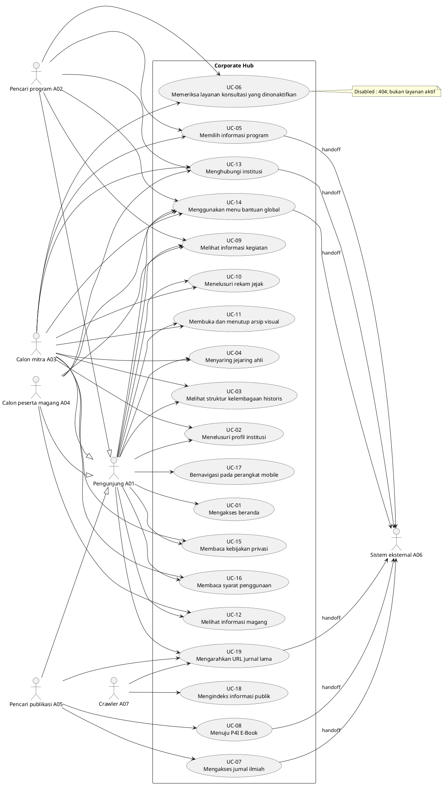

### D-03 — Master Activity

Siklus request, render, hydration, dan keputusan navigasi.  
**Sumber bukti:** EV-015, EV-018.  
**Status:** NOT_RENDER_VERIFIED.

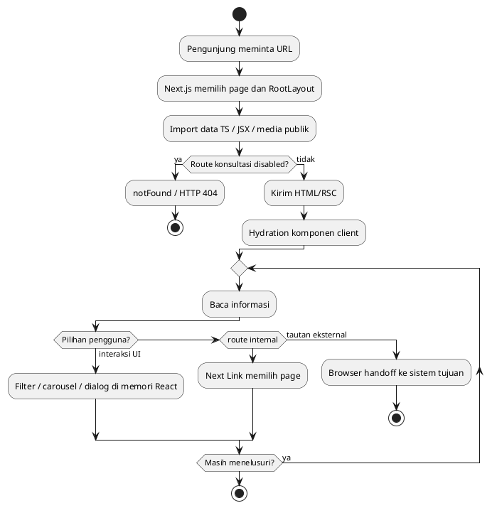

### D-04 — Activity Kontak

Portal hanya menyiapkan tautan; pengiriman pesan terjadi di aplikasi luar.  
**Sumber bukti:** EV-013, EV-001.  
**Status:** NOT_RENDER_VERIFIED.

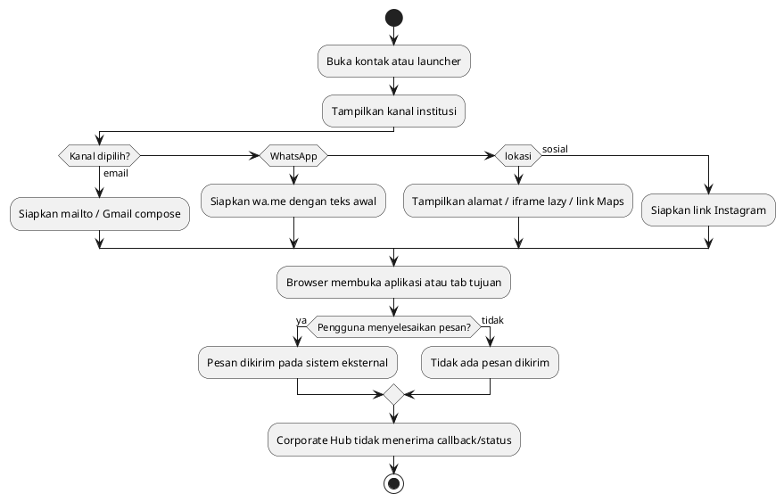

### D-05 — Activity Publikasi

OJS dan E-Book merupakan boundary sistem tersendiri.  
**Sumber bukti:** EV-020, EV-032.  
**Status:** NOT_RENDER_VERIFIED.

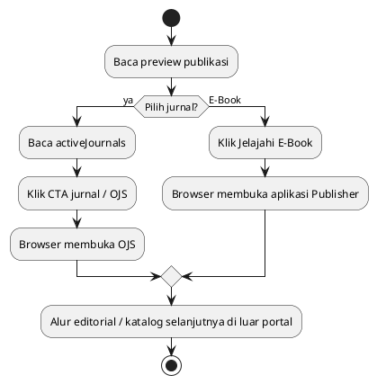

### D-06 — Activity Arsip dan Lightbox

Media di state sementara; tidak ada storage atau transaksi.  
**Sumber bukti:** EV-021, EV-009.  
**Status:** NOT_RENDER_VERIFIED.

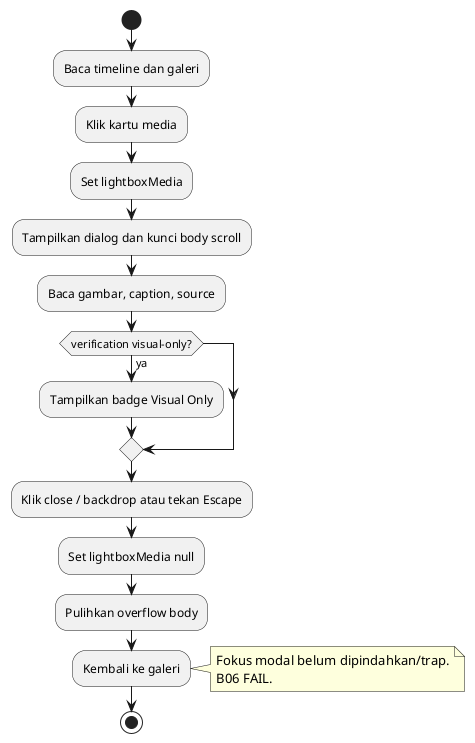

### D-07 — Activity Informasi Magang

Menggambarkan rendering aktual, termasuk gate consent yang tidak digunakan.  
**Sumber bukti:** EV-016, EV-031.  
**Status:** NOT_RENDER_VERIFIED.

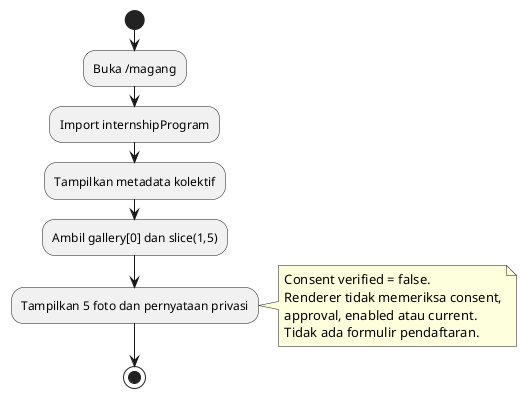

### D-08 — User Navigation Flow

Jalur nyata pengunjung dari home dan footer ke route atau boundary eksternal.  
**Sumber bukti:** EV-033, EV-018, EV-021.  
**Status:** NOT_RENDER_VERIFIED.

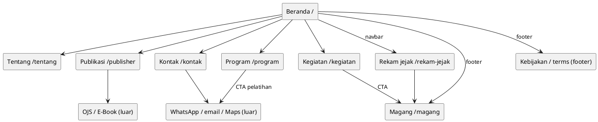

### D-09 — Sitemap / Information Architecture

Sebelas page routes dan endpoint konvensi; sitemap hanya sepuluh halaman aktif.  
**Sumber bukti:** EV-023, EV-033, EV-014.  
**Status:** NOT_RENDER_VERIFIED.

```plantuml
@startuml
rectangle "Root /" as Root
rectangle "/tentang" as A
rectangle "/program" as B
rectangle "/publisher" as C
rectangle "/rekam-jejak" as D
rectangle "/kegiatan" as E
rectangle "/magang" as F
rectangle "/kontak" as G
rectangle "/kebijakan-privasi" as H
rectangle "/syarat-ketentuan" as I
rectangle "/layanan/konsultasi
DISABLED 404" as J
rectangle "Metadata
sitemap.xml / robots.txt
opengraph-image / icon.png" as K
rectangle "Redirect /journal/:path*" as L
Root --> A
Root --> B
Root --> C
Root --> D
Root --> E
Root --> F
Root --> G
Root --> H
Root --> I
Root ..> J : route direct dormant
Root --> K
Root ..> L
@enduml
```

### D-10 — Component Diagram

Server dan client dibedakan; komponen dormant tidak dirangkai ke layout.  
**Sumber bukti:** EV-015, EV-025, EV-026.  
**Status:** NOT_RENDER_VERIFIED.

```plantuml
@startuml
component "RootLayout <<Server>>" as Layout
component "Navbar <<Client>>" as Nav
component "Footer <<Server>>" as Foot
component "ContactLauncher <<Client>>" as Launcher
component "Home / RekamJejak <<Client>>" as ClientPages
component "Tentang / Program / Publikasi
Kegiatan / Magang / Kontak / Kebijakan <<Server>>" as ServerPages
component "PageHero <<Client>>" as Hero
component "OrganizationChart <<Server>>" as Org
component "ExpertCarousel <<Client>>" as Expert
component "Lightbox <<Client>>" as Light
component "Data modules TS" as Data
component "ThemeProvider / ExpertNetwork / HistoricalGallery
<<Dormant>>" as Dormant
Layout --> Nav
Layout --> Foot
Layout --> Launcher
Layout --> ClientPages
Layout --> ServerPages
ClientPages --> Hero
ClientPages --> Light
ServerPages --> Hero
ServerPages --> Org
ServerPages --> Expert
Nav --> Data
Foot --> Data
ServerPages --> Data
ClientPages --> Data
note bottom of Dormant : Tidak diimport consumer aktif.
@enduml
```

### D-11 — Application Architecture

Lapisan konten, framework, rendering dan browser; database tidak ada.  
**Sumber bukti:** EV-015, EV-039, next.config.mjs.  
**Status:** NOT_RENDER_VERIFIED.

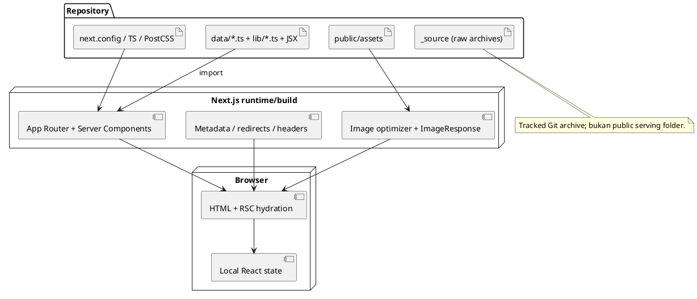

### D-12 — Data Flow Diagram

DFD logis konten statis dan UI; A06 menerima hanya handoff atau telemetry pihak ketiga.  
**Sumber bukti:** EV-027, EV-015, EV-001.  
**Status:** NOT_RENDER_VERIFIED.

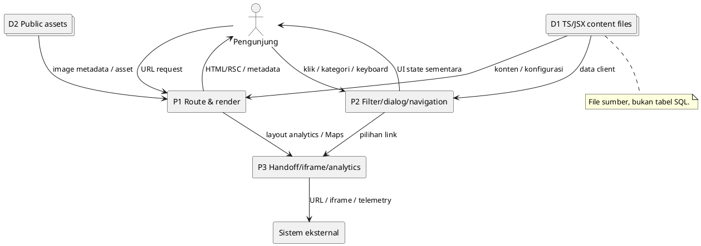

### D-13 — Logical Data Model

Interfaces dan komposisi arrays; tidak ada PK/FK/constraints SQL.  
**Sumber bukti:** EV-036, EV-034, EV-029, EV-031.  
**Status:** NOT_RENDER_VERIFIED.

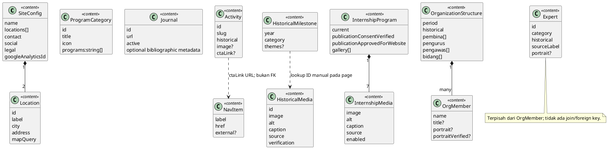

### D-14 — Sequence Interaksi Kontak

Tidak ada pesan otomatis dikirim oleh portal atau callback dari kanal.  
**Sumber bukti:** EV-013, EV-001.  
**Status:** NOT_RENDER_VERIFIED.

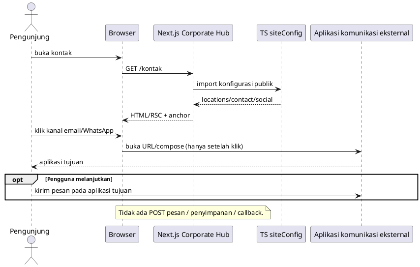

### D-15 — Deployment Diagram Logis

Bukti konfigurasi, bukan klaim hosting produksi; font access diperlukan saat build.  
**Sumber bukti:** next.config.mjs, EV-017, EV-015.  
**Status:** NOT_RENDER_VERIFIED.

```plantuml
@startuml
node "Mesin build/development lokal" as Build {
 artifact "Checkout main + lockfile" as Repo
 component "Node >=20.9 / npm ci / next build" as Tool
}
cloud "Google Fonts
fonts.googleapis.com / fonts.gstatic.com" as Fonts
node "Runtime Next.js produksi
provider belum diverifikasi" as Runtime {
 artifact ".next build output" as Bundle
 component "App Router / images / headers / redirects" as Server
}
node "Browser pengunjung" as Browser
cloud "OJS / E-Book / channels / Google" as Ext
Repo --> Tool
Tool --> Fonts : fetch Inter; BLOCKED saat audit
Tool ..> Bundle : build belum berhasil pada audit
Bundle --> Server
Browser --> Server : HTTP
Browser --> Ext : handoff / iframe / analytics
note bottom of Runtime : Tidak ada deployment dilakukan / server produksi diakses.
@enduml
```

### D-16 — Content Update Workflow di Luar Aplikasi

Rekonstruksi file-based maintenance; approval formal otomatis belum ada.  
**Sumber bukti:** EV-031, EV-040, EV-027.  
**Status:** NOT_RENDER_VERIFIED.

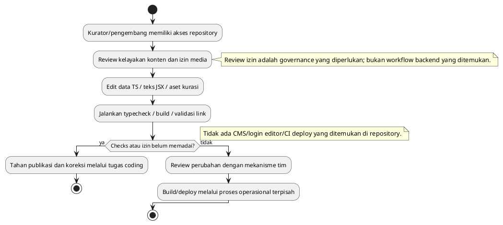

## 28. Source Evidence Register

Setiap EV di bawah adalah file yang dibaca pada commit audit. Rentang baris menunjukkan cakupan pembacaan seluruh file; URL permalink mengikat ke SHA. SHA-256 file lengkap disimpan dalam evidence inventory lokal dan lampiran JSON tanpa nilai data sensitif. Referensi file tidak membuktikan kebenaran narasi sejarah, persetujuan media, atau availability tujuan eksternal.

| ID | Lokasi | Cakupan | Status | Permalink/bukti |
| --- | --- | --- | --- | --- |
| EV-001 | app/components/contact/ContactLauncher.tsx | L1–L209 | SOURCE VERIFIED | https://github.com/HannR002/p4i-corporate-hub/blob/2e6ae709edaa1e21b4b71d15c7f8d43431296f57/app/components/contact/ContactLauncher.tsx#L1 |
| EV-002 | app/components/experts/ExpertCarousel.tsx | L1–L199 | SOURCE VERIFIED | https://github.com/HannR002/p4i-corporate-hub/blob/2e6ae709edaa1e21b4b71d15c7f8d43431296f57/app/components/experts/ExpertCarousel.tsx#L1 |
| EV-003 | app/components/experts/ExpertNetwork.tsx | L1–L111 | SOURCE VERIFIED | https://github.com/HannR002/p4i-corporate-hub/blob/2e6ae709edaa1e21b4b71d15c7f8d43431296f57/app/components/experts/ExpertNetwork.tsx#L1 |
| EV-004 | app/components/gallery/HistoricalGallery.tsx | L1–L129 | SOURCE VERIFIED | https://github.com/HannR002/p4i-corporate-hub/blob/2e6ae709edaa1e21b4b71d15c7f8d43431296f57/app/components/gallery/HistoricalGallery.tsx#L1 |
| EV-005 | app/components/layout/Footer.tsx | L1–L137 | SOURCE VERIFIED | https://github.com/HannR002/p4i-corporate-hub/blob/2e6ae709edaa1e21b4b71d15c7f8d43431296f57/app/components/layout/Footer.tsx#L1 |
| EV-006 | app/components/layout/Navbar.tsx | L1–L123 | SOURCE VERIFIED | https://github.com/HannR002/p4i-corporate-hub/blob/2e6ae709edaa1e21b4b71d15c7f8d43431296f57/app/components/layout/Navbar.tsx#L1 |
| EV-007 | app/components/layout/PageHero.tsx | L1–L117 | SOURCE VERIFIED | https://github.com/HannR002/p4i-corporate-hub/blob/2e6ae709edaa1e21b4b71d15c7f8d43431296f57/app/components/layout/PageHero.tsx#L1 |
| EV-008 | app/components/organization/OrganizationChart.tsx | L1–L164 | SOURCE VERIFIED | https://github.com/HannR002/p4i-corporate-hub/blob/2e6ae709edaa1e21b4b71d15c7f8d43431296f57/app/components/organization/OrganizationChart.tsx#L1 |
| EV-009 | app/components/ui/Lightbox.tsx | L1–L84 | SOURCE VERIFIED | https://github.com/HannR002/p4i-corporate-hub/blob/2e6ae709edaa1e21b4b71d15c7f8d43431296f57/app/components/ui/Lightbox.tsx#L1 |
| EV-010 | app/globals.css | L1–L30 | SOURCE VERIFIED | https://github.com/HannR002/p4i-corporate-hub/blob/2e6ae709edaa1e21b4b71d15c7f8d43431296f57/app/globals.css#L1 |
| EV-011 | app/kebijakan-privasi/page.tsx | L1–L58 | SOURCE VERIFIED | https://github.com/HannR002/p4i-corporate-hub/blob/2e6ae709edaa1e21b4b71d15c7f8d43431296f57/app/kebijakan-privasi/page.tsx#L1 |
| EV-012 | app/kegiatan/page.tsx | L1–L140 | SOURCE VERIFIED | https://github.com/HannR002/p4i-corporate-hub/blob/2e6ae709edaa1e21b4b71d15c7f8d43431296f57/app/kegiatan/page.tsx#L1 |
| EV-013 | app/kontak/page.tsx | L1–L188 | SOURCE VERIFIED | https://github.com/HannR002/p4i-corporate-hub/blob/2e6ae709edaa1e21b4b71d15c7f8d43431296f57/app/kontak/page.tsx#L1 |
| EV-014 | app/layanan/konsultasi/page.tsx | L1–L16 | SOURCE VERIFIED | https://github.com/HannR002/p4i-corporate-hub/blob/2e6ae709edaa1e21b4b71d15c7f8d43431296f57/app/layanan/konsultasi/page.tsx#L1 |
| EV-015 | app/layout.tsx | L1–L108 | SOURCE VERIFIED | https://github.com/HannR002/p4i-corporate-hub/blob/2e6ae709edaa1e21b4b71d15c7f8d43431296f57/app/layout.tsx#L1 |
| EV-016 | app/magang/page.tsx | L1–L143 | SOURCE VERIFIED | https://github.com/HannR002/p4i-corporate-hub/blob/2e6ae709edaa1e21b4b71d15c7f8d43431296f57/app/magang/page.tsx#L1 |
| EV-017 | app/opengraph-image.tsx | L1–L57 | SOURCE VERIFIED | https://github.com/HannR002/p4i-corporate-hub/blob/2e6ae709edaa1e21b4b71d15c7f8d43431296f57/app/opengraph-image.tsx#L1 |
| EV-018 | app/page.tsx | L1–L521 | SOURCE VERIFIED | https://github.com/HannR002/p4i-corporate-hub/blob/2e6ae709edaa1e21b4b71d15c7f8d43431296f57/app/page.tsx#L1 |
| EV-019 | app/program/page.tsx | L1–L103 | SOURCE VERIFIED | https://github.com/HannR002/p4i-corporate-hub/blob/2e6ae709edaa1e21b4b71d15c7f8d43431296f57/app/program/page.tsx#L1 |
| EV-020 | app/publisher/page.tsx | L1–L124 | SOURCE VERIFIED | https://github.com/HannR002/p4i-corporate-hub/blob/2e6ae709edaa1e21b4b71d15c7f8d43431296f57/app/publisher/page.tsx#L1 |
| EV-021 | app/rekam-jejak/page.tsx | L1–L247 | SOURCE VERIFIED | https://github.com/HannR002/p4i-corporate-hub/blob/2e6ae709edaa1e21b4b71d15c7f8d43431296f57/app/rekam-jejak/page.tsx#L1 |
| EV-022 | app/robots.ts | L1–L12 | SOURCE VERIFIED | https://github.com/HannR002/p4i-corporate-hub/blob/2e6ae709edaa1e21b4b71d15c7f8d43431296f57/app/robots.ts#L1 |
| EV-023 | app/sitemap.ts | L1–L24 | SOURCE VERIFIED | https://github.com/HannR002/p4i-corporate-hub/blob/2e6ae709edaa1e21b4b71d15c7f8d43431296f57/app/sitemap.ts#L1 |
| EV-024 | app/syarat-ketentuan/page.tsx | L1–L61 | SOURCE VERIFIED | https://github.com/HannR002/p4i-corporate-hub/blob/2e6ae709edaa1e21b4b71d15c7f8d43431296f57/app/syarat-ketentuan/page.tsx#L1 |
| EV-025 | app/tentang/page.tsx | L1–L272 | SOURCE VERIFIED | https://github.com/HannR002/p4i-corporate-hub/blob/2e6ae709edaa1e21b4b71d15c7f8d43431296f57/app/tentang/page.tsx#L1 |
| EV-026 | components/ThemeProvider.tsx | L1–L9 | SOURCE VERIFIED | https://github.com/HannR002/p4i-corporate-hub/blob/2e6ae709edaa1e21b4b71d15c7f8d43431296f57/components/ThemeProvider.tsx#L1 |
| EV-027 | data/activities.ts | L1–L151 | SOURCE VERIFIED | https://github.com/HannR002/p4i-corporate-hub/blob/2e6ae709edaa1e21b4b71d15c7f8d43431296f57/data/activities.ts#L1 |
| EV-028 | data/experts.ts | L1–L235 | SOURCE VERIFIED | https://github.com/HannR002/p4i-corporate-hub/blob/2e6ae709edaa1e21b4b71d15c7f8d43431296f57/data/experts.ts#L1 |
| EV-029 | data/historical-media.ts | L1–L142 | SOURCE VERIFIED | https://github.com/HannR002/p4i-corporate-hub/blob/2e6ae709edaa1e21b4b71d15c7f8d43431296f57/data/historical-media.ts#L1 |
| EV-030 | data/history.ts | L1–L118 | SOURCE VERIFIED | https://github.com/HannR002/p4i-corporate-hub/blob/2e6ae709edaa1e21b4b71d15c7f8d43431296f57/data/history.ts#L1 |
| EV-031 | data/internship.ts | L1–L61 | SOURCE VERIFIED | https://github.com/HannR002/p4i-corporate-hub/blob/2e6ae709edaa1e21b4b71d15c7f8d43431296f57/data/internship.ts#L1 |
| EV-032 | data/journals.ts | L1–L47 | SOURCE VERIFIED | https://github.com/HannR002/p4i-corporate-hub/blob/2e6ae709edaa1e21b4b71d15c7f8d43431296f57/data/journals.ts#L1 |
| EV-033 | data/navigation.ts | L1–L34 | SOURCE VERIFIED | https://github.com/HannR002/p4i-corporate-hub/blob/2e6ae709edaa1e21b4b71d15c7f8d43431296f57/data/navigation.ts#L1 |
| EV-034 | data/organization.ts | L1–L85 | SOURCE VERIFIED | https://github.com/HannR002/p4i-corporate-hub/blob/2e6ae709edaa1e21b4b71d15c7f8d43431296f57/data/organization.ts#L1 |
| EV-035 | data/platforms.ts | L1–L39 | SOURCE VERIFIED | https://github.com/HannR002/p4i-corporate-hub/blob/2e6ae709edaa1e21b4b71d15c7f8d43431296f57/data/platforms.ts#L1 |
| EV-036 | data/programs.ts | L1–L75 | SOURCE VERIFIED | https://github.com/HannR002/p4i-corporate-hub/blob/2e6ae709edaa1e21b4b71d15c7f8d43431296f57/data/programs.ts#L1 |
| EV-037 | data/timeline.ts | L1–L42 | SOURCE VERIFIED | https://github.com/HannR002/p4i-corporate-hub/blob/2e6ae709edaa1e21b4b71d15c7f8d43431296f57/data/timeline.ts#L1 |
| EV-038 | lib/features.ts | L1–L29 | SOURCE VERIFIED | https://github.com/HannR002/p4i-corporate-hub/blob/2e6ae709edaa1e21b4b71d15c7f8d43431296f57/lib/features.ts#L1 |
| EV-039 | lib/site-config.ts | L1–L66 | SOURCE VERIFIED | https://github.com/HannR002/p4i-corporate-hub/blob/2e6ae709edaa1e21b4b71d15c7f8d43431296f57/lib/site-config.ts#L1 |
| EV-040 | scripts/process-logo.js | L1–L47 | SOURCE VERIFIED | https://github.com/HannR002/p4i-corporate-hub/blob/2e6ae709edaa1e21b4b71d15c7f8d43431296f57/scripts/process-logo.js#L1 |
| EV-041 | package.json | Seluruh konfigurasi/inventaris | SOURCE VERIFIED | https://github.com/HannR002/p4i-corporate-hub/blob/2e6ae709edaa1e21b4b71d15c7f8d43431296f57/package.json |
| EV-042 | package-lock.json | Seluruh konfigurasi/inventaris | SOURCE VERIFIED | https://github.com/HannR002/p4i-corporate-hub/blob/2e6ae709edaa1e21b4b71d15c7f8d43431296f57/package-lock.json |
| EV-043 | tsconfig.json | Seluruh konfigurasi/inventaris | SOURCE VERIFIED | https://github.com/HannR002/p4i-corporate-hub/blob/2e6ae709edaa1e21b4b71d15c7f8d43431296f57/tsconfig.json |
| EV-044 | next.config.mjs | Seluruh konfigurasi/inventaris | SOURCE VERIFIED | https://github.com/HannR002/p4i-corporate-hub/blob/2e6ae709edaa1e21b4b71d15c7f8d43431296f57/next.config.mjs |
| EV-045 | postcss.config.js | Seluruh konfigurasi/inventaris | SOURCE VERIFIED | https://github.com/HannR002/p4i-corporate-hub/blob/2e6ae709edaa1e21b4b71d15c7f8d43431296f57/postcss.config.js |
| EV-046 | tailwind.config.js | Seluruh konfigurasi/inventaris | SOURCE VERIFIED | https://github.com/HannR002/p4i-corporate-hub/blob/2e6ae709edaa1e21b4b71d15c7f8d43431296f57/tailwind.config.js |
| EV-047 | AGENTS.md | Seluruh konfigurasi/inventaris | SOURCE VERIFIED | https://github.com/HannR002/p4i-corporate-hub/blob/2e6ae709edaa1e21b4b71d15c7f8d43431296f57/AGENTS.md |
| EV-048 | .gitignore | Seluruh konfigurasi/inventaris | SOURCE VERIFIED | https://github.com/HannR002/p4i-corporate-hub/blob/2e6ae709edaa1e21b4b71d15c7f8d43431296f57/.gitignore |
| EV-049 | _source/ | 38 tracked files; scan DOCX/XML/media terbatas | INDICATORS VERIFIED; publication basis UNVERIFIED | Lokasi diperiksa; isi pribadi tidak disalin |
| EV-050 | public/ dan app/icon.png | 21 public assets; icon convention | INVENTORY VERIFIED; dua referensi hero FAIL | Filesystem dan GET lokal |
| EV-051 | Runtime npm/Node/typecheck/build | Run audit 9 Oktober 2026 | PASS install/typecheck; build ENVIRONMENT BLOCKED | Lampiran evidence results |
| EV-052 | npm audit JSON | Run audit saat ini | 19 affected packages | Advisory table bagian 17 |
| EV-053 | HTTP route results | 16 representative local requests | Expected responses VERIFIED | Route matrix bagian 20 |
| EV-054 | Browser checks Chromium | 9 checks; third parties blocked | 7 PASS / 2 FAIL | Browser matrix bagian 20 |

### Temuan belum terverifikasi

1. Hosting/runtime/CSP/HSTS/proxy produksi dan deploy pipeline aktual.
2. Kebenaran sejarah/struktur/claim institusi, status aktif layanan bisnis, dan hak publikasi materi.
3. Bukti izin foto/portrait, termasuk kategori usia/izin wali bila berlaku, dan proses pencabutan.
4. Dasar/konfigurasi/retensi/cookies Analytics dan Maps; compliance hukum formal.
5. Availability, otorisasi, keamanan dan transaksi OJS/E-Book/kanal luar; tidak diakses.
6. Exploitability advisories pada hosting nyata; audit tidak melakukan exploit.
7. Build produksi setelah prasyarat font diperbaiki, production start, CWV/Lighthouse.
8. WCAG penuh, screen-reader, keyboard lengkap, semua viewport dan studi usability.
9. Secret di history Git, OCR media, dan seluruh format credential; scan terbatas working tree.
10. Rendering PlantUML; kode tersedia lengkap dengan status NOT_RENDER_VERIFIED.

Tidak ada kekurangan tersebut yang ditandai PASS. Verifikasi history/credential/production memerlukan ruang lingkup terpisah sesuai otorisasi.

## 29. Glosarium

| Istilah | Definisi dalam laporan |
| --- | --- |
| AS-IS | Implementasi pada commit yang diaudit |
| TO-BE | Usulan kebutuhan/arsitektur, belum diimplementasikan |
| Actor | Entitas yang berinteraksi; persona bukan role login |
| RBAC | Kontrol hak berbasis role autentikasi; tidak ditemukan |
| RSC | React Server Components dan payload rendering/navigation |
| Hydration | Mengaktifkan interaksi client pada output awal server |
| Handoff | Navigasi keluar ke sistem yang menangani proses lanjutan |
| Metadata route | Endpoint konvensi Next untuk sitemap/robots/OG/icon |
| Logical Data Model | Struktur object/array konten tanpa asumsi persistence SQL |
| Consent metadata | Atribut status pada source; bukan bukti persetujuan |
| Source verified | File/consumer diperiksa, bukan klaim fakta bisnis benar |
| NOT TESTED | Pemeriksaan tidak dijalankan |
| NOT_RENDER_VERIFIED | Kode diagram tersedia tetapi renderer belum dijalankan |
| Environment blocked | Prasyarat lingkungan menghalangi operasi, misalnya font network |
| Vulnerable package entry | Entri paket npm audit; bukan jumlah exploit unik |
| Ready for review | Laporan lengkap untuk ditinjau, bukan production readiness |

### Ringkasan terstruktur hasil akhir

```text
REPOSITORY=HannR002/p4i-corporate-hub
BRANCH_ANALYZED=main
COMMIT_SHA=2e6ae709edaa1e21b4b71d15c7f8d43431296f57
REPORT_PATH=docs/LAPORAN_ANALISIS_KOMPREHENSIF_P4I_CORPORATE_HUB_CODEX.md
DOCX_PATH=docs/LAPORAN_ANALISIS_KOMPREHENSIF_P4I_CORPORATE_HUB_CODEX.docx
TOTAL_ROUTES=11
TOTAL_MODULES=10
TOTAL_FEATURES=31
TOTAL_ACTORS=7
TOTAL_AUTHENTICATED_ROLES=0
DATABASE_DETECTED=NO
DATA_MODEL_TYPE=STATIC_TYPESCRIPT_CONTENT_LOGICAL_MODEL
TOTAL_USE_CASES=19
TOTAL_USE_CASE_SPECIFICATIONS=19
TOTAL_DIAGRAMS=16
TOTAL_FUNCTIONAL_REQUIREMENTS=24
TOTAL_NON_FUNCTIONAL_REQUIREMENTS=12
SOURCE_EVIDENCE_VERIFIED=YES: 40 program source files plus config; runtime limited as documented
TESTING_STATUS=Install/typecheck PASS; build ENVIRONMENT_BLOCKED; local routes PASS expected; browser 7 PASS/2 FAIL; npm audit 19 affected packages
SECURITY_PRIVACY_FINDINGS=8
UNVERIFIED_ITEMS=10
SOURCE_CODE_MODIFIED=NO
GITHUB_PUSH_EXECUTED=NO
PRODUCTION_ACCESSED=NO
DEPLOYMENT_EXECUTED=NO
REPORT_READY_FOR_REVIEW=true
```
