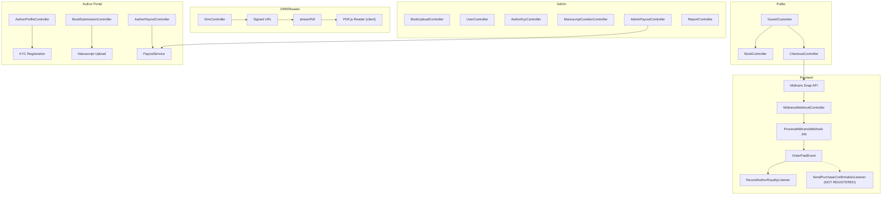
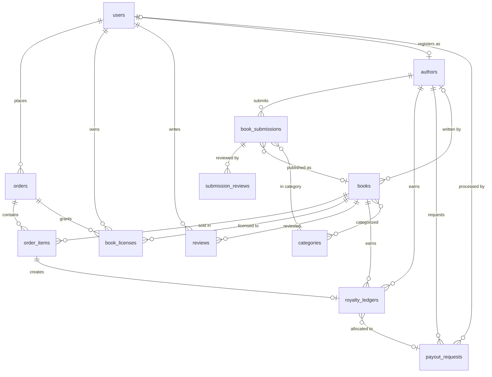

# 02 — ARCHITECTURE AND DATA MODEL

**Audit Date:** 2026-09-21

---

## 1. Request Flow Architecture

```
Browser Request
    → Route (web.php / auth.php)
        → Global Middleware (EnsureAccountIsActive)
            → Route Middleware (auth, admin, author, author.verified, throttle, signed)
                → Controller
                    → Form Request Validation (where applicable)
                        → Service Layer (PayoutService, OrderIdGenerator)
                            → Eloquent Model (DB Transaction)
                                → Event (OrderPaidEvent)
                                    → Queued Listener (RecordAuthorRoyaltyListener)
                                    → Queued Listener (SendPurchaseConfirmationListener — NOT REGISTERED)
                                → Queued Job (ProcessMidtransWebhook)
    → Blade View Response
```

---

## 2. Domain Architecture Diagram



---

## 3. Database Entity Relationship



---

## 4. Table Schema Details

### 4.1 `users`

| Column | Type | Nullable | Constraint | Notes |
|---|---|---|---|---|
| id | bigint PK | No | auto_increment | — |
| name | string | No | — | — |
| email | string | No | unique | — |
| email_verified_at | timestamp | Yes | — | — |
| password | string | No | — | hashed cast |
| is_admin | boolean | No | default false | ⚠️ Only admin mechanism |
| is_active | boolean | No | default true | Account suspension |
| remember_token | string | Yes | — | — |
| timestamps | — | — | — | — |

### 4.2 `books`

| Column | Type | Nullable | Constraint | Notes |
|---|---|---|---|---|
| id | bigint PK | No | auto_increment | — |
| title | string | No | — | — |
| slug | string | No | unique | Auto-generated |
| author | string | No | — | ⚠️ Denormalized text field |
| author_id | FK→authors | Yes | — | Added later via migration |
| description | text | Yes | — | — |
| price | decimal(10,2) | No | — | ⚠️ Only one price per book |
| isbn | string | Yes | — | Added later, not unique |
| pages | integer | Yes | — | — |
| publish_date | date | Yes | — | — |
| cover_image_path | string | Yes | — | Public storage URL |
| file_path | string | No | — | Private storage path |
| is_published | boolean | No | default false | — |
| timestamps | — | — | — | — |

**Issues:**
- `author` (text) AND `author_id` (FK) coexist — redundant/inconsistent
- `isbn` not unique — allows duplicate ISBNs
- Only supports ONE file (PDF) and ONE price — cannot model editions/formats
- No `language`, `publisher`, `edition`, `format`, `weight`, `dimensions`, `stock`

### 4.3 `orders`

| Column | Type | Nullable | Constraint | Notes |
|---|---|---|---|---|
| id | string PK | No | ULID | — |
| user_id | FK→users | No | cascade delete | ⚠️ Deleting user destroys order history |
| gross_amount | decimal(12,2) | No | — | — |
| status | enum | No | pending/success/failed/expired | — |
| payment_type | string | Yes | — | Set by webhook |
| snap_token | string | Yes | — | Encrypted cast |
| timestamps | — | — | — | — |

**Issues:**
- No `refunded` or `chargeback` status
- `cascade delete` on user_id — financial records should never cascade delete

### 4.4 `order_items`

| Column | Type | Nullable | Constraint | Notes |
|---|---|---|---|---|
| id | bigint PK | No | auto_increment | — |
| order_id | FK→orders | No | cascade delete | — |
| book_id | FK→books | No | **cascade delete** | ⚠️ CRITICAL: Deleting book destroys order items |
| price | decimal(10,2) | No | — | Locked at checkout |
| timestamps | — | — | — | — |

**Issues:**
- `book_id onDelete('cascade')` — destroying financial records when book deleted
- No `quantity` field (currently hardcoded to 1)

### 4.5 `book_licenses`

| Column | Type | Nullable | Constraint | Notes |
|---|---|---|---|---|
| id | bigint PK | No | auto_increment | — |
| user_id | FK→users | No | **cascade delete** | ⚠️ Deleting user loses all license records |
| book_id | FK→books | No | FK constrained | Changed cascade behavior in later migration |
| order_id | FK→orders | Yes | set null | — |
| license_key | string | No | unique | UUID |
| status | enum | No | active/revoked | — |
| valid_until | timestamp | Yes | — | Not used currently |
| last_read_page | integer | Yes | — | Bookmark/progress |
| revocation_reason | string | Yes | — | — |
| timestamps | — | — | — | — |

**Issues:**
- Unique constraint on (user_id, book_id) added — prevents duplicate licenses correctly
- `cascade delete` on user — should use soft deletes

### 4.6 `authors`

| Column | Type | Nullable | Constraint | Notes |
|---|---|---|---|---|
| id | bigint PK | No | auto_increment | — |
| user_id | FK→users | No | unique, cascade delete | One author per user |
| pen_name | string(150) | No | — | — |
| bio | text | Yes | — | — |
| id_card_number | text | No | — | ✅ Encrypted cast in model |
| id_card_path | string(255) | Yes | — | Private storage |
| bank_name | string(50) | Yes | — | ⚠️ NOT encrypted |
| bank_account | string(50) | Yes | — | ⚠️ NOT encrypted |
| bank_holder_name | string(150) | Yes | — | ⚠️ NOT encrypted |
| kyc_status | enum | No | unverified/pending/verified/rejected | — |
| rejection_reason | text | Yes | — | — |
| verified_at | timestamp | Yes | — | — |
| timestamps | — | — | — | — |

### 4.7 `royalty_ledgers`

| Column | Type | Nullable | Constraint | Notes |
|---|---|---|---|---|
| id | bigint PK | No | auto_increment | — |
| author_id | FK→authors | No | restrict delete | — |
| order_item_id | FK→order_items | No | **unique**, restrict delete | ⚠️ Conflicts with ledger splitting |
| book_id | FK→books | No | restrict delete | — |
| payout_request_id | FK→payout_requests | Yes | set null | Added in later migration |
| gross_sale | decimal(12,2) | No | — | — |
| author_percentage | decimal(5,2) | No | default 70.00 | — |
| author_earning | decimal(12,2) | No | — | ⚠️ Mutated during partial payout |
| platform_earning | decimal(12,2) | No | — | ⚠️ Mutated during partial payout |
| status | enum | No | pending/available/withdrawn | — |
| timestamps | — | — | — | — |

### 4.8 `payout_requests`

| Column | Type | Nullable | Constraint | Notes |
|---|---|---|---|---|
| id | string(26) PK | No | ULID | — |
| author_id | FK→authors | No | restrict delete | — |
| amount | decimal(12,2) | No | — | — |
| bank_name_snapshot | string(50) | Yes | — | ⚠️ NOT encrypted |
| bank_account_snapshot | string(50) | Yes | — | ⚠️ NOT encrypted |
| bank_holder_name_snapshot | string(150) | Yes | — | ⚠️ NOT encrypted |
| status | enum | No | requested/processing/completed/rejected | — |
| transfer_proof_path | string(255) | Yes | — | Private storage |
| reference_number | string(100) | Yes | — | — |
| admin_notes | text | Yes | — | — |
| processed_by | FK→users | Yes | set null | — |
| processed_at | timestamp | Yes | — | — |
| timestamps | — | — | — | — |

---

## 5. Domain Flow Analysis

### 5.1 Authentication Flow

```
Register → User Created (is_admin=false, is_active=true) → Auto Login → Redirect /books
Login → Email/Password → Rate Limited (5 attempts) → Session
Logout → Session Invalidated
Password Reset → Email Token → Reset Form → Updated
```

**Roles:** Guest | Authenticated User | Author (KYC verified) | Admin (is_admin=true)

### 5.2 Book Purchase Flow (Paid)

```
Book Detail → Checkout (POST /checkout) 
    → Validate book_ids exist & published
    → Check no existing active license (repurchase prevention)
    → Calculate gross_amount from LIVE book prices
    → DB::transaction {
        Create Order (pending)
        Create OrderItems (lock price)
        Call Midtrans Snap API → Get snap_token
        Save encrypted snap_token
    }
    → Redirect to checkout.show (payment page)
    
[User pays via Midtrans Snap popup]
    
[Midtrans sends webhook POST /api/midtrans/webhook]
    → CheckMidtransIp middleware (production only)
    → CSRF excluded
    → Verify signature (SHA-512)
    → Replay protection (cache fingerprint, 5 min TTL)
    → Dispatch ProcessMidtransWebhook Job (queued)
    
[ProcessMidtransWebhook Job]
    → DB::transaction with lockForUpdate
    → Check idempotency (skip if already success)
    → If capture/settlement:
        Set order.status = 'success'
        BookLicense::firstOrCreate for each item
        Fire OrderPaidEvent
    → If cancel/deny: status = 'failed'
    → If expire: status = 'expired'
    
[OrderPaidEvent]
    → RecordAuthorRoyaltyListener (queued):
        For each order item with author_id:
            RoyaltyLedger::firstOrCreate (status: available)
            70% author / 30% platform split
    → SendPurchaseConfirmationListener: NOT REGISTERED ⚠️
```

### 5.3 Free Book Flow

```
Book Detail (price=0) → Checkout
    → gross_amount = 0 detected
    → DB::transaction {
        Create Order (status='success', payment_type='free')
        Create OrderItems (price=0)
        BookLicense::firstOrCreate (active)
    }
    → Fire OrderPaidEvent (creates royalty of Rp 0)
    → Redirect to My Library
```

### 5.4 Author Registration & KYC

```
User → /author/register → Fill Form:
    pen_name, bio, id_card_number, id_card_file, bank details
    → RegisterAuthorRequest validation (NIK 16 digits regex)
    → Store id_card to private/kyc (local disk)
    → Create Author (kyc_status='pending')
    → Redirect to /author/kyc-status

Admin → /admin/kyc → Review pending authors
    → View ID card (streamed from private storage)
    → Approve → kyc_status='verified', verified_at=now()
    → OR Reject → kyc_status='rejected' + reason
```

### 5.5 Book Submission Workflow

```
Author (verified) → /author/submissions/create
    → Upload manuscript (PDF), cover preview, synopsis, proposed price
    → StoreSubmissionRequest (magic bytes validation)
    → Status: 'draft' or 'submitted'

Admin → /admin/curation
    → View submission → Auto-set 'in_review'
    → Stream manuscript PDF
    → Request Revision → status='revision_requested' + SubmissionReview
    → Reject → status='rejected' + SubmissionReview
    → Approve & Publish → DB::transaction {
        Copy manuscript to private/private_books/
        Create Book record
        Sync categories
        Create SubmissionReview
        Update submission: status='published', book_id=new_book.id
    }
```

### 5.6 Royalty & Payout Flow

```
[Sale occurs → OrderPaidEvent → RecordAuthorRoyaltyListener]
    → RoyaltyLedger created: status='available'

Author → /author/payouts → View balance → Request Payout
    → PayoutService::requestPayout():
        Verify KYC, minimum Rp 100,000, bank data complete
        DB::transaction with lockForUpdate:
            Fetch 'available' ledgers FIFO
            Check total >= requested amount
            Create PayoutRequest (status='requested')
            FIFO allocation:
                Full ledgers: status='pending', payout_request_id=payout
                Partial ledger: ⚠️ MUTATES original record + creates split remainder
        
Admin → /admin/payouts → Review requests
    → Complete: ledgers→'withdrawn', payout→'completed', ref number, proof
    → Reject: ledgers→'available' (released), payout→'rejected'
```

### 5.7 DRM / Reader Flow

```
User → /reader/{bookId}
    → Verify auth + active license
    → Generate temporarySignedRoute (15 min, IP bound)
    → Return reader.blade.php with streamUrl, licenseKey, email, IP

Reader (client-side):
    → PDF.js loads PDF from signed URL
    → Canvas watermark (email + IP + key, opacity 0.15)
    → Anti-devtools key blocking (F12, Ctrl+Shift+I, Ctrl+P, Ctrl+S)
    → Context menu disabled
    → IntersectionObserver tracks visible page → POST /drm/progress (debounced 1s)

Stream URL → /drm/stream/{license_key}
    → Validate signed URL
    → Validate IP match
    → Verify active license
    → Stream PDF via fpassthru() (memory efficient)
    → Headers: no-cache, inline disposition
```

---

## 6. Consistency Analysis

### Migration vs Model vs Controller Inconsistencies

| Issue | Description |
|---|---|
| `submission_reviews.notes` | ManuscriptCurationController writes 'notes' field (L78, L103, L155) but migration has no 'notes' column — only 'feedback' and 'action' |
| `Book.author` (text) vs `Book.author_id` (FK) | Both exist — redundant, one is denormalized text from admin upload, other is FK from submission workflow |
| RoyaltyLedger `unique(order_item_id)` vs ledger splitting | PayoutService creates new ledger rows from split, which would need same order_item_id — violates unique constraint |
| OrderIdGenerator comment says "INV-{YYYYMMDD}" | But actual implementation uses ULID — comment is outdated |
| `BookUploadController.store` has duplicate validation key | `'is_published' => 'nullable|boolean'` appears twice at L68-69 |
