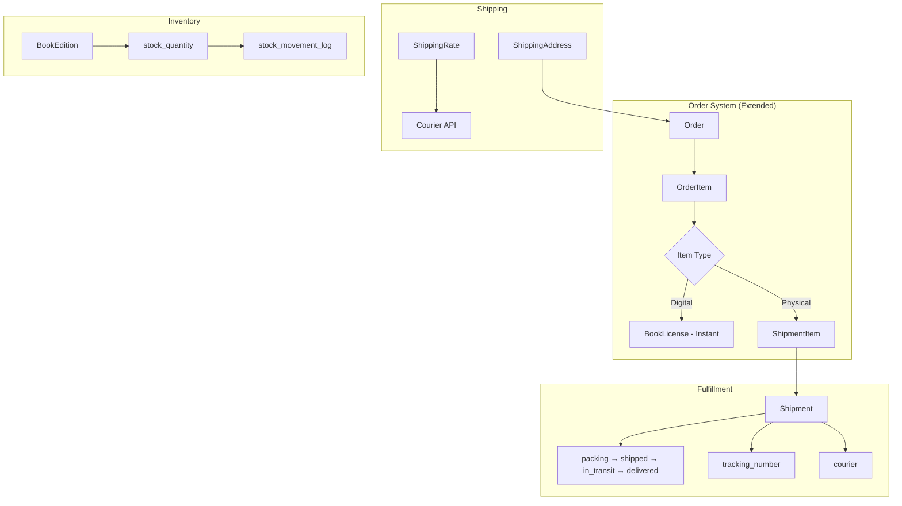

# 05 — BOOK PLATFORM GAP ANALYSIS

**Audit Date:** 2026-09-21  
**Current State:** E-Book Only Platform  
**Target State:** P4I Digital Book Publishing Platform (E-Book + Physical Books + Digital Library + Author Center)

---

## 1. Product Model Gap (Tahap 9)

### Current Book Model

The `Book` model currently supports:
- **1 file** (PDF via `file_path`)
- **1 price** (`price` decimal)
- **1 format** (implied PDF/e-book)
- Text `author` field + optional `author_id` FK (redundant)

### Required Multi-Format Architecture

```
┌─────────────────┐
│  Book (Title)    │  ← Represents the intellectual work
│  - title         │
│  - slug          │
│  - description   │
│  - author_id     │
│  - language      │
│  - publisher     │
│  - publication_year │
│  - is_published  │
└────────┬────────┘
         │ 1:N
         ▼
┌─────────────────────────────────┐
│  BookEdition / BookVariant      │  ← Physical or digital format
│  - book_id (FK)                 │
│  - format: enum(pdf, epub,      │
│    paperback, hardcover)        │
│  - isbn (unique)                │
│  - price                        │
│  - sku                          │
│  - weight_grams (physical)      │
│  - dimensions (physical)        │
│  - stock_quantity (physical)    │
│  - file_path (digital)         │
│  - cover_image_path            │
│  - pages                        │
│  - production_status            │
│  - edition_label (e.g., "1st")  │
│  - is_active                    │
└─────────────────────────────────┘
```

**Example:**
```
"Buku Pemrograman Laravel" (Book)
├── PDF/E-Book Edition    → Rp 50.000, ISBN 978-xxx-1, file: book.pdf
├── Paperback Edition     → Rp 85.000, ISBN 978-xxx-2, 350g, 15x23cm, stock: 100
└── Hardcover Edition     → Rp 125.000, ISBN 978-xxx-3, 500g, 15x23cm, stock: 50
```

### Fields Needed for Physical Books

| Field | Type | Notes |
|---|---|---|
| sku | string, unique | Stock Keeping Unit |
| isbn | string, unique per edition | — |
| format | enum | pdf, epub, paperback, hardcover |
| weight_grams | integer | For shipping calculation |
| dimensions | string | "15x23x2 cm" |
| stock_quantity | integer | Current inventory |
| low_stock_threshold | integer | Alert when below |
| production_status | enum | in_production, available, out_of_print |
| cover_type | string | Matte, glossy, etc. |
| edition_label | string | "1st Edition", "Revised" |

---

## 2. Free Book & Paid Book Gap (Tahap 10)

### Current Implementation

| Scenario | Status | Notes |
|---|---|---|
| Free book checkout (price=0) | ✅ WORKING | Bypasses Midtrans, creates Order(status='success', payment_type='free') + License |
| Paid book checkout | ✅ WORKING | Midtrans Snap integration |
| Prevent repurchase | ✅ WORKING | Checks existing active license |
| Free book creates Order | ⚠️ QUESTIONABLE | Creates full Order/OrderItem even for free books |

### Analysis: Should Free Books Create Orders?

**Current approach:** Free books create a full `Order` with `status='success'` and `payment_type='free'`.

**Pros:**
- Consistent tracking — all acquisitions have an order record
- Royalty listener can fire (creates Rp 0 royalty entry)
- Unified "My Orders" page shows all acquisitions

**Cons:**
- Pollutes financial reports (Rp 0 orders mixed with real revenue)
- Creates unnecessary royalty ledger entries (Rp 0)
- No clear distinction between "acquired for free" and "purchased"

**Recommendation:** Keep the Order model for free books BUT:
1. Add `acquisition_type` field: `purchase` | `free` | `promotion` | `gift`
2. Filter reports to exclude `payment_type='free'`
3. Skip royalty recording for price=0 items
4. Consider a simpler "Claim" mechanism for free books that only creates the license

---

## 3. Online Library Gap (Tahap 11)

### Feature Matrix

| Feature | Status | Notes |
|---|---|---|
| My Library (owned books) | ✅ EXISTS | Basic grid of owned books |
| Read button → Reader | ✅ EXISTS | Links to DRM reader |
| My Orders | ✅ EXISTS | Paginated order history |
| Book search in catalog | ✅ EXISTS | Text search |
| Categories | 🟡 PARTIAL | Exists in DB but no category filter UI |
| Reading progress (last page) | ✅ EXISTS | Auto-saved via IntersectionObserver |
| Resume reading (continue) | ✅ EXISTS | Scrolls to last read page |
| **Collections / Shelves** | ❌ NOT IMPLEMENTED | Cannot organize books |
| **Favorites / Wishlist** | ❌ NOT IMPLEMENTED | Cannot save books for later |
| **"Continue Reading" section** | ❌ NOT IMPLEMENTED | Library doesn't show last-read books first |
| **"Last Read" timestamp** | ❌ NOT IMPLEMENTED | No last_accessed_at on license |
| **"Recently Added" section** | 🟡 PARTIAL | Homepage shows 4 latest, but no dedicated section |
| **Popular books** | ❌ NOT IMPLEMENTED | No view/purchase count sorting |
| **Recommended books** | ❌ NOT IMPLEMENTED | No recommendation engine |
| **Author pages** | ❌ NOT IMPLEMENTED | No public author profile page |
| **Publisher info** | ❌ NOT IMPLEMENTED | No publisher field on books |
| **Search within library** | ❌ NOT IMPLEMENTED | My Library has no search |
| **Download for offline** | ❌ NOT IMPLEMENTED | Reader is online-only |
| **Reading statistics** | ❌ NOT IMPLEMENTED | No time spent, pages read |
| **Book ratings summary** | 🟡 PARTIAL | Reviews exist but no average rating display in catalog |

---

## 4. Author Center Gap (Tahap 12)

### Target Menu vs Current Implementation

| Menu Item | Status | Controller/View | Notes |
|---|---|---|---|
| **Dashboard** | ❌ BROKEN | `AuthorDashboardController` DOES NOT EXIST | Route references missing class |
| **Buku Saya** (My Books) | ❌ NOT IMPLEMENTED | — | No page to see author's published books |
| **Naskah Saya** (My Manuscripts) | ✅ EXISTS | `BookSubmissionController::index()` | Paginated submission list |
| **Tambah/Submit Naskah** | ✅ EXISTS | `BookSubmissionController::create/store()` | Upload form with magic bytes |
| **Status Penerbitan** | ✅ EXISTS | `BookSubmissionController::show()` | Shows status + review history |
| **Penjualan** (Sales) | ❌ NOT IMPLEMENTED | — | No sales/revenue dashboard |
| **Royalti** | 🟡 PARTIAL | Balance shown in payouts page | No detailed royalty ledger view |
| **Payout** | ✅ EXISTS | `AuthorPayoutController` | Request payout + history |
| **Profil Penulis** | ❌ NOT IMPLEMENTED | — | Cannot edit pen name, bio after registration |
| **Verifikasi Penulis** | ✅ EXISTS | `AuthorProfileController::kycStatus()` | Status page |
| **Rekening Pembayaran** | ❌ NOT IMPLEMENTED | — | Cannot update bank details |
| **Notifikasi** | ❌ NOT IMPLEMENTED | — | No notification system |
| **Dokumen/Perjanjian** | ❌ NOT IMPLEMENTED | — | No publishing agreements |

---

## 5. Book Publishing Workflow Gap (Tahap 13)

### Current Status Transitions

```
draft → submitted → in_review → revision_requested → approved/rejected → published
```

### Transition Analysis

| Transition | Who | How | Guarded? |
|---|---|---|---|
| draft → submitted | Author | Store/Update with action='submit' | ✅ |
| submitted → in_review | Admin | Auto on view (`show()`) | ⚠️ Implicit, no explicit action |
| in_review → revision_requested | Admin | `requestRevision()` | ✅ |
| revision_requested → submitted | Author | Update with re-upload | ✅ |
| in_review → rejected | Admin | `reject()` | ✅ |
| in_review → published | Admin | `approveAndPublish()` | ✅ |
| Any → Any | — | — | ❌ No state machine validation |

### Issues Found

| Issue | Description |
|---|---|
| No `approved` status used | Transitions directly from `in_review` to `published` |
| Auto-transition on view | `show()` auto-changes `submitted` to `in_review` — what if multiple admins view simultaneously? |
| No state validation | Controller doesn't check current status before transitioning (e.g., can you reject a published submission?) |
| No editor assignment | No way to assign a specific editor/reviewer to a submission |
| No publishing metadata | No final ISBN, publication date, edition on the created Book |
| No cover image processing | Cover preview from submission used directly, no production-quality cover |

### Missing Professional Workflow Features

- [ ] Editor assignment
- [ ] Multiple review rounds tracking
- [ ] Revision deadline
- [ ] Publication date scheduling
- [ ] ISBN assignment at approval
- [ ] Author notification on status change
- [ ] Publishing agreement/contract
- [ ] Proof/preview stage

---

## 6. Physical Book Gap (Tahap 14)

### Current Support: **NONE**

| Capability | Status |
|---|---|
| Physical book catalog | ❌ NOT IMPLEMENTED |
| Inventory management | ❌ NOT IMPLEMENTED |
| Stock tracking | ❌ NOT IMPLEMENTED |
| Weight/dimensions | ❌ NOT IMPLEMENTED |
| Shipping address collection | ❌ NOT IMPLEMENTED |
| Courier integration | ❌ NOT IMPLEMENTED |
| Shipping cost calculation | ❌ NOT IMPLEMENTED |
| Order fulfillment workflow | ❌ NOT IMPLEMENTED |
| Packing status | ❌ NOT IMPLEMENTED |
| Tracking number | ❌ NOT IMPLEMENTED |
| Shipped/Delivered status | ❌ NOT IMPLEMENTED |
| Return/exchange | ❌ NOT IMPLEMENTED |

### Proposed Architecture (Do NOT Implement Yet)



**New Tables Needed:**
- `shipping_addresses` — user delivery addresses
- `shipments` — per-order shipping tracking
- `shipment_items` — which order items are in which shipment
- `stock_movements` — inventory change log
- Extend `book_editions` with weight, dimensions, stock

**New Statuses for Physical Orders:**
- `order.status` needs: `processing`, `shipped`, `delivered`
- Or better: separate `order.payment_status` from `order.fulfillment_status`

---

## 7. User Journey Audit (Tahap 16)

### Journey A: Guest Acquires Free Book

| Step | Status | Notes |
|---|---|---|
| Guest visits homepage | ✅ WORKING | |
| Guest browses catalog | ✅ WORKING | Search functional |
| Guest views book detail | ✅ WORKING | Shows price "Gratis" |
| Guest clicks Buy/Get | → Redirected to login | ✅ WORKING (checkout.login route) |
| Guest registers | ✅ WORKING | |
| User checkouts free book | ✅ WORKING | Order created, license issued |
| User views My Library | ✅ WORKING | Book appears |
| User reads book | ✅ WORKING | Reader loads |
| **Overall** | ✅ **WORKING** | |

### Journey B: Customer Buys Paid E-Book

| Step | Status | Notes |
|---|---|---|
| Customer views book detail | ✅ WORKING | |
| Customer clicks Buy | ✅ WORKING | POST /checkout |
| Midtrans Snap popup | ✅ WORKING | Payment page shown |
| Customer pays | ✅ WORKING | Via Midtrans |
| Webhook processes payment | ✅ WORKING | License created |
| Customer receives email | ❌ **BROKEN** | Listener not registered (AUD-PAY-001) |
| Customer views My Library | ✅ WORKING | Book appears |
| Customer reads book | ✅ WORKING | Reader loads |
| **Overall** | ⚠️ **PARTIAL** | Email notification broken |

### Journey C: Customer Buys Physical Book

| Step | Status |
|---|---|
| All steps | ❌ **NOT IMPLEMENTED** |

### Journey D: User Becomes Author

| Step | Status | Notes |
|---|---|---|
| User visits Author Register | ✅ WORKING | |
| User fills KYC form | ✅ WORKING | |
| User submits registration | ✅ WORKING | Author created (pending) |
| User views KYC status | ✅ WORKING | |
| Admin reviews KYC | ✅ WORKING | |
| Admin approves | ✅ WORKING | |
| Author visits dashboard | ❌ **BROKEN** | Controller missing (AUD-SYS-001) |
| Author submits manuscript | ✅ WORKING | |
| Admin reviews manuscript | ✅ WORKING | |
| Admin requests revision | ⚠️ **PARTIAL** | `notes` column missing (AUD-DB-001) |
| Author resubmits | ✅ WORKING | |
| Admin publishes | ✅ WORKING | Book created from submission |
| **Overall** | ⚠️ **PARTIAL** | Dashboard broken, notes field issue |

### Journey E: Author Earns Royalty & Requests Payout

| Step | Status | Notes |
|---|---|---|
| Sale occurs | ✅ WORKING | OrderPaidEvent fires |
| Royalty recorded | ✅ WORKING | RoyaltyLedger created |
| Author views balance | ✅ WORKING | Available balance calculated |
| Author requests payout | ⚠️ **BUGGY** | Ledger splitting violates unique constraint (AUD-ROY-001) |
| Admin reviews payout | ✅ WORKING | |
| Admin completes payout | ⚠️ **RISKY** | No status guard (AUD-ROY-005) |
| **Overall** | ⛔ **BROKEN for partial payouts** | Full-ledger payouts may work, partial will crash |

---

## 8. OJS Integration Notes

The project does NOT currently have any journal-related functionality. This is correct — OJS handles journals separately.

**Recommended integration points with OJS:**
- Link in navigation: "Jurnal Ilmiah" → OJS URL
- Shared authentication (SSO) if desired in future
- Cross-links between book authors and journal authors
- Do NOT duplicate: submission workflow for articles, peer review, editorial, issue management

---

## 9. Testing Gap (Tahap 17)

### Existing Tests (11 files)

| Test | Coverage |
|---|---|
| EbookBvaTest | Checkout boundary values |
| AdminCurationAndRoyaltyTest | Submission + royalty flow |
| AdminReportTest | Report generation |
| AdminUserManagementTest | User toggle/license operations |
| AuthorSubmissionFlowTest | Submission CRUD |
| AuthorPayoutTest | Payout request |
| PurchaseNotificationTest | Email listener (tests the unregistered listener!) |
| ProfileTest | Profile CRUD |
| AuthorArchitectureTest | Model relationships |

### Missing Critical Tests

| Area | Missing Tests |
|---|---|
| Webhook security | Signature validation, replay protection, IP whitelist |
| Duplicate payment | Same order paid twice |
| Free book flow | Complete free book acquisition |
| DRM access | Unauthorized access, expired URL, IP mismatch |
| Royalty calculation | Correct 70/30 split |
| Payout partial allocation | Ledger splitting (will fail due to AUD-ROY-001) |
| Payout concurrency | Two simultaneous payout requests |
| Authorization | IDOR attempts across all controllers |
| KYC data security | Encrypted storage verification |
| Admin status guards | Complete/reject already-processed payouts |
| State machine | Invalid status transitions |
