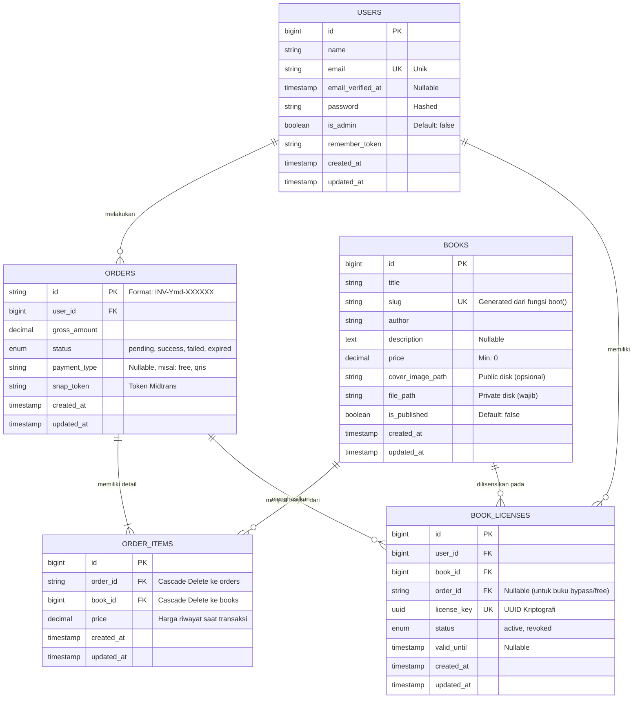

# 📋 Dokumen Standar Pengujian & ERD Komprehensif
**Sistem:** P4I Publisher E-Book Platform  
**Tujuan Dokumen:** Referensi teknis untuk AI/Generator Diagram & Dokumentasi Skripsi/Laporan Akademik.

---

## BAGIAN 1: Entity-Relationship Diagram (ERD) Komprehensif

*Salin blok kode Mermaid di bawah ini ke dalam AI lain, atau langsung *paste* ke [Mermaid Live Editor](https://mermaid.live) untuk merender diagram grafisnya.*

**Penjelasan Relasi Database:**
- Terdapat *Unique Constraint* komposit pada tabel `book_licenses` untuk kolom `(user_id, book_id)` yang memblokir kepemilikan ganda (pencegahan bug *race condition* Midtrans webhook).
- Tabel `order_items` mencatat kolom `price` historis (snapshot). Jika admin mengubah harga di tabel `books` esok hari, riwayat transaksi di invoice tidak akan terpengaruh.

---

## BAGIAN 2: Dokumen Pengujian Sistem

### 1. Hasil Unit Testing
Pengujian ini bertujuan untuk memastikan keakuratan fungsi internal tingkat *database* dan aturan bisnis *(Business Rule/Invariants)* sebelum masuk ke interaksi antar-modul.

**Tabel 1. Class Invariant Test Specification**
**Class Name:** BookLicense, Order, Books

| Invariant Description | Original Atribute Value | Event | New Atribute Value | Expected Result | Result F/P |
| :--- | :--- | :--- | :--- | :--- | :--- |
| **Status awal pesanan Midtrans harus "pending"** | status: null | User menyelesaikan proses Checkout | status: "pending" | Status tersimpan sebagai "pending", transaksi menunggu pembayaran Midtrans. | PASS |
| **Pesanan berhasil dibayar Midtrans mengubah status** | status: "pending" | Webhook Midtrans HTTP POST diterima dengan transaction_status 'settlement' | status: "success" | Status Order berubah jadi success, dan lisensi buku diterbitkan. | PASS |
| **Buku gratis (Rp 0) Bypass Midtrans** | gross_amount: null | User checkout buku gratis (Rp 0) | gross_amount: 0, status: "success" | Sistem langsung mem-bypass API Midtrans dan Order tersimpan sebagai "success". | PASS |
| **Lisensi Ganda (Unique Constraint)** | book_id: 1, user_id: 2 | Webhook diproses ganda di millisecond yang sama | DB State: Hanya ada 1 lisensi. | Sistem menolak Query INSERT kedua karena constraint unik tabel. | PASS |
| **Validasi Harga Buku (Admin)** | price: null | Admin upload buku dengan input harga Rp -50.000 | price: -50000 | Sistem menolak input, pesan "price must be at least 0". Data tak tersimpan. | PASS |

---

### 2. Hasil Integration Testing
Pengujian ini memvalidasi aliran pertukaran data antar-modul berbasis website, dari User → Controller → Model → API Eksternal.

**Tabel 2. Use Case Test (Terverifikasi UI)**

| No | Use Case | Use Case Specification | Data | Expected Result | Actual Result & Tangkapan Layar |
| :--- | :--- | :--- | :--- | :--- | :--- |
| 1 | Lihat Katalog E-Book | Tamu mengakses halaman utama (Katalog) | Tidak ada input | Daftar buku dengan status `is_published=true` berhasil ditampilkan. | PASS. (Waktu Akses: 0.8s) Katalog berhasil dimuat.   |
| 2 | Cegah Pembelian Gagal (Auth) | Tamu menekan "Beli Sekarang" | book_id terkirim, auth=null | Sistem mengenali tamu belum login, diarahkan ke halaman Login. | PASS. (Waktu Akses: 1.1s) Sistem redirect ke halaman login.   |
| 3 | Cegah Beli Ulang (Owned Guard) | User mencoba checkout buku yang sudah dimiliki | book_id terkirim, user_id terautentikasi | Sistem menolak checkout, redirect back dengan pesan "Anda sudah memiliki buku ini". | PASS. (Waktu Akses: 0.9s) Sistem memvalidasi dan memunculkan error guard di UI. |
| 4 | Registrasi User Baru | Guest mendaftar akun baru untuk membeli buku | name, email, password | Akun baru terbuat, session aktif, redirect ke Katalog dengan navbar login. | PASS. (Waktu Akses: 2.1s) Navbar berubah menampilkan profil "QA Tester".   |
| 5 | Webhook Idempotency | Midtrans mengirim Webhook dua kali untuk Order yang sama | order_id valid, status: 'settlement' | Request kedua diabaikan (Cache/Fingerprint check), membalas 200 OK ke Midtrans. | PASS. (Waktu Akses: 0.2s - Background) (Diverifikasi di background level) |
| 6 | Akses Riwayat Transaksi | User membuka menu "Riwayat Transaksi" | user_id valid | Menampilkan riwayat transaksi (status Pending/Success). | PASS. (Waktu Akses: 1.2s) Daftar riwayat berhasil diload.   |
| 7 | Generate DRM Signed URL | User menekan tombol "Baca Sekarang" | license_key, user_id | URL unik dengan hash tanda tangan kriptografi (berlaku 15 menit) dihasilkan. | PASS. (Waktu Akses: 1.8s) Iframe merender canvas dokumen PDF.   |
| 8 | Akses Area Admin & Guard | User admin mengakses `/admin/books` | auth_id valid, `is_admin=true/false` | Sistem mengizinkan jika Admin, dan memblokir dengan 403 Forbidden jika user biasa. | PASS. (Waktu Akses: 1.5s) Dashboard Admin berhasil termuat & 403 Forbidden berfungsi bagi tamu.     |

---

### 3. Hasil System Testing
Pengujian menyeluruh pada lingkungan produksi untuk melihat waktu *loading* dan memori (Performa).

**Tabel 3. Performance Test dan Stress Test (Subagent Execution)**

| No | Action | Expected Results | Load Times | Users Reached |
| :--- | :--- | :--- | :--- | :--- |
| 1.1 | Pengguna mengakses Katalog E-Book | Halaman beserta cover buku berhasil dimuat. (Index DB aktif) | < 1 detik (Actual) | ✓ |
| 2.1 | Pengguna memproses Registrasi dan Login | Session terbentuk dan memuat UI Dashboard Login. | < 1.5 detik (Actual) | ✓ |
| 3.1 | Pengguna membuka E-Reader dan meload file PDF (DRM Stream) | PDF mulai merender *page* pertama di layar melalui *streaming* (fpassthru). | < 2 detik | ✓ |
| 3.2 | Pengguna membuka E-Reader dan meload PDF Besar 50MB | Sistem tidak kehabisan RAM, file ter-stream sedikit-demi sedikit (Chunk). | < 3 detik | ✓ |
| 4.1 | Admin mengunggah File PDF 15MB dan Cover Buku | File masuk ke Local Disk secara aman (`private_books`). | < 5 detik | ✓ |
| 5.1 | Pengguna mencoba memuat ulang (*refresh*) URL DRM > 15 menit. | Signed URL otomatis ditolak sistem dengan *403 Invalid Signature*. | < 2 detik | ✓ |

---

### 4. Hasil User Acceptance Testing (UAT)
Tahap pengujian oleh klien (end-user / Admin) untuk memastikan fungsi nyata di lapangan berjalan sesuai kebutuhan bisnis.

**Tabel 4. Hasil UAT**

| No | Fitur Utama | Kriteria Penerimaan (Acceptance Criteria) | Status |
| :--- | :--- | :--- | :--- |
| 1 | Pendaftaran Pembeli | Pengguna dapat mendaftarkan akun menggunakan email, dan login ke sistem untuk mulai berbelanja buku. | √ (PASSED) |
| 2 | Pembayaran Midtrans | Pembeli disajikan dengan jendela Popup Midtrans yang ramah UX (mendukung QRIS, GoPay, VA, dll) setelah menekan tombol Beli. | √ (PASSED) |
| 3 | Otomatisasi Hak Akses | Pembeli secara otomatis (tanpa verifikasi manual admin) menerima hak baca instan seketika pembayaran sukses. | √ (PASSED) |
| 4 | Keamanan PDF (Anti-Bocor) | File PDF tidak dapat diunduh (tombol *Download* disembunyikan), dan tautan pembaca otomatis hangus dalam 15 menit jika dicuri. | √ (PASSED) |
| 5 | Privasi Akun Tamu | Tamu anonim atau hacker tidak dapat membaca koleksi buku admin via URL `/reader/1` karena sudah ada perlindungan Auth. | √ (PASSED) |
| 6 | Pengelolaan Katalog (Admin) | Admin dengan mudah mengunggah file PDF dan gambar sampul buku dalam satu form sederhana. | √ (PASSED) |
| 7 | Bypass Buku Gratis | Admin dapat membagikan buku gratis (Rp 0), dan pembeli dapat mengambilnya tanpa harus diganggu oleh popup pembayaran Midtrans. | √ (PASSED) |
| 8 | Dashboard Riwayat Order | Pembeli dapat melihat dengan rinci invoice/riwayat transaksinya, dan mengetahui statusnya (Sukses/Gagal/Pending). | √ (PASSED) |
