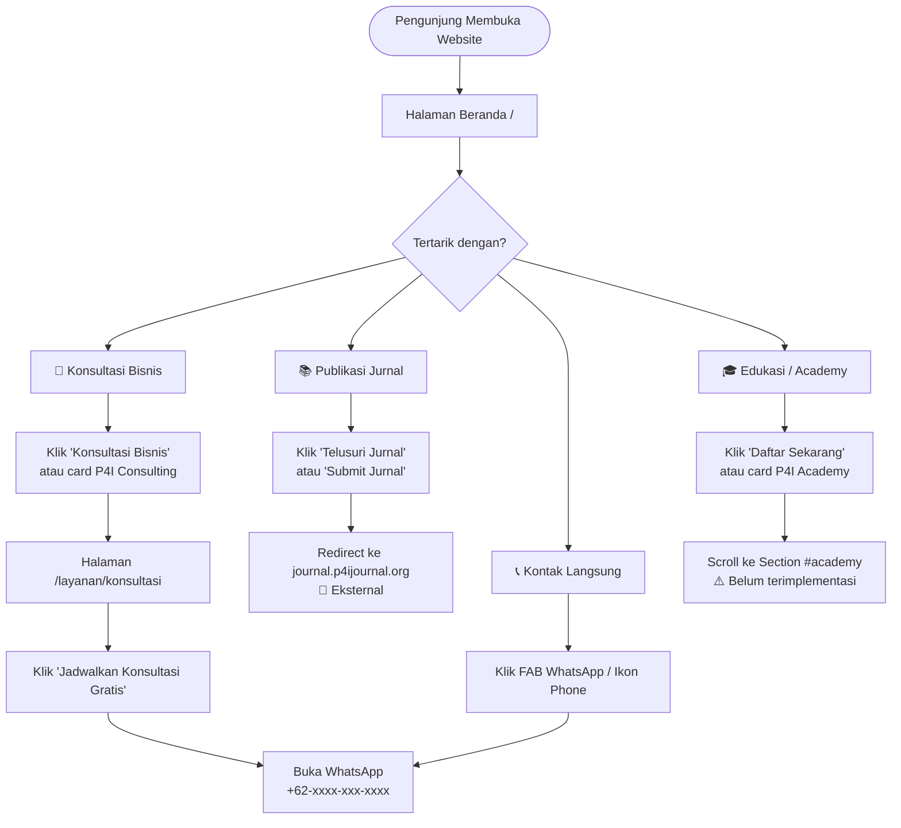
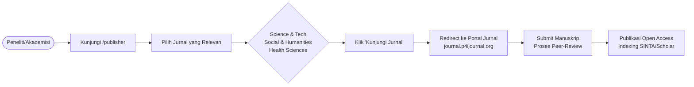
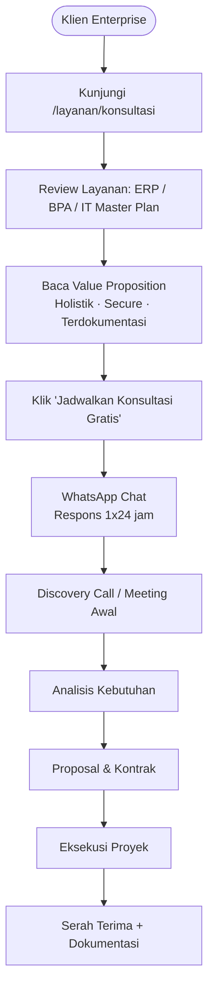

# Laporan Teknis & Bisnis: P4I Corporate Hub
**Tanggal Laporan:** 30 Agustus 2026  
**Versi Proyek:** 1.0.0  
**Status:** Aktif dalam Pengembangan

---

## 1. Gambaran Umum Proyek

**P4I Corporate Hub** adalah website korporat resmi milik **Yayasan P4I** (Pusat Pendidikan dan Penelitian Pembangunan Indonesia), yang berlokasi di Jl. TP. Sriwijaya, Beliung, Kota Baru, Kota Jambi, Jambi 36361.

Website ini berfungsi sebagai **portal terpusat (corporate hub)** yang mempresentasikan seluruh ekosistem layanan P4I kepada publik, akademisi, dan mitra korporat. Platform ini mengintegrasikan tiga pilar utama organisasi: publikasi ilmiah, konsultasi bisnis & IT, serta program edukasi profesional.

### Tujuan Utama Platform

| Tujuan | Deskripsi |
|---|---|
| **Brand Awareness** | Memperkuat citra P4I sebagai lembaga riset, teknologi, dan edukasi terkemuka di Indonesia |
| **Lead Generation** | Mendorong calon klien untuk menghubungi tim konsultan melalui WhatsApp |
| **Portal Jurnal** | Mengarahkan peneliti dan akademisi ke platform jurnal ilmiah P4I |
| **Katalog Layanan** | Memaparkan seluruh portofolio layanan secara terstruktur dan mudah dipahami |

---

## 2. Teknologi & Stack yang Digunakan

```
Framework    : Next.js 16.3+ (App Router)
Bahasa       : TypeScript 7.0
Runtime      : React 19
Styling      : Tailwind CSS 3.4 + CSS Modules
Animasi      : Framer Motion 13
Ikon         : Lucide React 1.30 + React Icons 5.7
Font         : Inter (Google Fonts, via next/font)
Theme Engine : next-themes 0.4.6
Analytics    : Google Analytics (GA4) via @next/third-parties
Build Tool   : PostCSS + Autoprefixer
```

### Justifikasi Pilihan Teknologi

- **Next.js App Router** — digunakan untuk mendapat keuntungan SSR (Server-Side Rendering) pada halaman yang membutuhkan SEO optimal, serta RSC (React Server Components) untuk performa tinggi.
- **TypeScript** — memastikan keandalan kode jangka panjang dan keterbacaan yang lebih baik.
- **Tailwind CSS** — mempercepat pengembangan UI dengan utility classes yang konsisten.
- **Framer Motion** — menyediakan animasi yang halus dan profesional untuk meningkatkan UX.
- **next-themes** — mengelola dark/light mode dengan penanganan hydration yang benar.

---

## 3. Struktur Direktori

```
d:\P4I_Corporate_Hub\
│
├── app/                              # Next.js App Router root
│   ├── layout.tsx                    # Root layout (Navbar, Footer, ThemeProvider, GA)
│   ├── page.tsx                      # Halaman beranda (/)
│   ├── globals.css                   # Global CSS dasar
│   │
│   ├── components/                   # Komponen khusus fitur App
│   │   ├── layout/
│   │   │   ├── Navbar.tsx            # Navigasi utama (sticky, glassmorphism)
│   │   │   └── Footer.tsx            # Footer korporat (kontak, tautan cepat)
│   │   │
│   │   ├── sections/
│   │   │   ├── Hero.tsx              # Hero section + Metrics bar
│   │   │   └── BentoGrid.tsx         # Grid 3 pilar + Katalog layanan
│   │   │
│   │   └── ui/
│   │       └── SmartLink.tsx         # Komponen link cerdas (internal/eksternal)
│   │
│   ├── publisher/
│   │   └── page.tsx                  # Halaman P4I Publisher (/publisher)
│   │
│   └── layanan/
│       └── konsultasi/
│           └── page.tsx              # Halaman Konsultasi (/layanan/konsultasi)
│
├── components/                       # Komponen shared global
│   ├── ThemeProvider.tsx             # Wrapper next-themes (client component)
│   └── ThemeToggle.tsx               # Tombol toggle dark/light mode
│
├── public/
│   └── p4i-logo.png                  # Aset logo utama P4I
│
├── next.config.mjs                   # Konfigurasi Next.js (CSP, redirects)
├── tailwind.config.js                # Konfigurasi Tailwind CSS
├── tsconfig.json                     # Konfigurasi TypeScript
├── postcss.config.js                 # Konfigurasi PostCSS
└── package.json                      # Dependensi & scripts npm
```

---

## 4. Halaman & Rute Aplikasi

### 4.1 Beranda — `/` (Home)

**File:** [app/page.tsx](file:///d:/P4I_Corporate_Hub/app/page.tsx)

Halaman utama yang menjadi pintu masuk pengunjung. Terdiri dari dua section besar:

1. **Hero Section** — Judul utama "Pusat Solusi Riset, Teknologi, dan Edukasi Enterprise" dengan dua CTA button dan metrics bar.
2. **BentoGrid Section** — Grid tiga pilar layanan + katalog layanan spesifik.
3. **FAB (Floating Action Button)** — Tombol WhatsApp mengambang di pojok kanan bawah untuk kontak langsung.

**Elemen Interaktif:**
- Animasi fade-in bertahap pada heading dan paragraf (Framer Motion)
- Animated SVG growth chart (animasi stroke path)
- FAB WhatsApp dengan tooltip "Hubungi Kami" saat hover
- BentoGrid cards dengan hover lift effect (`y: -5`)

---

### 4.2 Publisher — `/publisher`

**File:** [app/publisher/page.tsx](file:///d:/P4I_Corporate_Hub/app/publisher/page.tsx)

Halaman yang mempresentasikan platform penerbitan jurnal ilmiah P4I. Ditargetkan untuk **peneliti, dosen, dan akademisi**.

**Konten:**

| Jurnal | Fokus | Warna Aksen |
|---|---|---|
| **Science and Technology** | Sains murni, rekayasa, TI, sistem cerdas | Orange |
| **Social, Economic, and Humanities** | Ilmu sosial, ekonomi, manajemen, humaniora | Red |
| **Health Sciences** | Kesehatan masyarakat, farmasi, keperawatan | Blue |

**Fitur visual:**
- Hero gelap dengan mesh gradient (orange + red glow)
- Badge "Open Access Journal Publishing"
- Kartu jurnal dengan icon hover color transition

---

### 4.3 Konsultasi — `/layanan/konsultasi`

**File:** [app/layanan/konsultasi/page.tsx](file:///d:/P4I_Corporate_Hub/app/layanan/konsultasi/page.tsx)

Halaman layanan konsultasi yang ditargetkan untuk **enterprise dan organisasi besar**.

**Tiga Layanan Utama:**

| # | Layanan | Deskripsi |
|---|---|---|
| 1 | **Konsultan ERP** | Integrasi sistem manajemen perusahaan (data operasional, HR, keuangan) |
| 2 | **Analisis Proses Bisnis** | Audit alur kerja untuk identifikasi inefisiensi & optimalisasi |
| 3 | **IT Master Plan** | Cetak biru arsitektur teknologi jangka panjang |

**Tiga Value Proposition:**

| Nilai | Penjelasan |
|---|---|
| **Pendekatan Holistik** | Tidak hanya instalasi software, tapi analisis arsitektur bisnis menyeluruh |
| **Security & Scalability** | Standar keamanan enterprise, siap diskalakan |
| **Dokumentasi Presisi** | Knowledge management + dokumentasi teknis komprehensif |

**CTA Utama:** Tombol "Jadwalkan Konsultasi Gratis" terhubung ke WhatsApp.

---

## 5. Komponen — Detail Fungsi

### 5.1 `Navbar.tsx`
**Path:** [app/components/layout/Navbar.tsx](file:///d:/P4I_Corporate_Hub/app/components/layout/Navbar.tsx)

```
Fungsi    : Navigasi utama yang sticky di bagian atas halaman
Behavior  : Sticky (top-0, z-50) dengan efek glassmorphism (backdrop-blur + bg/70)
```

**Navigasi Menu:**
- `Home` → `/`
- `About P4I` → `/#about`
- `Editorial Board` → `https://journal.p4ijournal.org/index.php/journal/about/editorialTeam` (eksternal)
- `Contact` → `#contact`

**Ikon Sosial:**
- 📞 WhatsApp: `wa.me/6289699161526`
- 📷 Instagram: `instagram.com/p4i.official`
- 🎥 Video (belum dikonfigurasi)

**Responsif:** Menu full pada desktop (md+), mode mobile hanya tampilkan tombol "Menu" (belum ada hamburger/dropdown implementasi).

---

### 5.2 `Footer.tsx`
**Path:** [app/components/layout/Footer.tsx](file:///d:/P4I_Corporate_Hub/app/components/layout/Footer.tsx)

Footer tiga kolom dengan latar `slate-900`:

| Kolom | Konten |
|---|---|
| **Tentang P4I** | Deskripsi singkat misi yayasan |
| **Tautan Cepat** | Link ke Publisher, Consulting, Academy |
| **Kontak** | Alamat fisik, nomor telepon, email |

**Informasi Kontak:**
- 📍 Jl. TP. Sriwijaya, Beliung, Kec. Kota Baru, Kota Jambi, Jambi 36361
- 📞 +62 896-9916-1526
- ✉️ admin@p4ijournal.org

**Copyright:** © 2026 Yayasan P4I (Pusat Pendidikan dan Penelitian Pembangunan Indonesia).

---

### 5.3 `Hero.tsx`
**Path:** [app/components/sections/Hero.tsx](file:///d:/P4I_Corporate_Hub/app/components/sections/Hero.tsx)

Dua bagian utama:

**Bagian A — Hero Banner:**
- Judul utama (H1) dengan animasi entrance `opacity + y`
- Subtitle/tagline
- Dua tombol CTA: "Telusuri Jurnal" (→ journal.p4ijournal.org) dan "Layanan Konsultan" (→ #layanan)
- Background: radial gradient `blue-50 → slate-50`

**Bagian B — Metrics Bar (Impact Stats):**
Glassmorphism card floating dengan statistik kunci:

| Metrik | Nilai |
|---|---|
| Riset Terpublikasi | 15,000+ |
| Klien Konsultasi Enterprise | 50+ |
| Tingkat Keberhasilan Transformasi | 99.8% |

- Animated SVG growth chart dengan gradient biru→hijau, dianimasikan menggunakan `strokeDashoffset` dari Framer Motion.

---

### 5.4 `BentoGrid.tsx`
**Path:** [app/components/sections/BentoGrid.tsx](file:///d:/P4I_Corporate_Hub/app/components/sections/BentoGrid.tsx)

Dua section pada satu komponen:

**Section A — "Tiga Pilar Utama Kami":**
Layout grid 3 kolom (responsive):

| Kartu | Style | Span | Link |
|---|---|---|---|
| **P4I Publishing** | Light (slate-50) | 1 kolom | `/publisher` |
| **P4I Consulting** | Dark (slate-900) dengan glow | 2 kolom (lg) | `/layanan/konsultasi` |
| **P4I Academy** | Light (slate-50) | Full width (lg) | `#academy` |

Kartu Consulting menggunakan design dark dengan `bg-blue-500/20` radial glow sebagai dekoratif.

**Section B — "Katalog Layanan Terintegrasi":**
Dua kolom daftar layanan spesifik:

*P4I Consulting:*
- Konsultan ERP (ikon: Settings)
- Analisis Proses Bisnis (ikon: Activity)
- Konsultan IT Strategis (ikon: Lightbulb)
- Konsultan Transformasi Digital (ikon: Globe)

*P4I Academy:*
- Pelatihan Manajemen (ikon: Users)
- Tata Kelola Ruang (ikon: Layout)
- English Course (ikon: Languages)

---

### 5.5 `SmartLink.tsx`
**Path:** [app/components/ui/SmartLink.tsx](file:///d:/P4I_Corporate_Hub/app/components/ui/SmartLink.tsx)

Komponen utility cerdas yang secara otomatis mendeteksi jenis link:

```typescript
// Jika href diawali 'http' atau '//' → render sebagai <a target="_blank" rel="noopener noreferrer">
// Selain itu → render sebagai Next.js <Link> (client-side navigation)
```

**Tujuan:** Menghindari penulisan kondisional secara berulang di setiap komponen, sekaligus memastikan keamanan link eksternal (rel="noopener noreferrer").

---

### 5.6 `ThemeProvider.tsx` & `ThemeToggle.tsx`
**Path:** [components/ThemeProvider.tsx](file:///d:/P4I_Corporate_Hub/components/ThemeProvider.tsx) | [components/ThemeToggle.tsx](file:///d:/P4I_Corporate_Hub/components/ThemeToggle.tsx)

- **ThemeProvider**: Wrapper tipis di atas `next-themes`, dikonfigurasi dengan `attribute="class"` agar Tailwind dark mode berbasis class dapat bekerja. Mendukung sistem tema otomatis (`enableSystem`).
- **ThemeToggle**: Tombol toggle UI dengan animasi Framer Motion (spring animation + rotate 180° saat klik). Menampilkan ikon matahari/bulan tergantung tema aktif. Sudah menangani **hydration mismatch** dengan pattern `mounted` state.

> **Catatan:** ThemeToggle sudah dibuat namun belum dipasang di Navbar.

---

## 6. Konfigurasi Infrastruktur

### 6.1 Next.js Config — `next.config.mjs`
**File:** [next.config.mjs](file:///d:/P4I_Corporate_Hub/next.config.mjs)

**Content Security Policy (CSP):**
Dikonfigurasi untuk keamanan production, mengizinkan:
- Script dari: `self`, Google Tag Manager (`googletagmanager.com`)
- Connect dari: `self`, Google Analytics (`google-analytics.com`)
- Image dari: `self`, blob, data URI, Google Tag Manager

**URL Redirect:**
```
/journal/:path*  →  https://journal.p4ijournal.org/journal/:path*  (permanent: 301)
```
Memungkinkan URL internal `/journal/...` diredirect permanen ke subdomain jurnal eksternal.

---

### 6.2 Google Analytics Integration
**Tracking ID:** `G-6C89K5WKQG`  
**Implementasi:** `@next/third-parties/google` dipasang di root layout (`app/layout.tsx`), merender GA4 tag secara optimal sesuai Next.js best practice.

---

### 6.3 SEO Metadata

| Halaman | Title | Description |
|---|---|---|
| Beranda | Professional Data Analyst Portfolio | Muhammad Farhan - Transforming Data into Executive Strategy |
| Publisher | P4I Publisher \| Publikasi Jurnal Ilmiah Terakreditasi | Platform publikasi jurnal ilmiah open access |
| Konsultasi | Konsultasi IT & ERP Enterprise \| P4I Corporate Hub | Layanan konsultasi IT Enterprise, implementasi ERP, dan IT Master Plan |

> **Catatan:** Metadata beranda saat ini masih menggunakan teks placeholder "Professional Data Analyst Portfolio" yang perlu diperbarui sesuai identitas P4I.

---

## 7. Alur Bisnis

### 7.1 Alur Pengguna (User Flow) — Visitor Umum



---

### 7.2 Alur Bisnis — P4I Publishing



---

### 7.3 Alur Bisnis — P4I Consulting



---

### 7.4 Alur Navigasi Halaman (Site Map)

```mermaid
graph TD
    Root[/] --> Publisher[/publisher]
    Root --> Konsultasi[/layanan/konsultasi]
    Root --> JournalExt["journal.p4ijournal.org 🔗"]
    Root --> WAExt["wa.me/628996... 🔗"]
    Root --> IGExt["instagram.com/p4i.official 🔗"]
    
    Publisher --> JournalExt
    Konsultasi --> WAExt

    style Root fill:#3b82f6,color:white
    style JournalExt fill:#94a3b8,color:white
    style WAExt fill:#22c55e,color:white
    style IGExt fill:#e11d48,color:white
```

---

## 8. Tiga Pilar Layanan P4I (Ringkasan Bisnis)

### 🔵 Pilar 1 — P4I Publishing
**Target:** Peneliti, dosen, mahasiswa pascasarjana, profesional akademik

| Item | Detail |
|---|---|
| Model | Open Access (bebas biaya baca) |
| Peer-Review | Fast track peer-review |
| Indexing | SINTA, Google Scholar |
| Jurnal | Science & Technology, Social & Humanities, Health Sciences |
| Portal | [journal.p4ijournal.org](https://journal.p4ijournal.org) |

---

### ⚫ Pilar 2 — P4I Consulting
**Target:** Perusahaan skala menengah-besar, instansi pemerintah, organisasi enterprise

| Item | Detail |
|---|---|
| ERP | SAP, Odoo, atau custom ERP implementation |
| Business Process Analysis | Workflow audit, process mapping, lean improvement |
| IT Master Plan | Roadmap teknologi 3–5 tahun |
| Digital Transformation | Cloud migration, digitalisasi operasional |
| Kontak | WhatsApp +62 896-9916-1526 |

---

### 🎓 Pilar 3 — P4I Academy
**Target:** Profesional, karyawan perusahaan, individu yang ingin meningkatkan kompetensi

| Item | Detail |
|---|---|
| Pelatihan Manajemen | Leadership, project management, strategic management |
| Tata Kelola Ruang | Facility management, space governance |
| English Course | Business English, conversational, TOEFL preparation |

> **Catatan:** Halaman Academy belum memiliki halaman khusus (`/academy`). Link `#academy` saat ini masih anchor hash yang belum diarahkan ke section tertentu.

---

## 9. Status Pengembangan & Item Backlog

### ✅ Yang Sudah Selesai

- [x] Arsitektur proyek Next.js App Router
- [x] Root Layout (Navbar, Footer, ThemeProvider, Google Analytics)
- [x] Halaman Beranda dengan Hero + Metrics + BentoGrid
- [x] Halaman Publisher (`/publisher`) dengan katalog 3 jurnal
- [x] Halaman Konsultasi (`/layanan/konsultasi`) dengan layanan + value proposition
- [x] SmartLink utility component
- [x] ThemeProvider & ThemeToggle (dark mode infrastructure)
- [x] CSP Security headers di Next.js config
- [x] URL Redirect `/journal/:path*` → external
- [x] Google Analytics GA4 integration
- [x] WhatsApp FAB button

### ⚠️ Perlu Perhatian / Item Backlog

| Prioritas | Item | Detail |
|---|---|---|
| 🔴 Tinggi | Perbaiki metadata beranda | Masih berisi placeholder "Professional Data Analyst Portfolio" |
| 🔴 Tinggi | Buat halaman P4I Academy | `/academy` belum ada, link `#academy` tidak ke mana-mana |
| 🟡 Sedang | Mobile hamburger menu | Navbar mobile hanya tampilkan teks "Menu" tanpa dropdown |
| 🟡 Sedang | Pasang ThemeToggle di Navbar | Komponen sudah ada tapi belum digunakan di Navbar |
| 🟡 Sedang | Lengkapi ISSN jurnal | E-ISSN masih placeholder `2987-xxxx`, `2987-yyyy`, `2987-zzzz` |
| 🟡 Sedang | Link jurnal aktif | Tombol "Kunjungi Jurnal" di halaman Publisher mengarah ke `#` |
| 🟢 Rendah | Section `#contact` | Link "Contact" di navbar mengarah ke `#contact` yang tidak ada |
| 🟢 Rendah | Ikon Video di Navbar | Link ikon video mengarah ke `#` tanpa tujuan |
| 🟢 Rendah | Nomor WA Konsultasi | Halaman konsultasi pakai nomor placeholder `6281234567890` |

---

## 10. Dependensi Lengkap

### Production Dependencies

| Package | Versi | Fungsi |
|---|---|---|
| `next` | ^16.3.0 | Framework utama |
| `react` | ^19.2.8 | UI library |
| `react-dom` | ^19.2.8 | DOM rendering |
| `framer-motion` | ^13.0.0 | Animasi komponen |
| `lucide-react` | ^1.30.0 | Ikon UI |
| `react-icons` | ^5.7.0 | Ikon tambahan (Instagram, Moon, Sun) |
| `next-themes` | ^0.4.6 | Dark/light mode management |
| `@next/third-parties` | ^16.3.0 | Google Analytics integration |

### Dev Dependencies

| Package | Versi | Fungsi |
|---|---|---|
| `typescript` | 7.0.2 | Type checking |
| `tailwindcss` | ^3.4.19 | CSS utility framework |
| `@tailwindcss/postcss` | ^4.3.3 | PostCSS integration |
| `postcss` | ^8.5.26 | CSS processing |
| `autoprefixer` | ^10.5.4 | CSS vendor prefixes |
| `@types/node` | 26.1.2 | TypeScript Node.js types |
| `@types/react` | 19.2.18 | TypeScript React types |

---

## 11. Informasi Kontak & Identitas Yayasan

| Item | Detail |
|---|---|
| **Nama Resmi** | Yayasan P4I — Pusat Pendidikan dan Penelitian Pembangunan Indonesia |
| **Alamat** | Jl. TP. Sriwijaya, Beliung, Kec. Kota Baru, Kota Jambi, Jambi 36361 |
| **Telepon/WA** | +62 896-9916-1526 |
| **Email** | admin@p4ijournal.org |
| **Website Jurnal** | https://journal.p4ijournal.org |
| **Instagram** | @p4i.official |
| **Google Analytics** | G-6C89K5WKQG |

---

*Dokumen ini dibuat secara otomatis berdasarkan analisis mendalam terhadap seluruh source code proyek P4I Corporate Hub per tanggal 30 Agustus 2026.*
