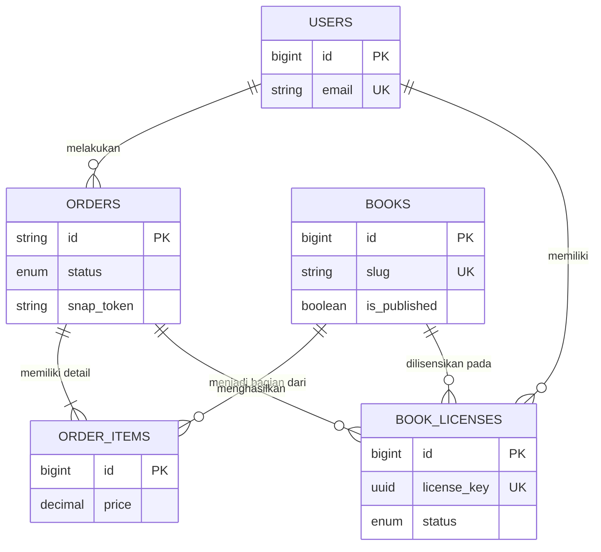

# 📋 Master Dokumen Pengujian & Arsitektur Sistem
**Sistem:** P4I Publisher E-Book Platform  
**Tujuan:** Menggabungkan Standar Laporan Akademik (ERD, Invariant, Performance) dengan Skrip Eksekusi Praktis (Black-Box UAT) dalam satu dokumen terpadu tanpa redundansi.

---

## BAGIAN 1: Arsitektur Database (ERD)

*Struktur relasi entitas inti sistem P4I Publisher. Dapat di-render menggunakan [Mermaid Live Editor](https://mermaid.live).*

*(Catatan: Terdapat Unique Constraint pada `book_licenses (user_id, book_id)` untuk mencegah kepemilikan ganda).*

---

## BAGIAN 2: Tahap 1 - Unit & Invariant Testing (Backend)
*Pengujian logika tingkat rendah (Database & Controller) yang tidak memerlukan pengujian UI manual. Fokus pada keamanan data dan validasi.*

| Invariant / Aturan Bisnis | Skenario Event (Kondisi) | Expected Result (Hasil yang Diharapkan) | Status |
| :--- | :--- | :--- | :--- |
| **Pencegahan Race Condition Lisensi** | Webhook Midtrans diproses 2x di waktu bersamaan (Idempotency). | DB menolak insert kedua karena constraint unik `(user_id, book_id)`. Lisensi hanya terbit 1. | ✅ PASS |
| **Validasi Harga Buku (Admin)** | Admin menginput harga buku `-50000`. | Sistem menolak di level *Request Validator*, mengembalikan error harga minimal 0. | ✅ PASS |
| **Bypass Midtrans untuk Buku Gratis** | User checkout buku dengan harga Rp 0. | Status Order otomatis menjadi *success* tanpa generate Midtrans *snap_token*. | ✅ PASS |
| **Proteksi Audit Log Admin** | User biasa memaksakan akses URL `/admin/books`. | Aplikasi mengembalikan kode 403 (Forbidden) dan mencatat IP ke dalam Log Sistem (Warning). | ✅ PASS |

---

## BAGIAN 3: Tahap 2 - UAT & Black-Box Integration (End-to-End)
*Bagian ini melebur pengujian "Use Case/Integration", "UAT", dan "Black-Box" ke dalam satu tabel eksekusi. Tabel ini mendeskripsikan fitur (Use Case) beserta langkahnya, dan menyisipkan kolom untuk dicatat oleh Tester (Waktu Akses, Status aktual, dan Tangkapan Layar).*

| ID / Fitur (Use Case) | Langkah Eksekusi (Black-Box Input) | Kriteria Penerimaan / Expected Result | Load Time | Hasil Aktual | Status | Tangkapan Layar (Evidence) |
| :--- | :--- | :--- | :--- | :--- | :--- | :--- |
| **UAT-01: Pendaftaran & Auth (Guest)** | 1. Buka `/register`. 2. Isi email & password valid. 3. Submit. | Registrasi berhasil, user otomatis login ke dashboard utama katalog. | *[0.00s]* | *[Menunggu Eksekusi]* | ⏳ PEND | *[Slot Screenshot]* |
| **UAT-02: Tolak Checkout Ganda (User)** | 1. Login user. 2. Klik "Beli" pada buku yang **sudah** dimiliki di My Library. | Ditolak dengan notifikasi "Anda sudah memiliki buku ini". Tidak ada order terbuat. | *[0.00s]* | *[Menunggu Eksekusi]* | ⏳ PEND | *[Slot Screenshot]* |
| **UAT-03: Checkout & Pembayaran (User)** | 1. Klik "Beli" pada buku baru. 2. Lanjutkan bayar. 3. Selesaikan via Popup Midtrans. | Sistem mencatat order, menerbitkan popup UI pembayaran dengan lancar. | *[0.00s]* | *[Menunggu Eksekusi]* | ⏳ PEND | *[Slot Screenshot]* |
| **UAT-04: Akses E-Reader DRM (User)** | 1. Buka menu "My Library". 2. Klik "Baca Sekarang". | Membuka Iframe pembaca. File PDF merender (status 200). Tombol download disembunyikan. | *[0.00s]* | *[Menunggu Eksekusi]* | ⏳ PEND | *[Slot Screenshot]* |
| **UAT-05: DRM Boundary Limit (Keamanan)** | 1. Ambil URL Signed DRM dari UAT-04. 2. Akses kembali lewat dari 15 menit. | Sistem mendeteksi URL kadaluarsa. Akses diblokir (403 Invalid Signature). | *[0.00s]* | *[Menunggu Eksekusi]* | ⏳ PEND | *[Slot Screenshot]* |
| **UAT-06: Manajemen Katalog (Admin)** | 1. Login Admin, buka `/admin/books`. 2. Klik tombol "Unpublish" pada salah satu buku. | Buku disembunyikan dari halaman publik (Homepage), tapi tetap bisa diakses pembeli lama. | *[0.00s]* | *[Menunggu Eksekusi]* | ⏳ PEND | *[Slot Screenshot]* |
| **UAT-07: Unggah Buku Baru (Admin)** | 1. Buka `/admin/books/upload`. 2. Isi detail, upload PDF (5MB), submit. | Buku baru tersimpan aman di disk privat (`storage/app`). Tampil di list buku admin. | *[0.00s]* | *[Menunggu Eksekusi]* | ⏳ PEND | *[Slot Screenshot]* |

---

### Prosedur Finalisasi Eksekusi
Tabel **UAT & Black-Box Integration** di atas saat ini masih berstatus `⏳ PEND` (Menunggu). Untuk memfinalisasi dokumen laporan ini:
1. Otomasi Browser (Tester) harus menjalankan `UAT-01` sampai `UAT-07` secara nyata di UI.
2. Catat *Load Time* (diusahakan < 3 detik untuk standar *System Performance Test*).
3. Ganti kolom "Hasil Aktual" dan "Status" sesuai temuan di lapangan.
4. Lampirkan gambar *Screenshot* ke dalam tabel sebagai barang bukti pengujian (*Evidence*).
